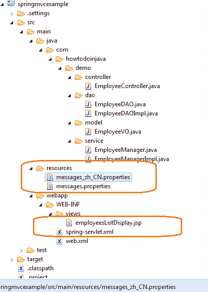
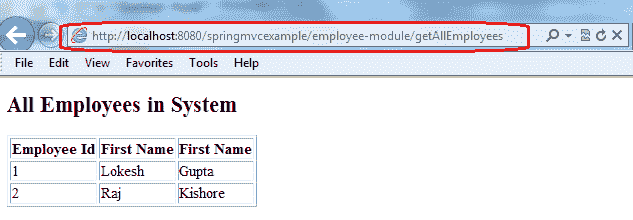

# Spring MVC 国际化（i18n）和本地化（i10n）示例

> 原文： [https://howtodoinjava.com/spring-mvc/spring-mvc-internationalization-i18n-and-localization-i10n-example/](https://howtodoinjava.com/spring-mvc/spring-mvc-internationalization-i18n-and-localization-i10n-example/)

国际化是设计软件应用程序的过程，这样它可以潜在地适应各种语言和地区而无需进行工程更改。 本地化是通过添加特定于语言环境的组件并翻原文本来使国际化软件适应特定区域或语言的过程[ [Wiki](https://en.wikipedia.org/wiki/Internationalization_and_localization "Internationalization_and_localization") ]。 Spring 框架随[`LocaleResolver`](https://docs.spring.io/spring/docs/current/javadoc-api/org/springframework/web/servlet/LocaleResolver.html "LocaleResolver")一起提供，以支持国际化和本地化。 本教程将帮助您学习**如何在基于 Spring MVC 的 Web 应用程序**中添加国际化支持。

```java
Table of Contents

1) Adding locale specific message resources
2) Adding LocaleResolver configuration in spring context
3) JSP changes to display locale specific messages
4) Project Structure
5) Testing the Application
6) Other Project Files
```

让我们开始分析为在 Spring Web 应用程序中添加 i18n 支持而需要进行的更改。

## 1）添加特定于语言环境的消息资源

如果要支持多个语言环境，那么第一步显然就是让每个特定于语言环境的属性文件都具有该语言环境特定语言的文本。 在我们的示例中，我支持两种语言环境。 第一个是使用英语的美国语言，第二个是中文。

`messages.properties`

```java
lbl.Id=Employee Id
lbl.firstName=First Name
lbl.lastName=First Name
lbl.page=All Employees in System

```

`messages_zh_CN.properties`

```java
lbl.Id=\u5458\u5DE5ID
lbl.firstName=\u540D\u5B57
lbl.lastName=\u59D3
lbl.page=\u7CFB\u7EDF\u4E2D\u7684\u6240\u6709\u5458\u5DE5

```

请注意这些属性文件的命名约定。 特定于语言环境的文件的名称后附加了语言环境短代码。

## 2）在 Spring 上下文中添加 LocaleResolver 配置

为了使 Spring MVC 应用程序支持国际化，您将需要注册两个 bean。

#### 1\. `SessionLocaleResolver`

[`SessionLocaleResolver`](https://docs.spring.io/spring/docs/current/javadoc-api/org/springframework/web/servlet/i18n/SessionLocaleResolver.html "SessionLocaleResolver") 通过检查用户会话中的预定义属性来解析语言环境。 如果会话属性不存在，则此语言环境解析器将从`accept-language` HTTP 标头中确定默认语言环境。

```java
<bean id="localeResolver" class="org.springframework.web.servlet.i18n.SessionLocaleResolver">
	<property name="defaultLocale" value="en" />
</bean>

```

#### 2\. `LocaleChangeInterceptor`

[`LocaleChangeInterceptor`](https://docs.spring.io/spring-framework/docs/2.5.6/api/org/springframework/web/servlet/i18n/LocaleChangeInterceptor.html "LocaleChangeInterceptor")侦听器检测当前 HTTP 请求中是否存在特殊参数。 可以使用此拦截器的`paramName`属性自定义参数名称。 如果当前请求中存在此类参数，则此拦截器会根据参数值更改用户的语言环境。

```java
<bean id="localeChangeInterceptor" class="org.springframework.web.servlet.i18n.LocaleChangeInterceptor">
	<property name="paramName" value="lang" />
</bean>

<bean class="org.springframework.web.servlet.mvc.annotation.DefaultAnnotationHandlerMapping">
	<property name="interceptors">
		<list>
			<ref bean="localeChangeInterceptor" />
		</list>
	</property>
</bean>

```

该应用程序的完整应用程序上下文文件如下所示：

```java
<beans xmlns="http://www.springframework.org/schema/beans"
	xmlns:xsi="http://www.w3.org/2001/XMLSchema-instance" 
	xmlns:context="http://www.springframework.org/schema/context"
	xsi:schemaLocation="http://www.springframework.org/schema/beans
        http://www.springframework.org/schema/beans/spring-beans-3.0.xsd
        http://www.springframework.org/schema/context/
        http://www.springframework.org/schema/context/spring-context-3.0.xsd">

	<context:component-scan base-package="com.howtodoinjava.demo" />

	<bean class="org.springframework.web.servlet.mvc.annotation.AnnotationMethodHandlerAdapter" />

	<bean class="org.springframework.web.servlet.view.InternalResourceViewResolver">
		<property name="prefix" value="/WEB-INF/views/" />
		<property name="suffix" value=".jsp" />
	</bean>

	<bean id="messageSource" class="org.springframework.context.support.ResourceBundleMessageSource">
	    <property name="basename" value="messages" />
	</bean>

	<bean id="localeResolver" class="org.springframework.web.servlet.i18n.SessionLocaleResolver">
		<property name="defaultLocale" value="en" />
	</bean>

	<bean id="localeChangeInterceptor" class="org.springframework.web.servlet.i18n.LocaleChangeInterceptor">
		<property name="paramName" value="lang" />
	</bean>

	<bean class="org.springframework.web.servlet.mvc.annotation.DefaultAnnotationHandlerMapping">
		<property name="interceptors">
            <list>
                <ref bean="localeChangeInterceptor" />
            </list>
        </property>
	</bean>

</beans>

```

## 3）更改 JSP 以显示特定于语言环境的消息

下一步是进行视图更改，以支持显示特定于区域设置的文本消息。 可以通过以下方式使用弹簧 TLD 来完成此操作。

```java
<%@ page contentType="text/html;charset=UTF-8" %>

<%@ taglib prefix="c" uri="http://java.sun.com/jsp/jstl/core"%>
<%@ taglib prefix="fmt" uri="http://java.sun.com/jsp/jstl/fmt"%>
<%@ taglib prefix="spring" uri="http://www.springframework.org/tags" %>

<html>
<head>
	<title>Spring MVC Hello World</title>
</head>

<body>
	<h2><spring:message code="lbl.page" text="All Employees in System" /></h2>

	<table border="1">
		<tr>
			<th><spring:message code="lbl.Id" text="Employee Id" /></th>
			<th><spring:message code="lbl.firstName" text="First Name" /></th>
			<th><spring:message code="lbl.lastName" text="Last Name" /></th>
		</tr>
		<c:forEach items="${employees}" var="employee">
			<tr>
				<td>${employee.id}</td>
				<td>${employee.firstName}</td>
				<td>${employee.lastName}</td>
			</tr>
		</c:forEach>
	</table>

</body>
</html>

```

## 4）项目结构

此应用程序的完整结构是这样的：



Spring i18n project structure and files

## 5）测试应用程序

**点击网址：`http://localhost:8080/springmvcexample/employee-module/getAllEmployees`**

如您所见，所有标签均以英语显示。



Spring i18n – En Locale

**点击网址：`http://localhost:8080/springmvcexample/employee-module/getAllEmployees?lang=zh_CN`**

现在，语言环境已更改为中文，并且所有标签都以中文显示。


Spring i18n – CN Locale

## 6）其他项目文件

让我们列出该应用程序涉及的其他文件。

`web.xml`

```java
<web-app id="WebApp_ID" version="2.4" 
	xmlns="http://java.sun.com/xml/ns/j2ee" 
	xmlns:xsi="http://www.w3.org/2001/XMLSchema-instance" 
	xsi:schemaLocation="http://java.sun.com/xml/ns/j2ee 
	http://java.sun.com/xml/ns/j2ee/web-app_2_4.xsd">

	<display-name>Spring Web MVC Hello World Application</display-name>

	<servlet>
		<servlet-name>spring</servlet-name>
			<servlet-class>
				org.springframework.web.servlet.DispatcherServlet
			</servlet-class>
		<load-on-startup>1</load-on-startup>
	</servlet>

	<servlet-mapping>
		<servlet-name>spring</servlet-name>
		<url-pattern>/</url-pattern>
	</servlet-mapping>

</web-app>

```

`EmployeeController.java`

```java
package com.howtodoinjava.demo.controller;

import org.springframework.beans.factory.annotation.Autowired;
import org.springframework.stereotype.Controller;
import org.springframework.ui.Model;
import org.springframework.web.bind.annotation.RequestMapping;
import org.springframework.web.bind.annotation.RequestMethod;

import com.howtodoinjava.demo.service.EmployeeManager;

@Controller
@RequestMapping("/employee-module")
public class EmployeeController 
{
	@Autowired
	EmployeeManager manager;

	@RequestMapping(value="/getAllEmployees", method = RequestMethod.GET)
    public String welcome(Model model) 
	{
		model.addAttribute("employees",manager.getAllEmployees());
        return "employeesListDisplay";
    }
}

```

`EmployeeDAO.java`

```java
package com.howtodoinjava.demo.dao;

import java.util.List;
import com.howtodoinjava.demo.model.EmployeeVO;

public interface EmployeeDAO 
{
	public List<EmployeeVO> getAllEmployees();
}

```

`EmployeeDAOImpl.java`

```java
package com.howtodoinjava.demo.dao;

import java.util.ArrayList;
import java.util.List;
import org.springframework.stereotype.Repository;
import com.howtodoinjava.demo.model.EmployeeVO;

@Repository
public class EmployeeDAOImpl implements EmployeeDAO {

	public List<EmployeeVO> getAllEmployees() 
	{
		List<EmployeeVO> employees = new ArrayList<EmployeeVO>();

		EmployeeVO vo1 = new EmployeeVO();
		vo1.setId(1);
		vo1.setFirstName("Lokesh");
		vo1.setLastName("Gupta");
		employees.add(vo1);

		EmployeeVO vo2 = new EmployeeVO();
		vo2.setId(2);
		vo2.setFirstName("Raj");
		vo2.setLastName("Kishore");
		employees.add(vo2);

		return employees;
	}
}

```

`EmployeeManager.java`

```java
import java.util.List;
import com.howtodoinjava.demo.model.EmployeeVO;

public interface EmployeeManager 
{
	public List<EmployeeVO> getAllEmployees();
}

```

`EmployeeManagerImpl.java`

```java
import java.util.List;

import org.springframework.beans.factory.annotation.Autowired;
import org.springframework.stereotype.Service;
import com.howtodoinjava.demo.dao.EmployeeDAO;
import com.howtodoinjava.demo.model.EmployeeVO;

@Service
public class EmployeeManagerImpl implements EmployeeManager {

	@Autowired
	EmployeeDAO dao;

	public List<EmployeeVO> getAllEmployees() 
	{
		return dao.getAllEmployees();
	}
}

```

`EmployeeVO.java`

```java
package com.howtodoinjava.demo.model;

import java.io.Serializable;

public class EmployeeVO implements Serializable 
{
	private static final long serialVersionUID = 1L;

	private Integer id;
	private String firstName;
	private String lastName;

	public Integer getId() {
		return id;
	}

	public void setId(Integer id) {
		this.id = id;
	}

	public String getFirstName() {
		return firstName;
	}

	public void setFirstName(String firstName) {
		this.firstName = firstName;
	}

	public String getLastName() {
		return lastName;
	}

	public void setLastName(String lastName) {
		this.lastName = lastName;
	}

	@Override
	public String toString() {
		return "EmployeeVO [id=" + id + ", firstName=" + firstName
				+ ", lastName=" + lastName + "]";
	}
}

```

请让我知道是否有任何疑问或想法。

**祝您学习愉快！**