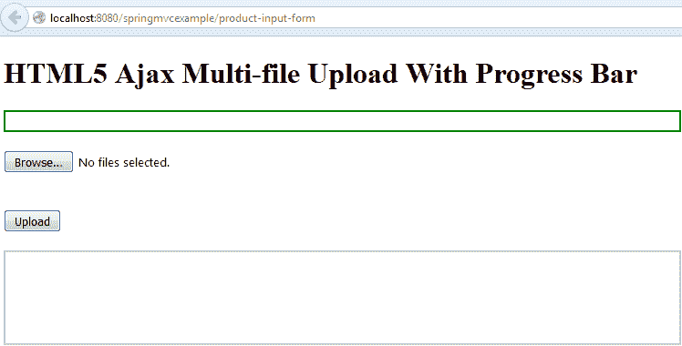
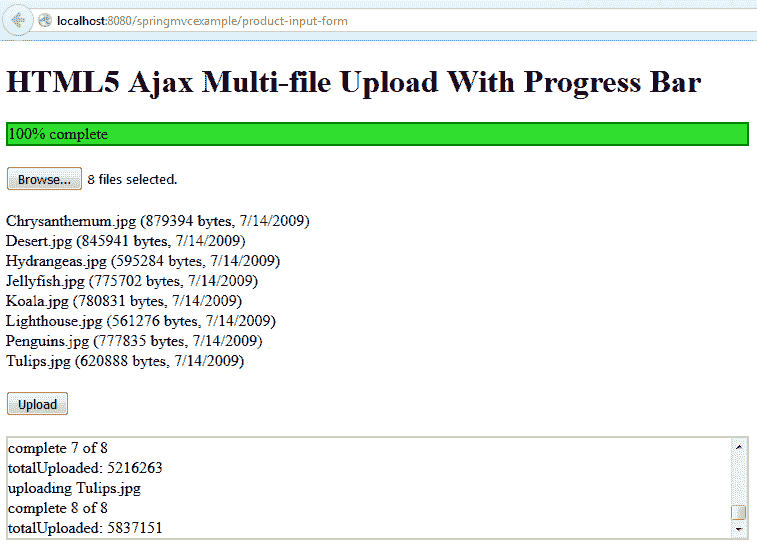

# Spring MVC 在 ajax 和 jquery 中使用进度条上传多个文件

> 原文： [https://howtodoinjava.com/spring-mvc/spring-mvc-multi-file-upload-with-progress-bar/](https://howtodoinjava.com/spring-mvc/spring-mvc-multi-file-upload-with-progress-bar/)

此 **Spring MVC** 示例演示了如何在进度条中使用**多文件上传功能，而服务器端代码是用 Spring MVC 编写的。 我已经修改了 [spring MVC 多文件上传示例](//howtodoinjava.com/spring/spring-mvc/spring-mvc-multi-file-upload-example/)上一篇文章的代码，该示例没有**进度栏**功能，而是在新的显示页面上显示了上传的图像和数据。**

本示例使用纯 JavaScript 代码和 HTML5 控件来构建客户端代码。 如果您想使用任何 JavaScript 库，例如 jQuery 然后请相应地修改代码。

## 1\. 文件上传和进度栏的客户端视图

在下面的`productForm.jsp`中给出了 spring MVC 项目中的 JSP 文件-但它仅包含 HTML 代码，因此如果您愿意，可以轻松地放置相同的代码。

该文件具有 **onUploadProgress（）**函数，该函数显示上传文件的进度。 还有其他功能可以显示上载过程和支持活动的完成情况。

`productForm.jsp`

```java
<!DOCTYPE html>
<html>
<head>
<script>
	var totalFileLength, totalUploaded, fileCount, filesUploaded;

	//To log everything on console
	function debug(s) {
		var debug = document.getElementById('debug');
		if (debug) {
			debug.innerHTML = debug.innerHTML + '<br/>' + s;
		}
	}

	//Will be called when upload is completed
	function onUploadComplete(e) {
		totalUploaded += document.getElementById('files').files[filesUploaded].size;
		filesUploaded++;
		debug('complete ' + filesUploaded + " of " + fileCount);
		debug('totalUploaded: ' + totalUploaded);
		if (filesUploaded < fileCount) {
			uploadNext();
		} else {
			var bar = document.getElementById('bar');
			bar.style.width = '100%';
			bar.innerHTML = '100% complete';
			alert('Finished uploading file(s)');
		}
	}

	//Will be called when user select the files in file control
	function onFileSelect(e) {
		var files = e.target.files; // FileList object
		var output = [];
		fileCount = files.length;
		totalFileLength = 0;
		for (var i = 0; i < fileCount; i++) {
			var file = files[i];
			output.push(file.name, ' (', file.size, ' bytes, ', file.lastModifiedDate.toLocaleDateString(), ')');
			output.push('<br/>');
			debug('add ' + file.size);
			totalFileLength += file.size;
		}
		document.getElementById('selectedFiles').innerHTML = output.join('');
		debug('totalFileLength:' + totalFileLength);
	}

	//This will continueously update the progress bar
	function onUploadProgress(e) {
		if (e.lengthComputable) {
			var percentComplete = parseInt((e.loaded + totalUploaded) * 100	/ totalFileLength);
			var bar = document.getElementById('bar');
			bar.style.width = percentComplete + '%';
			bar.innerHTML = percentComplete + ' % complete';
		} else {
			debug('unable to compute');
		}
	}

	//the Ouchhh !! moments will be captured here
	function onUploadFailed(e) {
		alert("Error uploading file");
	}

	//Pick the next file in queue and upload it to remote server
	function uploadNext() {
		var xhr = new XMLHttpRequest();
		var fd = new FormData();
		var file = document.getElementById('files').files[filesUploaded];
		fd.append("multipartFile", file);
		xhr.upload.addEventListener("progress", onUploadProgress, false);
		xhr.addEventListener("load", onUploadComplete, false);
		xhr.addEventListener("error", onUploadFailed, false);
		xhr.open("POST", "save-product");
		debug('uploading ' + file.name);
		xhr.send(fd);
	}

	//Let's begin the upload process
	function startUpload() {
		totalUploaded = filesUploaded = 0;
		uploadNext();
	}

	//Event listeners for button clicks
	window.onload = function() {
		document.getElementById('files').addEventListener('change', onFileSelect, false);
		document.getElementById('uploadButton').addEventListener('click', startUpload, false);
	}
</script>
</head>
<body>
	<div style="width:55%">  
		<h1>HTML5 Ajax Multi-file Upload With Progress Bar</h1>
		<div id='progressBar' style='height: 20px; border: 2px solid green; margin-bottom: 20px'>
			<div id='bar' style='height: 100%; background: #33dd33; width: 0%'>
			</div>
		</div>
		<form style="margin-bottom: 20px">
			<input type="file" id="files" multiple style="margin-bottom: 20px"/><br/>
			<output id="selectedFiles"></output>
			<input id="uploadButton" type="button" value="Upload" style="margin-top: 20px"/>
		</form>
		<div id='debug' style='height: 100px; border: 2px solid #ccc; overflow: auto'></div>
	</div>
</body>
</html>

```

## 2\. 讨论上传进度功能

上面的代码足以说明问题，您在理解上应该不会遇到任何问题。 但是，让我们总结一下要点：

1.  **“上传”** 按钮不是提交按钮。 因此，单击它不会提交包含表单。 实际上，该脚本使用`XMLHttpRequest`对象进行上传。
2.  `totalFileLength`变量保存要上传的文件的总长度。 `totalUploaded`是到目前为止已上传的字节数。 `fileCount`包含要上传的文件数，`filesUploaded`指示已上传的文件数。
3.  `window.onload()`使用`onFileSelect`功能映射文件输入元素的**更改**事件，并使用`startUpload`映射按钮的**单击**事件。
4.  当用户单击“上传”按钮时，将调用`startUpload`函数，然后依次调用`uploadNext`函数。 `uploadNext`上传所选文件集中的下一个文件。 首先创建一个`XMLHttpRequest`对象和一个`FormData`对象，接下来要上载的文件将附加到该对象。
5.  然后，`uploadNext`函数将`XMLHttpRequest`对象的**进度**事件附加到`onUploadProgress`和`load`事件，并将`error`事件附加到`onUploadComplete`和`onUploadFailed`。
6.  在上载进度期间，会反复调用`onUploadProgress`功能，从而有机会更新进度条。
7.  上载完成后，将调用`onUploadComplete`函数。

## 3\. 多个文件上传控制器和模型类

Spring MVC 文件上传控制器和模型类如下所示：

#### 3.1. Spring MVC 多文件上传控制器

`DemoProductController.java`

```java
package com.howtodoinjava.demo.controller;

import java.io.File;
import java.io.IOException;

import javax.servlet.http.HttpServletRequest;

import org.springframework.stereotype.Controller;
import org.springframework.ui.Model;
import org.springframework.validation.BindingResult;
import org.springframework.web.bind.annotation.ModelAttribute;
import org.springframework.web.bind.annotation.RequestMapping;
import org.springframework.web.multipart.MultipartFile;

import com.howtodoinjava.demo.model.UploadedFile;

@Controller
public class DemoProductController 
{
	@RequestMapping("/save-product")
    public void saveFile(HttpServletRequest servletRequest,
            @ModelAttribute UploadedFile uploadedFile,
            BindingResult bindingResult, Model model) {

        MultipartFile multipartFile = uploadedFile.getMultipartFile();
        String fileName = multipartFile.getOriginalFilename();
        try {
            File file = new File(servletRequest.getServletContext().getRealPath("/image"), fileName);
            multipartFile.transferTo(file);
        } catch (IOException e) {
            e.printStackTrace();
        }
    }

	@RequestMapping(value = "/product-input-form")
    public String inputProduct(Model model) {
        return "productForm";
    }
}

```

#### 3.2. Spring MVC 多文件模型类

`UploadedFile.java`

```java
package com.howtodoinjava.demo.model;

import org.springframework.web.multipart.MultipartFile;

public class UploadedFile {
	private static final long serialVersionUID = 1L;
    private MultipartFile multipartFile;
    public MultipartFile getMultipartFile() {
        return multipartFile;
    }
    public void setMultipartFile(MultipartFile multipartFile) {
        this.multipartFile = multipartFile;
    }
}

```

## 4\. 用于构建示例的其他文件

#### 4.1. web.xml

```java
<?xml version="1.0" encoding="UTF-8"?>
<web-app version="3.1" 
    xmlns="http://xmlns.jcp.org/xml/ns/javaee" 
    xmlns:xsi="http://www.w3.org/2001/XMLSchema-instance" 
    xsi:schemaLocation="http://xmlns.jcp.org/xml/ns/javaee 
	http://xmlns.jcp.org/xml/ns/javaee/web-app_3_1.xsd">

	<display-name>Spring Web MVC Hello World Application</display-name>

	<servlet>
		<servlet-name>spring</servlet-name>
		<servlet-class>
			org.springframework.web.servlet.DispatcherServlet
		</servlet-class>
		<multipart-config>
	        <max-file-size>20848820</max-file-size>
	        <max-request-size>418018841</max-request-size>
	        <file-size-threshold>1048576</file-size-threshold>
	    </multipart-config>    
	</servlet>

	<servlet-mapping>
		<servlet-name>spring</servlet-name>
		<url-pattern>/</url-pattern>
	</servlet-mapping>

</web-app>

```

#### 4.2. spring-servlet.xml

```java
<beans xmlns="http://www.springframework.org/schema/beans"
	xmlns:xsi="http://www.w3.org/2001/XMLSchema-instance" xmlns:context="http://www.springframework.org/schema/context" xmlns:mvc="http://www.springframework.org/schema/mvc"
	xsi:schemaLocation="http://www.springframework.org/schema/beans
        http://www.springframework.org/schema/beans/spring-beans-3.0.xsd
        http://www.springframework.org/schema/context/
        http://www.springframework.org/schema/context/spring-context-3.0.xsd
        http://www.springframework.org/schema/mvc
        http://www.springframework.org/schema/mvc/spring-mvc-3.0.xsd">

	<context:component-scan base-package="com.howtodoinjava.demo" />

	<mvc:resources mapping="/image/**" location="/image/" />

	<bean class="org.springframework.web.servlet.mvc.annotation.AnnotationMethodHandlerAdapter" />
	<bean class="org.springframework.web.servlet.mvc.annotation.DefaultAnnotationHandlerMapping" />

	<bean class="org.springframework.web.servlet.view.InternalResourceViewResolver">
		<property name="prefix" value="/WEB-INF/views/" />
		<property name="suffix" value=".jsp" />
	</bean>

	<bean id="messageSource" class="org.springframework.context.support.ResourceBundleMessageSource">
	    <property name="basename" value="messages" />
	</bean>

	<bean id="multipartResolver" class="org.springframework.web.multipart.support.StandardServletMultipartResolver"></bean>

</beans>

```

## 5\. Spring MVC 多个文件上传，带有进度条演示

*   Hit the URL: `http://localhost:8080/springmvcexample/product-input-form`

    下面的屏幕将在浏览器上加载。

    

    Multi-file Upload With Progress Bar – Input Form

*   选择文件，然后单击上载按钮
*   If everything goes right, then you will get upload progress bar and uploaded file information as below.

    

    Multi-file Upload With Progress Bar – Upload Success

请给我发送有关 **Spring mvc 多文件上传的问题和问题，并提供进度条示例**。

学习愉快！