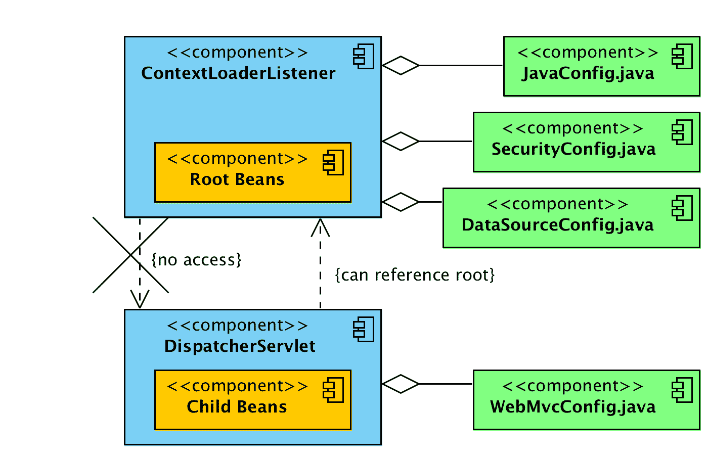

# `ContextLoaderListener`与`DispatcherServlet`

> 原文： [https://howtodoinjava.com/spring-mvc/contextloaderlistener-vs-dispatcherservlet/](https://howtodoinjava.com/spring-mvc/contextloaderlistener-vs-dispatcherservlet/)

在基于 XML 的 Spring MVC 配置中，您必须在`web.xml`文件中看到两个声明，即`ContextLoaderListener`和`DispatcherServlet`。 让我们尝试了解它们在框架中的用途及其差异。

## 根和子上下文

在进一步阅读之前，请了解：

*   Spring 一次可以有多个上下文。 其中之一将是根上下文，而所有其他上下文将是子上下文。
*   所有子上下文都可以访问在根上下文中定义的 Bean。 但事实并非如此。 根上下文无法访问子上下文 Bean。

## `DispatcherServlet` – 子应用程序上下文

[`DispatcherServlet`](https://docs.spring.io/spring-framework/docs/current/javadoc-api/org/springframework/web/servlet/DispatcherServlet.html)本质上是 Servlet（它扩展了`HttpServlet`），其主要目的是处理与配置的 URL 模式匹配的传入 Web 请求。 它采用传入的 URI 并找到控制器和视图的正确组合。 因此它是前端控制器。

在 spring 配置中定义`DispatcherServlet`时，您将使用`contextConfigLocation`属性为 XML 文件提供控制器类，视图映射等条目。

`web.xml`

```java
<servlet>
	<servlet-name>employee-services</servlet-name>
	<servlet-class>org.springframework.web.servlet.DispatcherServlet</servlet-class>
	<init-param>
		<param-name>contextConfigLocation</param-name>
		<param-value>classpath:employee-services-servlet.xml</param-value>
	</init-param>
	<load-on-startup>1</load-on-startup>
</servlet>

```

如果不提供配置文件，则它将使用`[servlet_name]-servlet.xml`加载其自己的配置文件。 Web 应用程序可以定义任意数量的`DispatcherServlet`条目。 每个 servlet 将在其自己的名称空间中运行，并使用映射，处理器等加载其自己的应用程序上下文。

这意味着每个`DispatcherServlet`都可以访问 Web 应用程序上下文。 **在指定之前，每个`DispatcherServlet`都会创建自己的内部 Web 应用程序上下文**。

从Spring 3.x开始，方法`DispatcherServlet(WebApplicationContext webApplicationContext)`使用给定的 Web 应用程序上下文创建一个新的`DispatcherServlet`。 只有通过`ServletContext.addServlet(java.lang.String, java.lang.String)`API支持，才可以在 Servlet 3.x 环境中使用。

## `ContextLoaderListener` – 根应用程序上下文

[**`ContextLoaderListener`**](https://docs.spring.io/spring-framework/docs/current/javadoc-api/org/springframework/web/context/ContextLoaderListener.html)创建根应用程序上下文，并将与所有`DispatcherServlet`上下文创建的子上下文共享。 在`web.xml`中只能有一个条目。

`web.xml`

```java
<listener>
  <listener-class>
    org.springframework.web.context.ContextLoaderListener
  </listener-class>
</listener>

<context-param>
  <param-name>contextConfigLocation</param-name>
  <param-value>/WEB-INF/spring/applicationContext.xml</param-value>
</context-param>

```

`ContextLoaderListener`的上下文包含全局可见的 Bean，例如服务，存储库，基础结构 Bean 等。创建根应用程序上下文后，它作为属性存储在`ServletContext`中，名称为：

`org/springframework/web/context/ContextLoader.java`

```java
servletContext.setAttribute(WebApplicationContext.ROOT_WEB_APPLICATION_CONTEXT_ATTRIBUTE, this.context);

//Where attibute is defined in /org/springframework/web/context/WebApplicationContext.java as

WebApplicationContext.ROOT_WEB_APPLICATION_CONTEXT_ATTRIBUTE = WebApplicationContext.class.getName() + ".ROOT";

```

要在 Spring 控制器中获取根应用程序上下文，可以使用`WebApplicationContextUtils`类。

`Controller.java`

```java
@Autowired
ServletContext context; 

ApplicationContext ac = WebApplicationContextUtils.getWebApplicationContext(context);

if(ac == null){
	return "root application context is null";
}     

```

## `ContextLoaderListener`与`DispatcherServlet`

下图在单个视图中描述了整个关系。



`ContextLoaderListener` vs `DispatcherServlet`

1.  `ContextLoaderListener`创建根应用程序上下文。
2.  `DispatcherServlet`条目为每个 Servlet 条目创建一个子应用程序上下文。
3.  子上下文可以访问在根上下文中定义的 bean。
4.  根上下文中的 Bean 无法（直接）访问子上下文中的 Bean。
5.  所有上下文都添加到`ServletContext`中。
6.  您可以使用`WebApplicationContextUtils`类访问根上下文。

## 总结

通常，您将在`DispatcherServlet`上下文中定义所有与 MVC 相关的 bean（控制器和视图等），并在`ContextLoaderListener`的根上下文中定义所有跨领域的 bean，例如安全性，事务，服务等。

通常，此设置可以正常工作，因为很少需要访问任何 MVC bean（从子上下文）到与安全相关的类（从根上下文）。 通常，我们在 MVC 类上使用安全 bean，并且他们可以通过上述设置来访问它。

学习愉快！