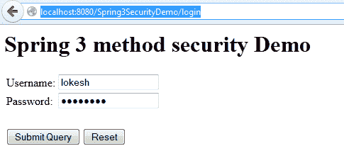
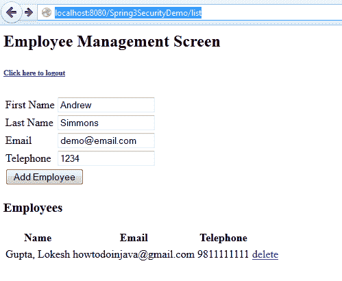
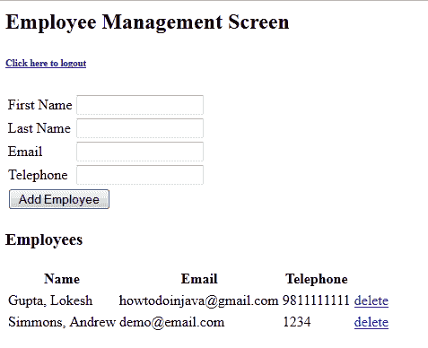
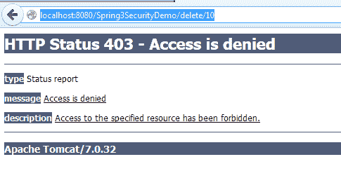
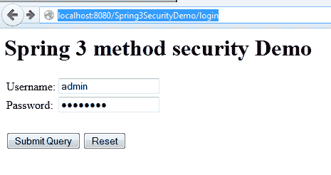
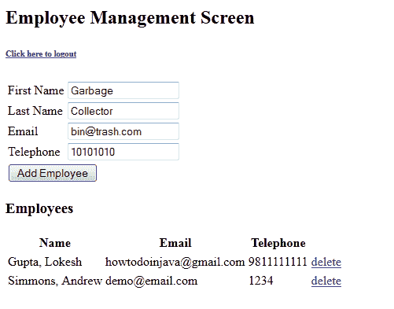
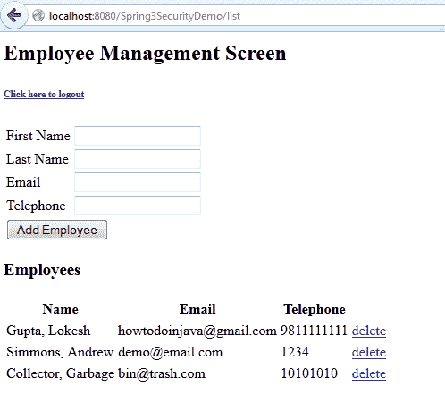
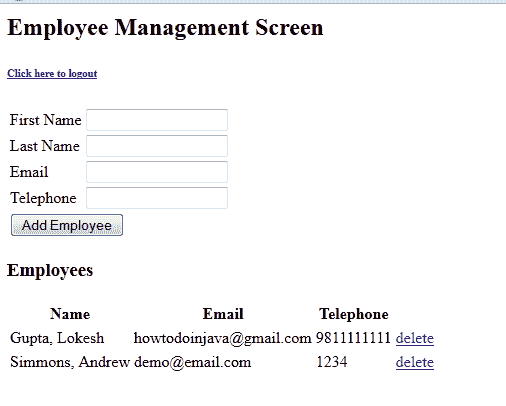
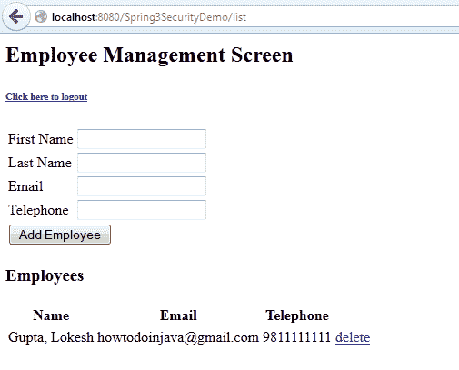

# 具有保护切入点的 Spring 方法安全性

> 原文： [https://howtodoinjava.com/spring-security/xml-config-based-method-level-spring-security-using-protect-pointcut/](https://howtodoinjava.com/spring-security/xml-config-based-method-level-spring-security-using-protect-pointcut/)

在方法级别安全性的先前示例中，我们使用`@PreAuthorize`注解添加了安全性。 注解也是在任何方法上增加安全性的好方法和快速方法。 但是有一个问题，它将您的应用程序代码紧紧地耦合到 Spring 上。 至少在理论上就[**最佳做法**](https://howtodoinjava.com/java-best-practices/)而言，这都是不推荐的。 推荐的方法是将所有此类安全性定义添加到 xml 配置文件中。 这样，您始终可以更改实现而无需触碰源代码。

## 总览

在此示例中，我使用了典型的员工管理屏幕。 有两个基本操作，`ADD`和`DELETE`。

1.  添加要求经过身份验证的用户具有`"ROLE_USER"`或`"ROLE_ADMIN"`。
2.  删除受到更多保护，并且需要管理员访问权限，即仅允许`ROLE_ADMIN`删除用户。

我在应用程序中有两个用户，即`admin`和`lokesh`。 `admin`用户同时具有“ `ROLE_USER`”和“ `ROLE_ADMIN`”角色，但另一个用户`lokesh`仅具有“ `ROLE_USER`”访问权限。

`applicationContext.xml`

```java
<user-service>
	<user name="lokesh" password="password" authorities="ROLE_USER" />
	<user name="admin"  password="password" authorities="ROLE_USER,ROLE_ADMIN" />
</user-service>

```

> 上面的安全配置将允许两个用户都添加用户，但是只有`admin`才能够删除用户。

让我们看一下示例应用程序中的主要功能点。

## 使用保护切入点的基于 XML 的 Spring Security

完整的 XML 配置如下所示：

`applicationContext.xml`

```java
<?xml version="1.0" encoding="UTF-8"?>
<beans:beans xmlns="http://www.springframework.org/schema/security"
	xmlns:beans="http://www.springframework.org/schema/beans" 
	xmlns:xsi="http://www.w3.org/2001/XMLSchema-instance"
	xsi:schemaLocation="http://www.springframework.org/schema/beans
	http://www.springframework.org/schema/beans/spring-beans-3.0.xsd
	http://www.springframework.org/schema/security
	http://www.springframework.org/schema/security/spring-security-3.0.3.xsd">

	<global-method-security>
		<protect-pointcut expression="execution(* com.howtodoinjava.service.*Impl.add*(..))" access="ROLE_USER"/>
		<protect-pointcut expression="execution(* com.howtodoinjava.service.*Impl.delete*(..))" access="ROLE_ADMIN"/>
	</global-method-security>

	<http auto-config="false"  use-expressions="true">
		<intercept-url pattern="/login" access="permitAll" />
		<intercept-url pattern="/logout" access="permitAll" />
		<intercept-url pattern="/accessdenied" access="permitAll" />
		<intercept-url pattern="/**" access="hasRole('ROLE_USER')" />
		<form-login login-page="/login" default-target-url="/list" authentication-failure-url="/accessdenied" />
		<logout logout-success-url="/logout" />
	</http>

	<authentication-manager alias="authenticationManager">
        <authentication-provider>
            <user-service>
                <user name="lokesh" password="password" authorities="ROLE_USER" />
                <user name="admin" password="password" authorities="ROLE_USER,ROLE_ADMIN" />
            </user-service>
        </authentication-provider>
    </authentication-manager>

    <beans:bean id="employeeDAO" class="com.howtodoinjava.dao.EmployeeDaoImpl" />
    <beans:bean id="employeeManager" class="com.howtodoinjava.service.EmployeeManagerImpl" />

</beans:beans>

```

## 应用安全性的管理器类

`EmployeeManagerImpl.java`

```java
package com.howtodoinjava.service;

import java.util.List;

import org.springframework.beans.factory.annotation.Autowired;
import org.springframework.stereotype.Service;
import org.springframework.transaction.annotation.Transactional;

import com.howtodoinjava.dao.EmployeeDAO;
import com.howtodoinjava.entity.EmployeeEntity;

@Service
public class EmployeeManagerImpl implements EmployeeManager {

	@Autowired
    private EmployeeDAO employeeDAO;

	@Override
	@Transactional
	public void addEmployee(EmployeeEntity employee) {
		employeeDAO.addEmployee(employee);
	}

	@Override
	@Transactional
	public List<EmployeeEntity> getAllEmployees() {
		return employeeDAO.getAllEmployees();
	}

	@Override
	@Transactional
	public void deleteEmployee(Integer employeeId) {
		employeeDAO.deleteEmployee(employeeId);
	}

	public void setEmployeeDAO(EmployeeDAO employeeDAO) {
		this.employeeDAO = employeeDAO;
	}
}

```

我跳过了其余代码，因为它与以前的使用注解的[安全示例](https://howtodoinjava.com/spring/spring-security/spring-3-method-level-security-example-using-preauthorize-and-secured/)完全相同。 另外，如果需要引用任何内容，则可以下载源代码。

## 测试应用

1）使用用户`"lokesh"`登录



2）将员工添加到列表中



3）用户添加成功



4）尝试删除员工。 访问被拒绝。



5）用管理员用户登录



6）将员工添加到列表中



7）用户添加成功



8）尝试删除员工。 员工已删除。



9）尝试删除其他员工。 员工已删除。



## 源代码下载

[**下载源码**](https://drive.google.com/file/d/0B7yo2HclmjI4M0hha2JHWXdHOTQ/edit?usp=sharing)

**学习愉快！**