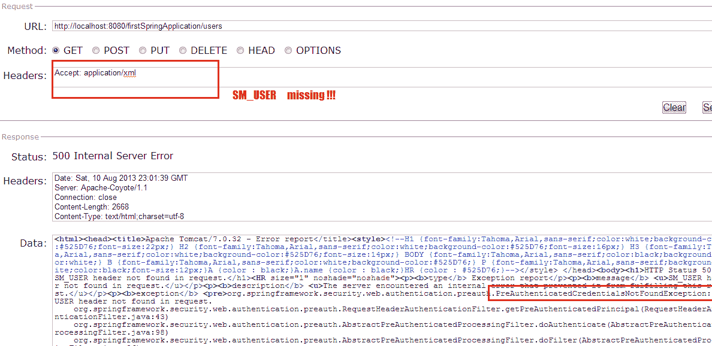
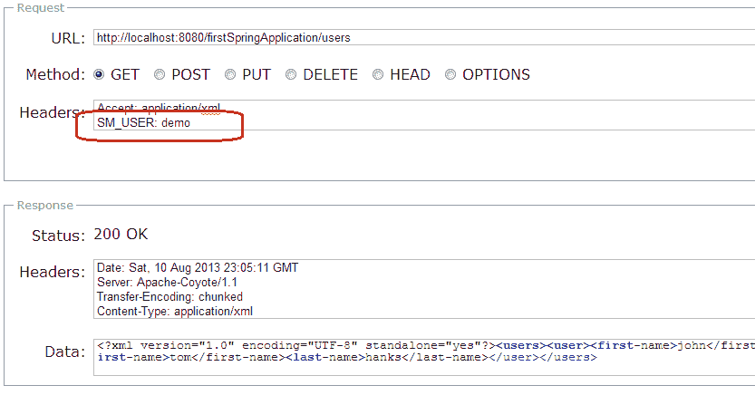

# Spring Security Siteminder 预身份验证示例

> 原文： [https://howtodoinjava.com/spring-security/spring-3-security-siteminder-pre-authentication-example/](https://howtodoinjava.com/spring-security/spring-3-security-siteminder-pre-authentication-example/)

到目前为止，我们已经了解了使用[**登录表单安全性**](//howtodoinjava.com/spring/spring-security/login-form-based-spring-3-security-example/) ， [**自定义用户详细信息安全性**](//howtodoinjava.com/spring/spring-security/custom-userdetailsservice-example-for-spring-3-security/)以及更多此类与安全性相关的概念。 在这篇文章中，我举了一个场景示例，其中已经通过任何第三方应用程序或工具对使用进行了身份验证，例如[**站点监视程序**](https://docs.oracle.com/cd/E19944-01/819-4520/SiteMinder.html)，这是组中多个应用程序之间非常常见的接口。

在这种情况下，**用户已在任何其他应用程序**中进行了预身份验证，并使用网站提示器进入您的 Web 应用程序。 网站管理员会发送有关预认证用户的请求标头，您可以利用该标头进一步授权应用程序内的用户。 您**不需要进一步验证用户**，只需从数据库验证用户角色并在应用程序内部提供适当的访问权限即可。

> 请记住，网站管理员仅是示例，实际上，您可以使用任何第三方
> 应用程序来获得预先认证的用户。 在每种情况下，仅请求标头都会更改。

让我们逐步学习本教程。

## 步骤 1）Maven 依赖

我使用 [**maven**](//howtodoinjava.com/maven/) 作为运行时依赖项，因此提供`pom.xml`。 如果使用的是 ANT，则下载相应的 JAR，并将其添加到类路径中。

`pom.xml`

```java
<properties>
	<spring.version>3.0.5.RELEASE</spring.version>
	<jackson-mapper-asl.version>1.9.9</jackson-mapper-asl.version>
    <jaxb-api.version>2.2.7</jaxb-api.version>
  </properties>
  <dependencies>
    <!-- Spring 3 dependencies -->
	<dependency>
		<groupId>org.springframework</groupId>
		<artifactId>spring-core</artifactId>
		<version>${spring.version}</version>
		<scope>runtime</scope>
	</dependency>
	<dependency>
		<groupId>org.springframework</groupId>
		<artifactId>spring-web</artifactId>
		<version>${spring.version}</version>
		<scope>runtime</scope>
	</dependency>
	<dependency>
		<groupId>org.springframework</groupId>
		<artifactId>spring-webmvc</artifactId>
		<version>${spring.version}</version>
		<scope>runtime</scope>
	</dependency>
	<!-- Spring Security -->
	<dependency>
	    <groupId>org.springframework.security</groupId>
	    <artifactId>spring-security-core</artifactId>
	    <version>${spring.version}</version>
	    <type>jar</type>
	    <scope>runtime</scope>
	</dependency>
	<dependency>
	    <groupId>org.springframework.security</groupId>
	    <artifactId>spring-security-web</artifactId>
	    <version>${spring.version}</version>
	    <type>jar</type>
	    <scope>runtime</scope>
	</dependency>
	<dependency>
	    <groupId>org.springframework.security</groupId>
	    <artifactId>spring-security-config</artifactId>
	    <version>${spring.version}</version>
	    <type>jar</type>
	    <scope>runtime</scope>
	</dependency>
	<dependency>
	    <groupId>org.springframework.security</groupId>
	    <artifactId>spring-security-taglibs</artifactId>
	    <version>${spring.version}</version>
	    <type>jar</type>
	    <scope>runtime</scope>
	</dependency>
  </dependencies>

```

## 步骤 2）更新`web.xml`文件

`web.xml`文件中没有太多内容。 只需添加**上下文配置位置**和 **Spring Security 相关​​的过滤器映射**即可。

`web.xml`

```java
<web-app>
  <display-name>www.howtodoinjava.com</display-name>

  	<servlet>
		<servlet-name>spring-mvc</servlet-name>
		<servlet-class>org.springframework.web.servlet.DispatcherServlet</servlet-class>
		<load-on-startup>1</load-on-startup>
	</servlet>

	<servlet-mapping>
		<servlet-name>spring-mvc</servlet-name>
		<url-pattern>/*</url-pattern>
	</servlet-mapping>

	<context-param>
		<param-name>contextConfigLocation</param-name>
		<param-value>/WEB-INF/spring-mvc-servlet.xml</param-value>
	</context-param>

	<filter>
	    <filter-name>springSecurityFilterChain</filter-name>
	    <filter-class>org.springframework.web.filter.DelegatingFilterProxy</filter-class>
	</filter>
	<filter-mapping>
        <filter-name>springSecurityFilterChain</filter-name>
        <url-pattern>/*</url-pattern>
    </filter-mapping>

	<listener>
		<listener-class>org.springframework.web.context.ContextLoaderListener</listener-class>
	</listener>
</web-app>

```

## 步骤 3）Spring Security 配置

这是最重要的步骤，因为在这里我们将配置与验证前安全性相关的映射。 让我们看一下文件：

`spring-mvc-servlet.xml`

```java
<beans xmlns="http://www.springframework.org/schema/beans"
    xmlns:security="http://www.springframework.org/schema/security"
    xmlns:xsi="http://www.w3.org/2001/XMLSchema-instance" xmlns:context="http://www.springframework.org/schema/context"
    xmlns:mvc="http://www.springframework.org/schema/mvc"
    xmlns:aop="http://www.springframework.org/schema/aop"
    xsi:schemaLocation="http://www.springframework.org/schema/mvc http://www.springframework.org/schema/mvc/spring-mvc-3.0.xsd
        http://www.springframework.org/schema/beans http://www.springframework.org/schema/beans/spring-beans-2.5.xsd
        http://www.springframework.org/schema/context http://www.springframework.org/schema/context/spring-context-2.5.xsd
        http://www.springframework.org/schema/aop http://www.springframework.org/schema/aop/spring-aop-3.0.xsd
        http://www.springframework.org/schema/security http://www.springframework.org/schema/security/spring-security-3.0.3.xsd">

     <!-- Annotation are configuring the application -->
     <mvc:annotation-driven/>

     <!-- Scan this package for all config annotations -->
	<context:component-scan base-package="com.howtodoinjava.web" />

	<security:http use-expressions="true" auto-config="false" entry-point-ref="http403EntryPoint">
    	<!-- Additional http configuration omitted -->
    	<security:intercept-url pattern="/**" access="hasRole('ROLE_USER')" />
    	<security:custom-filter position="PRE_AUTH_FILTER" ref="siteminderFilter" />
  	</security:http>

    <bean id="siteminderFilter" class="org.springframework.security.web.authentication.preauth.RequestHeaderAuthenticationFilter">
	    <property name="principalRequestHeader" value="SM_USER"/>
	    <property name="authenticationManager" ref="authenticationManager" />
	</bean>

  	<bean id="preauthAuthProvider" class="org.springframework.security.web.authentication.preauth.PreAuthenticatedAuthenticationProvider">
	    <property name="preAuthenticatedUserDetailsService">
	      	<bean id="userDetailsServiceWrapper"  class="org.springframework.security.core.userdetails.UserDetailsByNameServiceWrapper">
	        	<property name="userDetailsService" ref="customUserDetailsService"/>
	      	</bean>
	    </property>
    </bean>

    <security:authentication-manager alias="authenticationManager">
      	<security:authentication-provider ref="preauthAuthProvider" />
    </security:authentication-manager>	

    <bean id="customUserDetailsService" class="com.howtodoinjava.security.CustomUserDetailsService"></bean>
    <bean id="http403EntryPoint" class="org.springframework.security.web.authentication.Http403ForbiddenEntryPoint"></bean>

</beans>

```

让我们了解以下配置：

1.  `mvc：annotation-driven`用于告诉 spring 它需要在`context：component-scan`中指定的基本包中扫描注解，以搜索资源映射。
2.  `security：http`配置指定与安全性相关的配置和选项。 `use-expressions`告诉您，与`security: intercept-url`中的`access`属性匹配时，允许使用表达式，并应对其进行解析。
3.  `security：custom-filter`指定了自定义过滤器的定义，该过滤器将被调用以验证用户的有效性。
4.  `PRE_AUTH_FILTER`确保在其他身份验证/授权处理之前将调用此过滤器。 我为此定义了一个`siteminder`过滤器。 您可以将其命名为其他名称。
5.  `principalRequestHeader`很重要，因为一旦用户从另一个应用程序进入应用程序，它将检查请求标头属性。 因此，请第三方供应器提供的此标头在此处集成。
6.  `authenticationManager`最终使用了我在`com.howtodoinjava.security.CustomUserDetailsS​​ervice`类中编写的`customUserDetailsS​​ervice`。此类实现[`UserDetailsS​​ervice`](http://static.springsource.org/spring-security/site/docs/3.0.x/apidocs/org/springframework/security/core/userdetails/UserDetailsService.html)接口，并具有一种方法`loadUserByUsername()`。 此方法必须返回类型为[`org.springframework.security.core.userdetails.UserDetails`](http://static.springsource.org/spring-security/site/docs/3.0.x/apidocs/org/springframework/security/core/userdetails/UserDetails.html)的经过身份验证的用户界面。 该对象将具有其他授权详细信息，例如用户角色，将用于进一步的安全性。

## 步骤 4）编写自定义`UserDetailsS​​ervice`类

此类将获取从第三方应用程序传递的用户名，并将用户名作为请求标头传递，例如在我们的情况下为`SM_USER`。

`CustomUserDetailsService.java`

```java
package com.howtodoinjava.security;

import org.springframework.dao.DataAccessException;
import org.springframework.security.core.GrantedAuthority;
import org.springframework.security.core.authority.GrantedAuthorityImpl;
import org.springframework.security.core.userdetails.User;
import org.springframework.security.core.userdetails.UserDetails;
import org.springframework.security.core.userdetails.UserDetailsService;
import org.springframework.security.core.userdetails.UsernameNotFoundException;

public class CustomUserDetailsService implements UserDetailsService
{
	public UserDetails loadUserByUsername(String username)
	        throws UsernameNotFoundException, DataAccessException
    {
		System.out.println("username recieved :: " + username);
		@SuppressWarnings("deprecation")

		//Get this user details from database and set its roles also here

		UserDetails user = new User(username, "password", true, true, true, true,
				new GrantedAuthority[]{ new GrantedAuthorityImpl("ROLE_USER") });
		return user;
    }
}

```

## 步骤 5）编写安全资源以进行验证

为了简单起见，我编写了两个非常基本的类。 我将尝试在没有请求标头“ `SM_USER`”的情况下访问它们。

#### `DemoController.java`

`DemoController.java`

```java
package com.howtodoinjava.web;

@Controller
@RequestMapping("/users")
public class DemoController 
{
	@RequestMapping(method = RequestMethod.GET, value="/{id}", headers="Accept=application/xml")
	public @ResponseBody User getUserById(@PathVariable String id) 
	{
		User user = new User();
		user.setFirstName("john");
		user.setLastName("adward");
		return user;
	}

	@RequestMapping(method = RequestMethod.GET,  headers="Accept=application/xml")
	public @ResponseBody Users getAllUsers() 
	{
		User user1 = new User();
		user1.setFirstName("john");
		user1.setLastName("adward");

		User user2 = new User();
		user2.setFirstName("tom");
		user2.setLastName("hanks");

		Users users = new Users();
		users.setUsers(new ArrayList<User>());
		users.getUsers().add(user1);
		users.getUsers().add(user2);

		return users;
	}
}

```

#### `Users.java`

`Users.java`

```java
@XmlRootElement(name="users")
@XmlAccessorType(XmlAccessType.NONE)
public class Users 
{
	@XmlElement(name="user")
	private Collection<User> users;

	public Collection<User> getUsers() {
		return users;
	}

	public void setUsers(Collection<User> users) {
		this.users = users;
	}
}

```

`User.java`

`User.java`

```java
@XmlRootElement(name="user")
@XmlAccessorType(XmlAccessType.NONE)
public class User {

	@XmlElement(name="first-name")
	private String firstName;

	@XmlElement(name="last-name")
	private String lastName;

	public String getFirstName() {
		return firstName;
	}
	public void setFirstName(String firstName) {
		this.firstName = firstName;
	}
	public String getLastName() {
		return lastName;
	}
	public void setLastName(String lastName) {
		this.lastName = lastName;
	}
}

```

## 步骤 6）示范

让我们将应用程序部署在 tomcat 服务器中并进行测试。

#### 情况 1：不带`SM_USER`请求头

这将引发以下异常：

```java
org.springframework.security.web.authentication.preauth.PreAuthenticatedCredentialsNotFoundException: SM_USER header not found in request.
	at org.springframework.security.web.authentication.preauth.RequestHeaderAuthenticationFilter.getPreAuthenticatedPrincipal(RequestHeaderAuthenticationFilter.java:43)
	at org.springframework.security.web.authentication.preauth.AbstractPreAuthenticatedProcessingFilter.doAuthenticate(AbstractPreAuthenticatedProcessingFilter.java:98)
	at org.springframework.security.web.authentication.preauth.AbstractPreAuthenticatedProcessingFilter.doFilter(AbstractPreAuthenticatedProcessingFilter.java:86)
	at org.springframework.security.web.FilterChainProxy$VirtualFilterChain.doFilter(FilterChainProxy.java:380)
	at org.springframework.security.web.authentication.logout.LogoutFilter.doFilter(LogoutFilter.java:105)
	at org.springframework.security.web.FilterChainProxy$VirtualFilterChain.doFilter(FilterChainProxy.java:380)
	at org.springframework.security.web.context.SecurityContextPersistenceFilter.doFilter(SecurityContextPersistenceFilter.java:79)
	at org.springframework.security.web.FilterChainProxy$VirtualFilterChain.doFilter(FilterChainProxy.java:380)
	at org.springframework.security.web.FilterChainProxy.doFilter(FilterChainProxy.java:169)
	at org.springframework.web.filter.DelegatingFilterProxy.invokeDelegate(DelegatingFilterProxy.java:237)

```



Spring security 预认证错误

#### 情况 2：带`SM_USER`请求标头

这次，用户将可以访问资源。



Spring security 预认证成功

要下载以上教程的源代码，请点击以下下载链接。

[**下载源码**](https://docs.google.com/file/d/0B7yo2HclmjI4a080SnpaLS0wcjg/edit?usp=sharing)

学习愉快！