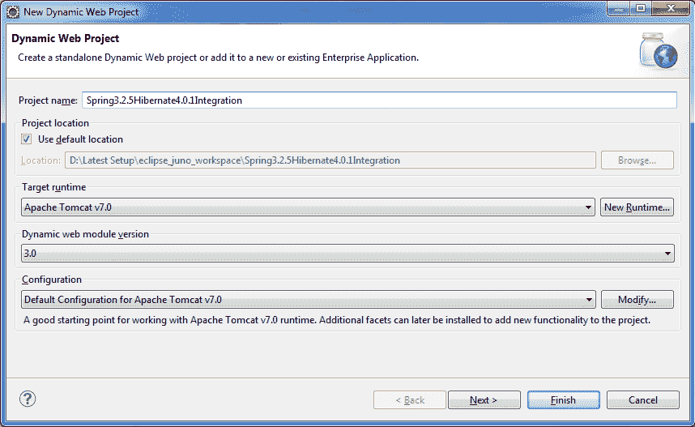
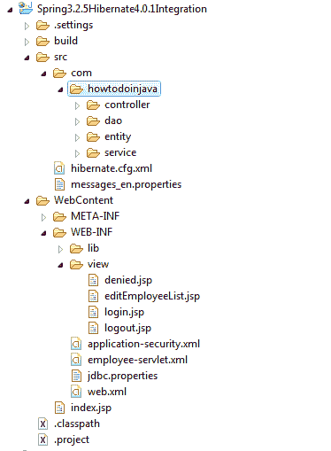
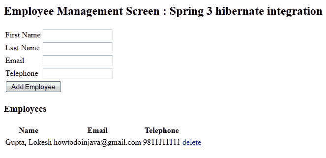

# Spring 3 和 Hibernate 4 集成示例教程

> 原文： [https://howtodoinjava.com/spring-orm/spring3-hibernate4-integration-example/](https://howtodoinjava.com/spring-orm/spring3-hibernate4-integration-example/)

如果您浏览了我以前的文章，该文章也是同一主题，即 [**Spring 3 + Hibernate 集成**](//howtodoinjava.com/spring/spring-orm/spring-3-and-hibernate-integration-tutorial-with-example/ "Spring 3 and hibernate integration tutorial with example") 。 我在那篇文章中收到了很多评论和反馈，其中大部分是因为人们试图在现有项目中使用代码/依赖关系，或者他们没有使用 Maven 来构建项目。

在这两种情况下，正确识别和使用项目依赖项仍然是主要挑战。 因此，我决定写另一篇根本不使用 Maven 的文章。 如果确实如此，我已经在项目源代码本身中添加了所有必需的 jar 文件。

此外，我具有 Spring 的最新版本，即 3.0.5 至 3.2.5.RELEASE。

[**Download sourcecode**](https://drive.google.com/file/d/0B7yo2HclmjI4Y3owV0FDaXBvU2c/edit?usp=sharing "Spring 3.2.5.RELEASE and Hibernate 4 Integration Example sourcecode")

## 1.开发环境

1.  Eclipse Juno 发布
2.  JDK 1.6
3.  休眠 4.0.1
4.  春天 3.2.5。发布
5.  MySQL 数据库
6.  雄猫 7

对于那些直接来到本文的人，让我们逐步讲解**春季休眠集成示例**。

## 2.数据库架构

在开始采取行动之前，请确保您已经使用下表创建了数据库模式：

```java
CREATE TABLE EMPLOYEE
(
	ID INT PRIMARY KEY AUTO_INCREMENT,
	FIRSTNAME VARCHAR(30),
	LASTNAME VARCHAR(30),
	TELEPHONE VARCHAR(15),
	EMAIL VARCHAR(30),
	CREATED TIMESTAMP DEFAULT NOW()
);

```

## 3.创建 Maven Eclipse 动态 Web 项目

这不是困难的一步，而是重要的一步。 请确保您正在创建“ Web 应用程序”而不是简单的“ java 项目”。 我已经创建了名称为“ **Spring3.2.5Hibernate4.0.1Integration** ”的项目。



## 4.创建配置

我不会在本节中强调更多，因为我没有使用上一篇文章中已经存在的新代码或函数集。 因此，请访问先前的 [**休眠+春季 3 集成示例**](//howtodoinjava.com/spring/spring-orm/spring-3-and-hibernate-integration-tutorial-with-example/ "Spring 3 and hibernate integration tutorial with example") 的示例，以获取更多详细信息。

由于春季版本的改进，我想在这里给出修改后的配置。

```java
<?xml  version="1.0" encoding="UTF-8"?>
<beans xmlns="http://www.springframework.org/schema/beans"
    xmlns:xsi="http://www.w3.org/2001/XMLSchema-instance"
    xmlns:aop="http://www.springframework.org/schema/aop"
    xmlns:context="http://www.springframework.org/schema/context"
    xmlns:jee="http://www.springframework.org/schema/jee"
    xmlns:lang="http://www.springframework.org/schema/lang"
    xmlns:p="http://www.springframework.org/schema/p"
    xmlns:tx="http://www.springframework.org/schema/tx"
    xmlns:util="http://www.springframework.org/schema/util"
    xsi:schemaLocation="http://www.springframework.org/schema/beans http://www.springframework.org/schema/beans/spring-beans.xsd
        http://www.springframework.org/schema/aop http://www.springframework.org/schema/aop/spring-aop.xsd
        http://www.springframework.org/schema/context http://www.springframework.org/schema/context/spring-context.xsd
        http://www.springframework.org/schema/jee http://www.springframework.org/schema/jee/spring-jee.xsd
        http://www.springframework.org/schema/lang http://www.springframework.org/schema/lang/spring-lang.xsd
        http://www.springframework.org/schema/tx http://www.springframework.org/schema/tx/spring-tx.xsd
        http://www.springframework.org/schema/util http://www.springframework.org/schema/util/spring-util.xsd">

    <context:annotation-config />
    <context:component-scan base-package="com.howtodoinjava.controller" />

    <bean id="jspViewResolver"
        class="org.springframework.web.servlet.view.InternalResourceViewResolver">
        <property name="viewClass"
            value="org.springframework.web.servlet.view.JstlView" />
        <property name="prefix" value="/WEB-INF/view/" />
        <property name="suffix" value=".jsp" />
    </bean>

    <bean id="messageSource"
        class="org.springframework.context.support.ReloadableResourceBundleMessageSource">
        <property name="basename" value="classpath:messages" />
        <property name="defaultEncoding" value="UTF-8" />
    </bean>
    <bean id="propertyConfigurer"
        class="org.springframework.beans.factory.config.PropertyPlaceholderConfigurer"
        p:location="/WEB-INF/jdbc.properties" />

    <bean id="dataSource"
        class="org.apache.commons.dbcp.BasicDataSource" destroy-method="close"
        p:driverClassName="${jdbc.driverClassName}"
        p:url="${jdbc.databaseurl}" p:username="${jdbc.username}"
        p:password="${jdbc.password}" />

    <bean id="sessionFactory"
        class="org.springframework.orm.hibernate4.LocalSessionFactoryBean">
        <property name="dataSource" ref="dataSource" />
        <property name="configLocation">
            <value>classpath:hibernate.cfg.xml</value>
        </property>
        <property name="hibernateProperties">
            <props>
                <prop key="hibernate.dialect">${jdbc.dialect}</prop>
                <prop key="hibernate.show_sql">true</prop>
            </props>
        </property>
    </bean>

    <bean id="employeeDAO" class="com.howtodoinjava.dao.EmployeeDaoImpl"></bean>
    <bean id="employeeManager" class="com.howtodoinjava.service.EmployeeManagerImpl"></bean>

    <tx:annotation-driven transaction-manager="transactionManager"/>
    <bean id="transactionManager"
        class="org.springframework.orm.hibernate4.HibernateTransactionManager">
        <property name="sessionFactory" ref="sessionFactory" />
    </bean>

</beans>

```

## 5.下载并复制 lib 文件夹中所需的 jar 文件

以前的帖子是关于 Maven 的，所以很多工作似乎都是多余的。 但是，对于使用 ANT 的用户，他们必须使用下载的 jar。 好吧，这一次，我已经为您完成了这项工作。 以下是此项目中使用的 jar 文件列表。

```java
antlr-2.7.7.jar
aopalliance-1.0.jar
commons-collections-3.2.1.jar
commons-dbcp-1.4.jar
commons-lang-2.5.jar
commons-logging-1.1.1.jar
commons-pool-1.5.4.jar
dom4j-1.6.1.jar
hibernate-commons-annotations-3.2.0.Final.jar
hibernate-core-4.0.1.Final.jar
hibernate-jpa-2.1-api-1.0.0.Draft-16.jar
javassist-3.12.1.GA.jar
jboss-logging-3.1.1.GA.jar
jstl-1.2.jar
jta-1.1.jar
junit-4.11.jar
mysql-connector-java-5.1.9.jar
slf4j-api-1.6.1.jar
spring-aop-3.2.5.RELEASE.jar
spring-beans-3.2.5.RELEASE.jar
spring-context-3.2.5.RELEASE.jar
spring-context-support-3.2.5.RELEASE.jar
spring-core-3.2.5.RELEASE.jar
spring-expression-3.2.5.RELEASE.jar
spring-jdbc-3.2.5.RELEASE.jar
spring-orm-3.2.5.RELEASE.jar
spring-tx-3.2.5.RELEASE.jar
spring-web-3.2.5.RELEASE.jar
spring-webmvc-3.2.5.RELEASE.jar
standard-1.1.2.jar

```

将上述所有 jar 文件复制到 lib 文件夹中。

完成此步骤后，您的项目应如下所示：



spring 3 project hierarchy

## 6\. Spring Hibernate 集成示例演示

结果将类似于以前的帖子。 为了提醒您，屏幕将如下所示：

URL：`http://localhost:8080/Spring3.2.5Hibernate4.0.1Integration/`



spring 3 + hibernate integration example

[**Download sourcecode**](https://drive.google.com/file/d/0B7yo2HclmjI4Y3owV0FDaXBvU2c/edit?usp=sharing "Spring 3.2.5.RELEASE and Hibernate 4 Integration Example sourcecode")

学习愉快！