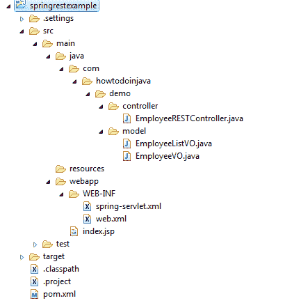
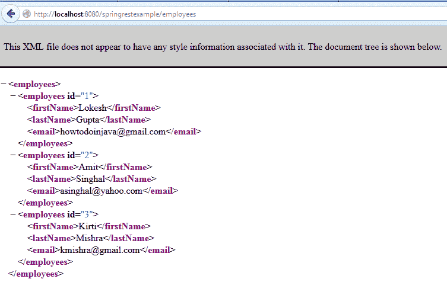
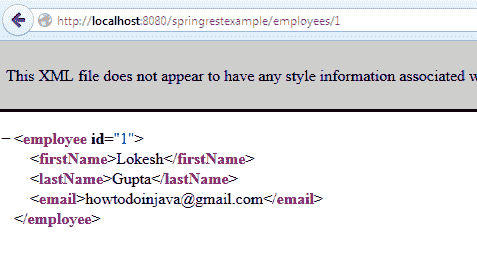

# Spring REST XML 响应示例

> 原文： [https://howtodoinjava.com/spring-restful/spring-rest-hello-world-xml-example/](https://howtodoinjava.com/spring-restful/spring-rest-hello-world-xml-example/)

在这个 Spring REST XML 示例中，我正在使用 **[Spring REST](//howtodoinjava.com/category/spring/spring-restful/ "spring rest")** 功能编写 **[REST API](//howtodoinjava.com/restful-web-service/ "restful apis")** 的世界示例。 在此示例中，我将创建两个 API，这些 API 将返回资源的 XML 表示形式。

**[Download Sourcecode](https://drive.google.com/file/d/0B7yo2HclmjI4b2tlR2N5enVvVHM/view?usp=sharing "spring rest hello world example source code")**

## 1\. Maven 依赖

让我们从运行时依赖关系开始，您需要编写这些 REST API。 实际上，您只需要 Spring MVC 支持。

**pom.xml**

```java
<project xmlns="http://maven.apache.org/POM/4.0.0" xmlns:xsi="http://www.w3.org/2001/XMLSchema-instance"
  xsi:schemaLocation="http://maven.apache.org/POM/4.0.0 http://maven.apache.org/maven-v4_0_0.xsd">
  <modelVersion>4.0.0</modelVersion>
  <groupId>com.howtodoinjava.demo</groupId>
  <artifactId>springrestexample</artifactId>
  <packaging>war</packaging>
  <version>0.0.1-SNAPSHOT</version>
  <name>springrestexample Maven Webapp</name>
  <url>http://maven.apache.org</url>
  <dependencies>
    <dependency>
      <groupId>junit</groupId>
      <artifactId>junit</artifactId>
      <version>4.12</version>
      <scope>test</scope>
    </dependency>

    <!-- Spring MVC support -->

	<dependency>
		<groupId>org.springframework</groupId>
		<artifactId>spring-webmvc</artifactId>
		<version>4.1.4.RELEASE</version>
	</dependency>

	<dependency>
		<groupId>org.springframework</groupId>
		<artifactId>spring-web</artifactId>
		<version>4.1.4.RELEASE</version>
	</dependency>

	<dependency>
		<groupId>org.springframework</groupId>
		<artifactId>spring-core</artifactId>
		<version>4.1.4.RELEASE</version>
	</dependency>

  </dependencies>
  <build>
    <finalName>springrestexample</finalName>
  </build>
</project>

```

> 注意：如果您还计划包括 JSON 支持，那么您要做的就是将 Jackson 库包含到类路径中，并且相同的 API 也将适用于 jackson。

```java
<!-- Jackson JSON Processor -->
<dependency>
	<groupId>com.fasterxml.jackson.core</groupId>
	<artifactId>jackson-databind</artifactId>
	<version>2.4.1</version>
</dependency>

```

## 2\. Spring MVC 配置

为了创建 API，您需要像在 **[Spring MVC](//howtodoinjava.com/category/frameworks/java-spring-tutorials/spring-mvc/ "spring mvc")** 中一样配置应用程序。

**web.xml**

```java
<!DOCTYPE web-app PUBLIC
 "-//Sun Microsystems, Inc.//DTD Web Application 2.3//EN"
 "http://java.sun.com/dtd/web-app_2_3.dtd" >

<web-app>
  <display-name>Archetype Created Web Application</display-name>

  <servlet>
		<servlet-name>spring</servlet-name>
			<servlet-class>
				org.springframework.web.servlet.DispatcherServlet
			</servlet-class>
		<load-on-startup>1</load-on-startup>
	</servlet>

	<servlet-mapping>
		<servlet-name>spring</servlet-name>
		<url-pattern>/</url-pattern>
	</servlet-mapping>

</web-app>

```

**spring-servlet.xml**

```java
<beans xmlns="http://www.springframework.org/schema/beans"
	xmlns:xsi="http://www.w3.org/2001/XMLSchema-instance" 
	xmlns:context="http://www.springframework.org/schema/context"
	xmlns:mvc="http://www.springframework.org/schema/mvc"
	xsi:schemaLocation="http://www.springframework.org/schema/beans
        http://www.springframework.org/schema/beans/spring-beans.xsd
        http://www.springframework.org/schema/context/
        http://www.springframework.org/schema/context/spring-context.xsd
        http://www.springframework.org/schema/mvc
    	http://www.springframework.org/schema/mvc/spring-mvc.xsd">

	<context:component-scan base-package="com.howtodoinjava.demo" />
	<mvc:annotation-driven />

</beans>

```

## 3\. JAXB 注释的模型对象

您将需要用 jaxb 注释来注释模型对象，以便 **[JAXB](//howtodoinjava.com/category/frameworks/jaxb/ "jaxb")** 可以将 Java 对象编组为 XML 表示形式，以发送给该 API 的客户端。

**EmployeeVO.java**

```java
package com.howtodoinjava.demo.model;

import java.io.Serializable;
import javax.xml.bind.annotation.XmlAccessType;
import javax.xml.bind.annotation.XmlAccessorType;
import javax.xml.bind.annotation.XmlAttribute;
import javax.xml.bind.annotation.XmlElement;
import javax.xml.bind.annotation.XmlRootElement;

@XmlRootElement (name = "employee")
@XmlAccessorType(XmlAccessType.NONE)
public class EmployeeVO implements Serializable 
{
	private static final long serialVersionUID = 1L;

	@XmlAttribute
	private Integer id;

	@XmlElement
	private String firstName;

	@XmlElement
	private String lastName;

	@XmlElement
	private String email;

	public EmployeeVO(Integer id, String firstName, String lastName, String email) {
		super();
		this.id = id;
		this.firstName = firstName;
		this.lastName = lastName;
		this.email = email;
	}

	public EmployeeVO(){

	}

	//Setters and Getters

	@Override
	public String toString() {
		return "EmployeeVO [id=" + id + ", firstName=" + firstName
				+ ", lastName=" + lastName + ", email=" + email + "]";
	}
}

```

**EmployeeListVO.java**

```java
package com.howtodoinjava.demo.model;

import java.util.ArrayList;
import java.util.List;
import javax.xml.bind.annotation.XmlRootElement;

@XmlRootElement (name="employees")
public class EmployeeListVO implements Serializable 
{
	private static final long serialVersionUID = 1L;

	private List<EmployeeVO> employees = new ArrayList<EmployeeVO>();

	public List<EmployeeVO> getEmployees() {
		return employees;
	}

	public void setEmployees(List<EmployeeVO> employees) {
		this.employees = employees;
	}
}

```

## 4\. REST 控制器

这是主类，它将决定哪个 API 将以哪种方式运行。

**EmployeeRESTController.java**

```java
package com.howtodoinjava.demo.controller;

import org.springframework.http.HttpStatus;
import org.springframework.http.ResponseEntity;
import org.springframework.web.bind.annotation.PathVariable;
import org.springframework.web.bind.annotation.RequestMapping;
import org.springframework.web.bind.annotation.ResponseBody;
import org.springframework.web.bind.annotation.RestController;
import com.howtodoinjava.demo.model.EmployeeListVO;
import com.howtodoinjava.demo.model.EmployeeVO;

@RestController
public class EmployeeRESTController 
{
	@RequestMapping(value = "/employees")
	public EmployeeListVO getAllEmployees() 
	{
		EmployeeListVO employees = new EmployeeListVO();

		EmployeeVO empOne = new EmployeeVO(1,"Lokesh","Gupta","howtodoinjava@gmail.com");
		EmployeeVO empTwo = new EmployeeVO(2,"Amit","Singhal","asinghal@yahoo.com");
		EmployeeVO empThree = new EmployeeVO(3,"Kirti","Mishra","kmishra@gmail.com");

		employees.getEmployees().add(empOne);
		employees.getEmployees().add(empTwo);
		employees.getEmployees().add(empThree);

		return employees;
	}

	@RequestMapping(value = "/employees/{id}")
	public ResponseEntity<EmployeeVO> getEmployeeById (@PathVariable("id") int id) 
	{
		if (id <= 3) {
			EmployeeVO employee = new EmployeeVO(1,"Lokesh","Gupta","howtodoinjava@gmail.com");
            return new ResponseEntity<EmployeeVO>(employee, HttpStatus.OK);
        }
        return new ResponseEntity(HttpStatus.NOT_FOUND);
	}
}

```

让我们记下一些重要的事情。

*   We have used **[@RestController](https://docs.spring.io/spring/docs/current/javadoc-api/org/springframework/web/bind/annotation/RestController.html "RestController")** annotation. Till Spring 3, we would have been using **[@Controller](https://docs.spring.io/spring/docs/current/javadoc-api/org/springframework/stereotype/Controller.html "Controller")** annotation and in that case it was important to use **[@ResponseBody](https://docs.spring.io/spring/docs/current/javadoc-api/org/springframework/web/bind/annotation/ResponseBody.html "ResponseBody")** annotation as well. e.g.

    ```java
    @Controller
    public class EmployeeRESTController 
    {
    	@RequestMapping(value = "/employees")
    	public @ResponseBody EmployeeListVO getAllEmployees() 
    	{
    		//API code
    	}
    }

    ```

    &gt; Spring 4 引入了`@RestController`，它是`@Controller + @ResponseBody`的组合。 因此，在使用`@RestController`时，无需使用`@ResponseBody`。 它是可选的。

*   Here we are relying on the Spring MVC `**HttpMessageConverter**` to convert an object to the xml representation requested by the user. `@ResponseBody` annotation (included through `@RestController`) tells Spring MVC that the result of the method should be used as the body of the response.

    正如我们想要的 XML 一样，这种封送处理由 Spring 提供的`**Jaxb2RootElementHttpMessageConverter**`完成，如果在类路径中找到 JAXB 库，则会在 Spring 上下文中自动注册。 由于我正在使用 JRE 7 运行此应用程序，并且它具有内置的 JAXB，因此不需要通过 maven 添加外部依赖项。

*   由于有了`@ResponseBody`批注，我们不再需要视图名称，而只需返回**员工**对象。
*   Instead of returning the java objects directly, you can wrap them inside `ResponseEntity`. The `ResponseEntity` is a class in Spring MVC that acts as a wrapper for an object to be used as the body of the result together with a HTTP status code.

    这样可以更好地控制您在各种用例中返回给客户端的内容。 例如 如果找不到给定员工 ID 的员工，则返回 404 错误。

## 5.项目结构



Spring REST XML Example – Project Structure

## 测试 API

让我们测试以上 REST API。

**1）命中网址：http：// localhost：8080 / springrestexample / employees**

您也可以传递接受标头“ `application/xml`”。



Spring REST XML Example – REST API for get all employees

**2）命中网址：http：// localhost：8080 / springrestexample / employees / 1**



Spring REST XML Example – REST API for get employee by id

**3）命中网址：http：// localhost：8080 / springrestexample / employees / 123**

```java
Status Code: 404 Not Found
Content-Length: 0
Date: Fri, 18 Feb 2015 07:01:17 GMT
Server: Apache-Coyote/1.1

```

这就是使用 spring mvc 的 REST API 快速 **hello world 应用程序的全部内容。**

**[Download Sourcecode](https://drive.google.com/file/d/0B7yo2HclmjI4b2tlR2N5enVvVHM/view?usp=sharing "spring rest hello world example source code")**

学习愉快！