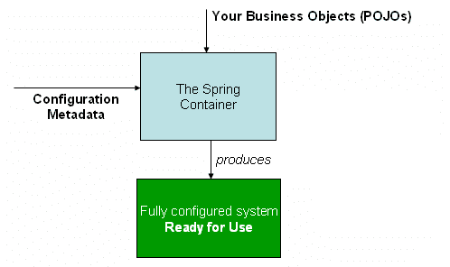

# Spring – 控制反转与依赖注入

> 原文： [https://howtodoinjava.com/spring-core/spring-ioc-vs-di/](https://howtodoinjava.com/spring-core/spring-ioc-vs-di/)

在软件工程中，[**控制反转**](https://en.wikipedia.org/wiki/Inversion_of_control)（IoC）是一种编程技术，其中对象耦合在运行时由汇编程序对象绑定，并且在编译时使用静态分析通常是未知的 。 在这个 Spring 教程中，通过示例了解 IoC 和依赖注入在 Spring 中的区别。

## 1\. 什么是控制反转（IoC）

在传统编程中，业务逻辑的流程由静态分配给彼此的对象确定。 通过控制的反转，该流程取决于由汇编程序实例化的对象图，并且通过抽象定义对象交互使之成为可能。 绑定过程是通过依赖项注入实现的，尽管有些人认为使用服务定位器还可以提供控制反转。

**控制反转作为设计准则**具有以下目的：

1.  某个任务的执行与实现之间存在脱钩。
2.  每个模块都可以专注于其设计目的。
3.  模块不假设其他系统在做什么，而是依赖其合同。
4.  更换模块对其他模块没有副作用。

## 2\. 什么是依赖注入（DI）

IoC 是一种设计示例，其目标是对应用程序的目标组件提供更多控制，使这些组件可以完成工作。 依赖注入是一种模式，用于创建其他对象依赖的对象实例，而在编译时不知道将使用哪个类来提供该功能。 IoC 依赖于依赖项注入，因为需要一种机制来激活提供特定功能的组件。

这两个概念以这种方式一起工作，以允许编写更加灵活，可重用和封装的代码。 因此，它们是设计面向对象解决方案中的重要概念。

## 3\. 如何实现 IoC

在面向对象的编程中，有几种基本技术可以实现控制反转。 这些是：

1.  使用工厂模式
2.  使用服务定位器模式
3.  使用以下任何给定类型的**依赖项注入**：
    *   构造函数注入
    *   setter 注入
    *   接口注入

## 4\. Spring 的控制反转

`org.springframework.beans`和`org.springframework.context`软件包为 Spring Framework 的 IoC 容器提供了基础。 [`BeanFactory`](https://docs.spring.io/spring/docs/1.2.x/javadoc-api/org/springframework/beans/factory/BeanFactory.html) 接口提供了一种高级配置机制，能够管理任何性质的对象。 [`ApplicationContext`](https://docs.spring.io/spring/docs/2.5.5/javadoc-api/org/springframework/context/ApplicationContext.html) 接口建立在`BeanFactory`的基础上（它是一个子接口），并添加了其他功能，例如与 Spring 的 AOP 功能的集成更加容易，消息资源处理（用于国际化）， 事件传播以及用于 Web 应用程序的特定于应用程序层的上下文，例如`WebApplicationContext`。

`BeanFactory`是 Spring IoC 容器的实际表示，该容器负责容纳和管理上述 bean。 `BeanFactory`接口是 Spring 中的中央 IoC 容器接口。

[](https://howtodoinjava.files.wordpress.com/2013/03/container-magic.png)

`BeanFactory`接口有多种实现。 最常用的`BeanFactory`实现是`XmlBeanFactory`类。 其他常用的类是`XmlWebApplicationContext`。 根据 bean 的定义，工厂将返回所包含对象的独立实例（原型设计模式），或者返回单个共享实例（单例设计模式的替代方案，其中实例是作用域中的单例工厂）。将返回哪种类型的实例取决于 bean 工厂的配置：API 是相同的。

在深入研究**依赖项注入类型**之前，让我们首先确定在 spring 框架中创建 bean 的方法，因为它将有助于理解下一部分的内容。

## 5\. 如何在 Spring 中创建 bean

Bean 定义可以视为创建一个或多个实际对象的方法。 询问时，容器将查看命名 bean 的配方，并使用该 bean 定义封装的配置元数据来创建（或获取）实际对象。

#### 5.1. 使用构造函数

当使用构造函数方法创建 bean 时，所有普通类都可以被 Spring 使用并与之兼容。 也就是说，正在创建的类不需要实现任何特定的接口或以特定的方式进行编码。 仅指定 bean 类就足够了。 使用基于 XML 的配置元数据时，您可以像这样指定 bean 类：

`beans.xml`

```java
<bean id="exampleBean"/>
```

#### 5.2. 使用静态工厂方法

在定义要使用静态工厂方法创建的 bean 以及指定包含静态工厂方法的类的`class`属性时，需要另一个名为`factory-method`的属性来指定工厂方法本身的名称。

`beans.xml`

```java
<bean id="exampleBean" factory-method="createInstance"/>
```

Spring 希望能够调用此方法并返回一个活动对象，从那时起，该对象将被视为通常是通过构造函数创建的。

#### 5.3. 使用实例工厂方法

以类似于通过静态工厂方法进行实例化的方式，使用实例工厂方法进行实例化是调用容器中现有 bean 的工厂方法来创建新 bean。

`beans.xml`

```java
<bean id="myFactoryBean"  class="...">

<bean id="exampleBean"  factory-bean="myFactoryBean" factory-method="createInstance"></bean>

```

## 6\. Spring 的依赖注入

依赖注入（DI）的基本原理是，对象只能通过构造函数参数，工厂方法的参数或在对象实例从工厂方法构造或返回后设置的属性来定义其依赖关系。 然后，容器的工作是在创建 bean 时实际注入那些依赖项。 从根本上讲，这是相反的概念，因此被称为控制反转（IoC）。

#### 6.1. 二次注入

通过调用无参数构造函数或无参数静态工厂方法以实例化 bean 之后，在 bean 上调用 setter 方法，可以实现基于 setter 的 DI。

`TestSetterDI.java`

```java
public class TestSetterDI {

DemoBean demoBean = null;

public void setDemoBean(DemoBean demoBean) {
	this.demoBean = demoBean;
}
}
```

#### 6.2. 构造函数注入

基于构造函数的 DI 是通过调用具有多个参数（每个参数代表一个协作者）的构造函数来实现的。 另外，调用带有特定参数的静态工厂方法来构造 Bean 几乎是等效的，本文的其余部分将类似地考虑构造函数的参数和静态工厂方法的参数。

`ConstructorDI.java`

```java
public class ConstructorDI {

DemoBean demoBean = null;

public TestSetterDI (DemoBean demoBean) {
	this.demoBean = demoBean;
}
}
```

#### 6.3. 接口注入

在这种方法中，我们实现了 IOC 框架的接口。 IOC 框架将使用接口方法将对象注入到主类中。 当您需要某种不适用于放置在属性中的逻辑时，使用这种方法更为合适。 如日志支持。

```java
public void SetLogger(ILogger logger)
{
  _notificationService.SetLogger(logger);
  _productService.SetLogger(logger);
}

```

## 7\. 面试题

#### 7.1. 组件和服务之间有什么区别？

组件是一整套软件，旨在由不受组件编写者控制的应用程序直接使用。 “不更改”表示使用中的应用程序不会更改组件的源代码，尽管它们可能会通过以组件编写者允许的方式扩展组件来更改组件的行为。

服务与组件相似，供外部应用程序使用。 主要区别在于要在本地使用的组件（请考虑 jar 文件，程序集，dll 或源导入）。 服务将通过同步或异步的某个远程接口（例如，Web 服务，消息系统，RPC 或套接字）远程使用。

#### 7.2. DI 与服务定位器模式有何不同？

依赖项注入器的主要好处是，它允许根据环境和使用情况插入合适的服务实现。 注入不是打破这种依赖的唯一方法，另一种方法是使用服务定位器。 服务定位器的基本思想是拥有一个对象，该对象知道如何掌握应用程序可能需要的所有服务。 然后，它将扫描所有此类服务，并将它们存储为单例注册表。 当要求提供服务实现时，请求者可以使用令牌查询注册表并获取适当的实现。

通常，这些注册表是通过一些配置文件填充的。 关键区别在于，使用服务定位器时，服务的每个用户都对定位器具有依赖。 定位器可以隐藏对其他实现的依赖关系，但是您确实需要查看定位器。

#### 7.3. 使用哪个服务更好（即服务定位器或依赖项注入）？

嗯，正如我已经说过的，关键区别在于，使用服务定位器，服务的每个用户都对定位器有依赖。 这意味着您必须在输入和输出切面了解服务定位器的详细信息。 因此，实际上成为选择哪种模式的决定因素。

如果维护注册表信息既简单又必要，则可以使用服务定位器，或者直接使用依赖项注入，因为它不会使服务用户感到任何先决条件。

#### 7.4. 构造函数注入或 setter 注入哪个更好？

在 setter 和构造函数注入之间进行选择很有趣，因为它反映了面向对象编程的一个更普遍的问题 – 如果您在构造函数或 setter 中填充字段。
带参数的构造函数可让您清楚地说明在明显的位置创建有效对象的含义。 如果执行此操作的方法不止一种，请创建多个显示不同组合的构造函数。 构造函数初始化的另一个优点是，您可以通过不提供设置器来清楚地隐藏任何不可变的字段。 我认为这很重要-如果某些事情不应该改变，那么缺少二传手就可以很好地传达这一点。 如果使用 setter 进行初始化，则可能会很痛苦。

但是，如果您有很多构造函数参数，则看起来会很混乱，尤其是在没有关键字参数的语言中。 如果您有多种方法来构造有效的对象，则可能很难通过构造函数来显示它，因为构造函数只能在参数的数量和类型上有所不同。 如果您具有简单的参数（例如字符串），构造函数也会受到影响。 使用 setter 注入，您可以为每个 setter 命名，以指示该字符串应该执行的操作。 对于构造函数，您只是依靠位置，这很难遵循。

我的偏好是从构造函数注入开始，但是一旦我上面概述的问题开​​始成为问题，就可以准备切换到 setter 注入。

#### 7.5. 什么是 Bean 工厂？

`BeanFactory`就像一个工厂类，其中包含一系列 bean。`BeanFactory`在其内部保存多个 Bean 的 Bean 定义，然后在每次客户端请求时实例化 Bean。

`BeanFactory`能够在实例化协作对象之间创建关联。 这消除了 bean 本身和 bean 客户端的配置负担。`BeanFactory`也参与了 bean 的生命周期，从而调用了自定义的初始化和销毁​​方法。

#### 7.6. 什么是应用程序上下文？

Bean 工厂适合简单的应用程序，但是要利用 Spring 框架的全部功能，您可能需要升级到 Springs 更高级的容器即应用程序上下文。 从表面上看，应用程序上下文与 Bean 工厂相同，两者都加载 Bean 定义，将 Bean 绑定在一起并根据请求分配 Bean。 但它也提供：

*   解决文本消息的方法，包括对国际化的支持。
*   加载文件资源的通用方法。
*   注册为监听器的 bean 的事件。

#### 7.7. 应用程序上下文的常见实现是什么？

`ApplicationContext`的三种常用实现是：

1.  `ClassPathXmlApplicationContext`：它从位于类路径中的 XML 文件中加载上下文定义，将上下文定义视为类路径资源。 使用代码从应用程序的类路径中加载应用程序上下文。

    ```java
    ApplicationContext context = new ClassPathXmlApplicationContext("bean.xml");
    ```

2.  `FileSystemXmlApplicationContext`：它从文件系统中的 XML 文件加载上下文定义。 使用代码从文件系统中加载应用程序上下文。

    ```java
    ApplicationContext context = new FileSystemXmlApplicationContext("bean.xml");
    ```

3.  `XmlWebApplicationContext`：它从 Web 应用程序中包含的 XML 文件中加载上下文定义。

#### 7.8. 最好使用`BeanFactory`或`ApplicationContext`？

`BeanFactory`几乎只是实例化和配置 bean。 `ApplicationContext`也这样做，它提供了支持基础结构，以支持许多企业特定的功能，例如事务和 AOP。

简而言之，赞成使用`ApplicationContext`。

在本教程中，我们了解了 Spring 中 ioc 和 di 之间的**区别**。

学习愉快！