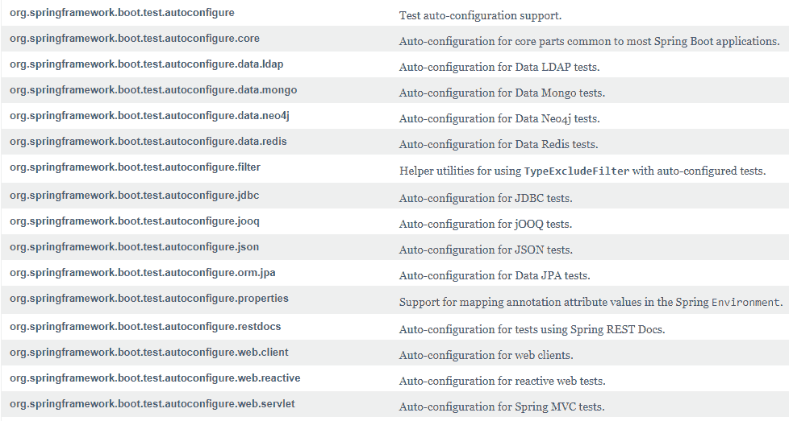

# 春季启动教程

> 原文： [https://howtodoinjava.com/spring-boot-tutorials/](https://howtodoinjava.com/spring-boot-tutorials/)

**Spring Boot** 是一个 Spring 框架模块，为 Spring 框架提供 RAD（**快速应用程序开发**）功能。 它高度依赖**入门模板**功能，该功能非常强大且可以完美运行。


Spring boot modules

## 1.什么是入门模板？

Spring Boot 启动器是模板，其中包含启动特定功能所需的所有相关传递依赖项的**集合。 例如，如果要创建 Spring WebMVC 应用程序，则在传统设置中，您自己会包含所有必需的依赖项。 这就留下了**版本冲突**的机会，这最终会导致更多**运行时异常**。**

使用 Spring boot，要创建 MVC 应用程序，只需导入`spring-boot-starter-web`依赖项。

`pom.xml`

```java
<!-- Parent pom is mandatory to control versions of child dependencies -->
<parent>
    <groupId>org.springframework.boot</groupId>
    <artifactId>spring-boot-starter-parent</artifactId>
    <version>2.1.6.RELEASE</version>
    <relativePath />
</parent>

<!-- Spring web brings all required dependencies to build web application. -->
<dependency>
    <groupId>org.springframework.boot</groupId>
    <artifactId>spring-boot-starter-web</artifactId>
</dependency>

```

在`spring-boot-starter-web`依赖关系之上，内部导入所有给定的依赖关系并将其添加到您的项目中。 请注意，某些依赖关系是直接的，某些依赖关系进一步引用了其他入门模板，这些模板可过渡地下载更多的依赖关系。

另外，请注意**不需要将版本信息提供到子依赖项**中。 相对于父级启动器的版本，已解决所有版本（在我们的示例中为`2.0.4.RELEASE`）。

`Dependencies brought in by webmvc starter template`

```java
<dependencies>
	<dependency>
		<groupId>org.springframework.boot</groupId>
		<artifactId>spring-boot-starter</artifactId>
	</dependency>
	<dependency>
		<groupId>org.springframework.boot</groupId>
		<artifactId>spring-boot-starter-json</artifactId>
	</dependency>
	<dependency>
		<groupId>org.springframework.boot</groupId>
		<artifactId>spring-boot-starter-tomcat</artifactId>
	</dependency>
	<dependency>
		<groupId>org.hibernate.validator</groupId>
		<artifactId>hibernate-validator</artifactId>
	</dependency>
	<dependency>
		<groupId>org.springframework</groupId>
		<artifactId>spring-web</artifactId>
	</dependency>
	<dependency>
		<groupId>org.springframework</groupId>
		<artifactId>spring-webmvc</artifactId>
	</dependency>
</dependencies>

```

> 阅读更多： [Spring Boot 入门模板列表](https://github.com/spring-projects/spring-boot/tree/master/spring-boot-project/spring-boot-starters/)

## 2\. Spring Boot 自动配置

通过`@EnableAutoConfiguration`注释启用自动配置。 Spring Boot 自动配置扫描类路径，在类路径中找到库，然后尝试为它们猜测最佳配置，最后配置所有此类 bean。

自动配置会尝试尽可能智能化，并且在您定义更多自己的配置时会自动退出。

> 自动配置始终在注册用户定义的 bean 之后应用。

Spring Boot 自动配置逻辑在 **spring-boot-autoconfigure.jar** 中实现。 Yoy 可以在此处验证软件包的[列表。](https://docs.spring.io/spring-boot/docs/2.0.4.RELEASE/api/)



Spring boot autoconfiguration packages

例如，查看 Spring AOP 的自动配置。 它执行以下操作

1.  **扫描类路径**以查看是否存在`EnableAspectJAutoProxy`，`Aspect`，`Advice`和`AnnotatedElement`类。
2.  如果不存在类，则不会为 Spring AOP 进行自动配置。
3.  如果找到了类，则使用 Java config 批注`@EnableAspectJAutoProxy`配置 AOP。
4.  它检查属性`spring.aop`的值可以是`true`或`false`。
5.  基于属性的值，设置`proxyTargetClass`属性。

`AopAutoConfiguration.java`

```java
@Configuration
@ConditionalOnClass({ EnableAspectJAutoProxy.class, Aspect.class, Advice.class,
		AnnotatedElement.class })
@ConditionalOnProperty(prefix = "spring.aop", name = "auto", havingValue = "true", matchIfMissing = true)
public class AopAutoConfiguration 
{

	@Configuration
	@EnableAspectJAutoProxy(proxyTargetClass = false)
	@ConditionalOnProperty(prefix = "spring.aop", name = "proxy-target-class", havingValue = "false", matchIfMissing = false)
	public static class JdkDynamicAutoProxyConfiguration {

	}

	@Configuration
	@EnableAspectJAutoProxy(proxyTargetClass = true)
	@ConditionalOnProperty(prefix = "spring.aop", name = "proxy-target-class", havingValue = "true", matchIfMissing = true)
	public static class CglibAutoProxyConfiguration {

	}

}

```

## 3.嵌入式服务器

春季启动应用程序始终将 **tomcat** 作为**嵌入式服务器**依赖项。 这意味着您可以从命令提示符运行 Spring Boot 应用程序，而无需使用复杂的服务器基础结构。

您可以根据需要排除 tomcat，并包括任何其他嵌入式服务器。 或者，您可以完全排除服务器环境。 全部基于配置。

例如，以下配置**排除了 tomcat** ，**包括了码头**作为嵌入式服务器。

`pom.xml`

```java
<dependency>
    <groupId>org.springframework.boot</groupId>
    <artifactId>spring-boot-starter-web</artifactId>
    <exclusions>
        <exclusion>
            <groupId>org.springframework.boot</groupId>
            <artifactId>spring-boot-starter-tomcat</artifactId>
        </exclusion>
    </exclusions>
</dependency>

<dependency>
    <groupId>org.springframework.boot</groupId>
    <artifactId>spring-boot-starter-jetty</artifactId>
</dependency>

```

## 4.引导应用程序

要**运行应用程序**，我们需要使用`[@SpringBootApplication](https://howtodoinjava.com/spring-boot/springbootapplication-auto-configuration/)`批注。 在幕后，它们相当于`@Configuration`，`@EnableAutoConfiguration`和`@ComponentScan`。

它可以扫描配置类，文件并将它们加载到 **spring context** 中。 在下面的示例中，执行从`main()`方法开始。 它开始加载所有配置文件，对其进行配置，然后根据`/resources`文件夹中 **application.properties** 文件中的[应用程序属性](https://docs.spring.io/spring-boot/docs/current/reference/html/common-application-properties.html)引导应用程序。

`MyApplication.java`

```java
@SpringBootApplication
public class MyApplication 
{
    public static void main(String[] args) 
    {
        SpringApplication.run(Application.class, args);
    }
}

```

`application.properties`

```java
### Server port #########
server.port=8080

### Context root ########
server.contextPath=/home

```

要执行该应用程序，可以从 IDE 中运行 **main（）方法**，例如 **eclipse** ，或者可以构建 jar 文件并从命令提示符下执行。

`Console`

```java
$ java -jar spring-boot-demo.jar

```

## 5\. Spring Boot 的优点

*   Spring Boot 帮助解决**依赖冲突**。 它标识所需的依赖项并为您导入它们。
*   对于所有依赖项，它都具有**兼容版本**的信息。 它最大程度地减少了运行时**类加载器**问题。
*   它的“预设默认配置”方法可帮助您配置幕后最重要的部分。 仅在需要时才覆盖它们。 否则，一切都会完美地进行。 它有助于避免**样板代码**，注释和 XML 配置。
*   它提供了嵌入式 HTTP 服务器 Tomcat，因此您可以快速进行开发和测试。
*   它与 eclipse 和**智能想法**等 IDE 具有出色的集成。

## 6\. Spring Boot 配置

1.  [Spring Boot 批注](https://howtodoinjava.com/spring-boot2/spring-boot-annotations/)
2.  [Spring Boot 登录指南](https://howtodoinjava.com/spring-boot2/spring-boot-logging-configurations/)
3.  [Spring Boot – Spring Boot 入门模板](https://howtodoinjava.com/spring/spring-boot2/spring-boot-starter-templates/)
4.  [Spring Boot –入门级父项依赖项](https://howtodoinjava.com/spring/spring-boot2/spring-boot-starter-parent-dependency/ )
5.  [Spring Boot –获取所有已加载的 bean](https://howtodoinjava.com/spring/spring-boot/get-loaded-beans-class-type-information/)
6.  [Spring Boot – @SpringBootApplication 和自动配置](https://howtodoinjava.com/spring/spring-boot2/springbootapplication-auto-configuration/)
7.  [Spring Boot –更改应用程序根目录](https://howtodoinjava.com/spring/spring-boot/change-application-root-context-path/)
8.  [Spring Boot –配置 Jetty 服务器](https://howtodoinjava.com/spring/spring-boot/configure-jetty-server/)
9.  [Spring Boot – Tomcat 默认端口](https://howtodoinjava.com/spring/spring-boot/change-tomcat-server-default-port-8080/)
10.  [Spring Boot – WAR 打包示例](https://howtodoinjava.com/spring/spring-boot2/war-packaging-example/)
11.  [Spring Boot –记录 yml Config](https://howtodoinjava.com/spring/spring-boot/configure-logging-application-yml/)
12.  [Spring Boot –记录属性 Config](https://howtodoinjava.com/spring/spring-boot/logging-application-properties/)
13.  [Spring Boot – SSL [https]](https://howtodoinjava.com/spring/spring-boot/spring-boot-ssl-https-example/)
14.  [Spring Boot – CommandLineRunner](https://howtodoinjava.com/spring/spring-boot/command-line-runner-interface-example/)
15.  [Spring Boot –开发人员工具模块教程](https://howtodoinjava.com/spring/spring-boot2/developer-tools-module-tutorial/)
16.  [Spring Boot –在@Bean 和@Compoment 中注入应用程序参数](https://howtodoinjava.com/spring-boot2/application-arguments/)
17.  [Spring Boot 嵌入式服务器日志](https://howtodoinjava.com/spring-boot2/embedded-server-logging-config/)
18.  [Spring Boot 嵌入式 tomcat 配置](https://howtodoinjava.com/spring-boot2/embedded-tomcat-configuration/)

## 7.开发 REST API 和 SOAP Web 服务

1.  [Spring Boot – REST API](https://howtodoinjava.com/spring/spring-boot/spring-boot-tutorial-with-hello-world-example/)
2.  [春季靴子–球衣](https://howtodoinjava.com/spring/spring-boot/spring-boot-jersey-example/)
3.  [Spring Boot – Spring HATEOAS 示例](https://howtodoinjava.com/spring/spring-boot2/rest-with-spring-hateoas-example/)
4.  [Spring Boot –请求验证 REST API](https://howtodoinjava.com/spring/spring-boot2/spring-rest-request-validation/)
5.  [Spring Boot –基于角色的安全性](https://howtodoinjava.com/spring/spring-boot/role-based-security-jaxrs-annotations/)
6.  [Spring Boot – SOAP Web 服务](https://howtodoinjava.com/spring/spring-boot/spring-boot-soap-webservice-example/)
7.  [Spring Boot – SOAP 客户端](https://howtodoinjava.com/spring/spring-boot/spring-soap-client-webservicetemplate/)
8.  [Spring Boot 2 和 ehcache 3 示例](https://howtodoinjava.com/spring-boot2/ehcache3-config-example/)

## 8.其他有用的话题

1.  [在启动时禁用横幅](https://howtodoinjava.com/spring-boot2/disable-logo-banner/)
2.  [Spring Boot – JSP 视图](https://howtodoinjava.com/spring/spring-boot/spring-boot-jsp-view-example/)
3.  [Spring Boot –自定义 PropertyEditor](https://howtodoinjava.com/spring/spring-boot/custom-property-editor-example/)
4.  [Spring Boot – @EnableScheduling](https://howtodoinjava.com/spring/spring-boot/enable-scheduling-scheduled-job-example/)
5.  [Spring Boot – JMSTemplate](https://howtodoinjava.com/spring/spring-boot/spring-boot-jmstemplate-activemq/)
6.  [Spring Boot – RSS / ATOM Feed](https://howtodoinjava.com/spring/spring-boot/spring-boot-rome-rss-and-atom-feed/)
7.  [Spring Boot 从资源文件夹](https://howtodoinjava.com/spring-boot2/read-file-from-resources/)读取文件
8.  [Spring Boot 面试问题](https://howtodoinjava.com/interview-questions/spring-boot-interview-questions/)

学习愉快！