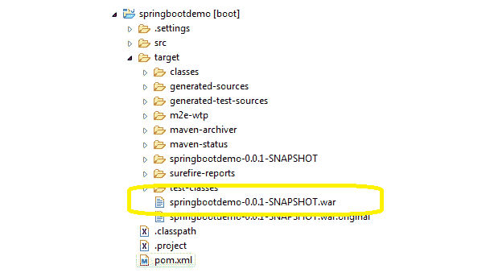

# Spring Boot WAR 包示例

> 原文： [https://howtodoinjava.com/spring-boot2/war-packaging-example/](https://howtodoinjava.com/spring-boot2/war-packaging-example/)

在 Spring Boot 应用程序中，默认包装是 jar，它部署在嵌入式服务器中。 如果要生成 war 文件以部署在单独的应用程序服务器实例（例如 Jboss，Weblogic 或 tomcat）中，请遵循以下说明。

## 步骤 1）声明包类型 WAR 

逻辑上的第一步是在`pom.xml`文件中声明包装类型为'war'。

```java
<project xmlns="http://maven.apache.org/POM/4.0.0"
  xmlns:xsi="http://www.w3.org/2001/XMLSchema-instance"
  xsi:schemaLocation="http://maven.apache.org/POM/4.0.0
                      http://maven.apache.org/xsd/maven-4.0.0.xsd;
  ...
  <packaging>war</packaging>
  ...
</project>
```

它指示项目的工件类型。 请注意，当未声明任何包装时，Maven 会假定工件为默认值：`jar`。

## 步骤 2）将嵌入式服务器相关性范围设置为“提供”

由于其在快速开发生命周期中的有用性，我们可能希望在开发环境中使用嵌入式服务器（例如 tomcat），但我们当然不希望这些服务器 jar 包含在最终生成的 Maven 工件或 war 文件中。 为此，请将嵌入式服务器依赖项的范围设置为“已提供”。

范围“提供”表示您希望 JDK 或容器在运行时提供依赖项。 该作用域仅在编译和测试类路径上可用，并且不可传递。

> 阅读更多：[依赖机制](https://howtodoinjava.com/maven/maven-dependency-scopes/#provided)

## WAR 包演示

在此演示中，我们在`pom.xml`下面使用。

```java
<project xmlns="http://maven.apache.org/POM/4.0.0" xmlns:xsi="http://www.w3.org/2001/XMLSchema-instance"
	xsi:schemaLocation="http://maven.apache.org/POM/4.0.0 http://maven.apache.org/xsd/maven-4.0.0.xsd;
	<modelVersion>4.0.0</modelVersion>

	<groupId>com.howtodoinjava</groupId>
	<artifactId>springbootdemo</artifactId>
	<version>0.0.1-SNAPSHOT</version>

	<packaging>war</packaging>

	<name>springbootdemo</name>
	<url>http://maven.apache.org</url>

	<parent>
		<groupId>org.springframework.boot</groupId>
		<artifactId>spring-boot-starter-parent</artifactId>
		<version>2.0.0.RELEASE</version>
	</parent>

	<properties>
		<java.version>1.8</java.version>
		<project.build.sourceEncoding>UTF-8</project.build.sourceEncoding>
	</properties>

	<dependencies>
		<dependency>
			<groupId>org.springframework.boot</groupId>
			<artifactId>spring-boot-starter-web</artifactId>
		</dependency>
		<dependency>
			<groupId>org.springframework.boot</groupId>
			<artifactId>spring-boot-starter-tomcat</artifactId>
			<scope>provided</scope>
		</dependency>
		<dependency>
			<groupId>org.springframework.boot</groupId>
			<artifactId>spring-boot-starter-hateoas</artifactId>
		</dependency>
		<dependency>
			<groupId>org.springframework.boot</groupId>
			<artifactId>spring-boot-starter-test</artifactId>
		</dependency>
	</dependencies>

	<build>
		<plugins>
			<plugin>
				<groupId>org.springframework.boot</groupId>
				<artifactId>spring-boot-maven-plugin</artifactId>
			</plugin>
		</plugins>
	</build>

	<repositories>
		<repository>
			<id>repository.spring.release</id>
			<name>Spring GA Repository</name>
			<url>http://repo.spring.io/release</url>
		</repository>
	</repositories>
</project>

```

现在运行目标为`clean install`的 maven build，它将在下面的目标文件夹中生成该项目的 war 文件。



Spring Boot War Packaging Example

将我的问题放在评论部分。

学习愉快！