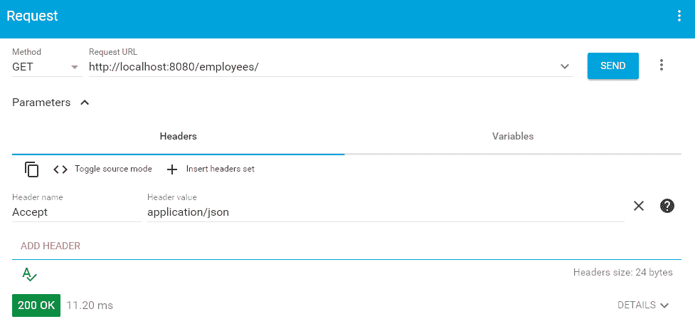
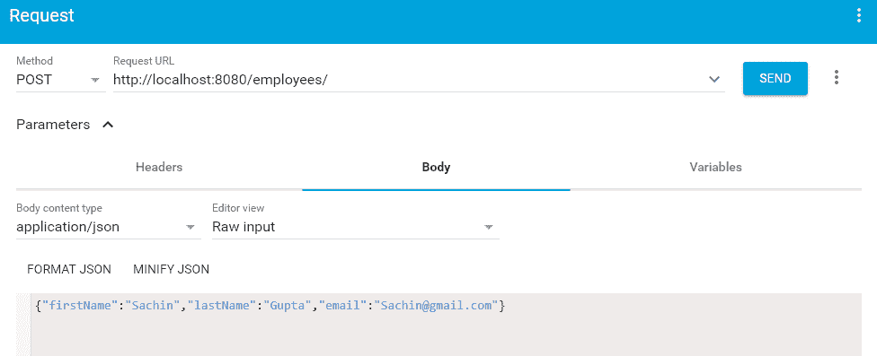

# Spring Boot 2 REST API 示例

> 原文： [https://howtodoinjava.com/spring-boot2/rest/rest-api-example/](https://howtodoinjava.com/spring-boot2/rest/rest-api-example/)

在本 Spring Rest 教程中，学习使用 Spring Boot 2 框架创建 REST API，该 API 将 JSON 响应返回给客户端。 在本 **Spring Boot 2 REST API** 教程中，我们将逐步创建两个简单的 GET 和 POST API 并进行测试。

## 1\. Maven 依赖

首先，[创建一个简单的 Maven Web 项目](https://howtodoinjava.com/maven/maven-web-project-in-eclipse/)，并根据`pom.xml`文件中的 spring boot 依赖项进行更新。

重要的依赖项是`spring-boot-starter-parent`（[阅读更多](https://howtodoinjava.com/spring-boot2/spring-boot-starter-parent-dependency/)）和`spring-boot-starter-web`（[阅读更多](https://howtodoinjava.com/spring-boot2/spring-boot-starter-templates/)）。 入门级 Web 依赖关系可传递地包含更多依赖关系，以构建 Web 应用程序，例如`spring-webmvc`，`spring-web`，`hibernate-validator`，`tomcat-embed-core`，`tomcat-embed-el`，`tomcat-embed-websocket`，`jackson-databind`，`jackson-datatype-jdk8`，`jackson-datatype-jsr310`和`jackson-module-parameter-names`。

`pom.xml`

[PRE0]

## 2\. Spring Boot 2 REST API 控制器

*   在 Spring 中，能够处理 REST API 请求的控制器类称为 rest 控制器。 应使用`@RestController`注解进行注解。
*   资源 uri 在`@RequestMapping`注解中指定。 它可以同时应用于类级别和方法级别。 添加类级别路径和方法级别路径后，将解析 API 的完整 URI。
*   我们应该始终写`produce`，`consume`属性来指定 API 的媒体类型属性。 切勿对假设作出响应。

在给定的控制器中，我们有两种 API 方法。 随时根据需要添加更多方法。

1.  **HTTP GET `/employee`** - 返回员工列表。
2.  **HTTP POST `/employee`** – 在员工集合中添加一个员工。

`EmployeeController.java`

[PRE1]

我们可以使用`application.properties`文件来控制和自定义许多实现细节。 但是为了使此演示简单，我将其保留为空白。

## 3\. `@SpringBootApplication`

我们的 REST API 框架已准备就绪。 现在，我们需要配置 Spring 以检测我们的 rest 控制器（使用自动扫描）并在嵌入式 tomcat 服务器中部署 api。 幸运的是，Spring Boot 通过使用[自动配置](https://howtodoinjava.com/spring-boot2/springbootapplication-auto-configuration/)的概念使所有这些事情变得非常容易。

**自动配置**尝试猜测和配置您可能需要的 bean。 自动配置类通常基于应用程序类路径中的 jar 和我们在`@Configuration`类中另外定义的 bean 来应用。

在这种情况下，它会执行以下操作。

1.  它检测到`spring-webmvc`，因此配置默认的 spring mvc 应用程序 bean。 它有助于扫描和配置`@RestController`和类似的注解。
2.  它检测到嵌入的 tomcat jar，因此为我们配置嵌入式 tomcat。
3.  它检测到 JSON jar，因此可以配置对 API 的 JSON 支持。

`SpringBootDemoApplication.java`

[PRE2]

## 4\. 模型类和 DAO

这些类与 REST 没有直接关系。 仍然让我们看看它们是如何编写的。

`Employee.java`

[PRE3]

`Employees.java`

[PRE4]

DAO 类使用静态列表存储数据。 在这里，我们需要实现实际的数据库交互。

`EmployeeDAO.java`

[PRE5]

## 5\. Spring Boot REST 演示

要启动该应用程序，请运行`SpringBootDemoApplication`类中的`main()`方法。 它将启动嵌入式 tomcat 服务器。 在服务器日志中，您将看到已在 Spring 上下文中注册了 API。

`Console`

[PRE6]

#### 5.1. HTTP GET `/employee`

服务器启动后，使用其他客户端访问 API。

Spring Boot REST HTTP GET

`API response`

[PRE7]

#### 5.2. HTTP POST `/employee`

Spring Boot REST HTTP POST

`Response headers`

[PRE8]

再次点击 GET 请求，这一次我们也将获得新增的员工。

Spring Boot REST HTTP GET – Updated

## 6\. 更多例子

1.  [Spring`@Controller`和`@RestController`注解](https://howtodoinjava.com/spring-boot2/controller-restcontroller/)

让我知道您是否在此 **spring boot restful web 服务 json 示例**中进行查询。

学习愉快！

[下载源码](https://howtodoinjava.com/wp-content/downloads/springbootrestdemo.zip)

参考文献：

[SpringBoot 启动器](https://github.com/spring-projects/spring-boot/tree/master/spring-boot-project/spring-boot-starters)