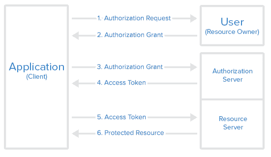
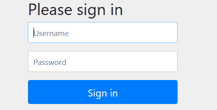
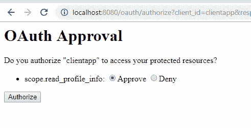
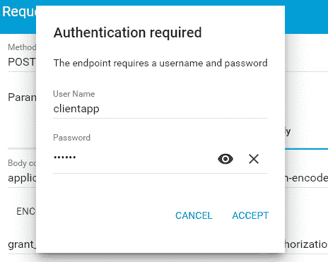

# Spring Boot 2 – OAuth2 Auth 和资源服务器

> 原文： [https://howtodoinjava.com/spring-boot2/oauth2-auth-server/](https://howtodoinjava.com/spring-boot2/oauth2-auth-server/)

在本 **Spring Security oauth2** 教程中，学习构建**授权服务器**来对您的身份进行身份验证，以提供`access_token`，您可以使用该服务器向资源服务器**请求数据**。

## 1\. 概述

OAuth 2 是一种授权方法，用于通过 HTTP 协议提供对受保护资源的访问。 首先，oauth2 使第三方应用程序可以获得对 HTTP 服务的有限访问权限：

*   通过协调资源所有者和 HTTP 服务之间的批准交互来代表资源所有者
*   或允许第三方应用程序代表自己获取访问权限。

#### 1.1. 角色

OAuth 定义了四个角色：

*   **资源所有者** – 应用程序的用户。
*   **客户端** – 需要访问资源服务器上用户数据的应用程序（用户正在使用）。
*   **资源服务器** – 存储用户数据和 http 服务，这些服务可以将用户数据返回到经过身份验证的客户端。
*   **授权服务器** – 负责验证用户的身份并提供授权令牌。 资源服务器接受此令牌并验证您的身份。

Oauth2 流程

#### 1.2. 访问令牌与刷新令牌

**访问令牌**是表示颁发给客户端的授权的字符串。 令牌代表资源所有者授予并由资源服务器和授权服务器强制执行的特定访问范围和持续时间。

**刷新令牌**由授权服务器发布（与访问令牌一起）给客户端，用于在当前访问令牌变为无效或过期时获取新的访问令牌，或用于获取具有相同权限的其他访问令牌或更窄的范围（访问令牌的生存期和权限可能比资源所有者授权的要短）。 授权服务器可以决定是否发出刷新令牌。

*   访问令牌的责任是在数据过期之前访问数据。
*   当现有访问令牌过期时，刷新令牌的职责是请求新的访问令牌。

## 2\. Oauth2 – 授权服务器

要使用 [spring security oauth2 模块](https://spring.io/projects/spring-security-oauth)创建授权服务器，我们需要使用注解`@EnableAuthorizationServer`并扩展类`AuthorizationServerConfigurerAdapter`。

`OAuth2AuthorizationServer.java`

[PRE0]

*   Spring Security oauth 公开了两个用于检查令牌的端点（`/oauth/check_token`和`/oauth/token_key`），这些令牌默认情况下在`denyAll()`之后受到保护。`tokenKeyAccess()`和`checkTokenAccess()`方法打开这些端点供使用。
*   `ClientDetailsServiceConfigurer`用于定义客户端详细信息服务的内存中或 JDBC 实现。我们使用了内存实现。它具有以下重要属性：

    `clientId` – （必填）客户端 ID。
    `password` – （对于受信任的客户端是必需的）客户端密码（如果有）。
    `scope` – 客户端受限的范围。 如果范围未定义或为空（默认值），则客户端不受范围的限制。
    `authorizedGrantTypes` – 授权给客户端使用的授权类型。 默认值为空。
    `previlege` – 授予客户端的权限（常规的 Spring Security 权限）。
    `redirectUris` – 将用户代理重定向到客户端的重定向端点。 它必须是一个绝对 URL。

## 3\. Oauth2 – 资源服务器

要创建资源服务器组件，请使用`@EnableResourceServer`注解并扩展`ResourceServerConfigurerAdapter`类。

`OAuth2ResourceServer.java`

[PRE1]

上面的 config 在所有从`/api`开始的端点上启用保护。 其他所有端点均可自由访问。

资源服务器还提供了一种对用户本身进行身份验证的机制。 在大多数情况下，它将是基于表单的登录名。

`SecurityConfig.java`

[PRE2]

在[`WebSecurityConfigurerAdapter`](https://howtodoinjava.com/spring5/security5/security-java-config-enablewebsecurity-example/)类上方，设置基于表单的登录页面，并使用`permitAll()`打开授权 URL。

## 4\. Oauth2 保护的 REST 资源

出于演示目的，我仅创建了一个 API，该 API 会返回登录用户的姓名和电子邮件。

`RestResource.java`

[PRE3]

`UserProfile.java`

[PRE4]

## 5\. 演示

我们有一个 API `http://localhost:8080/api/users/me`，可以通过直接在登录名中输入用户名/密码来访问它，但是第三方应用程序不能像在浏览器中那样访问 API。 他们需要 oauth2 令牌。

#### 5.1. 从用户获取授权授权代码

如上面的序列图所示，第一步是从 URL：`http://localhost:8080/oauth/authorize?client_id=clientapp&response_type=code&scope=read_profile_info`获得资源所有者的授权授予

它将带来一个登录页面。 提供用户名和密码。 对于此演示，请使用`humptydumpty`和`123456`。

登录页面

登录后，您将被重定向到“授予访问权限”页面，您可以在其中选择授予对第三方应用程序的访问权限。

获取权限授权

它将重定向到类似`http://localhost:8081/login?code=EAR76A`的 URL。 这里`'EAR76A'`是第三方应用程序的授权代码。

#### 5.2. 从授权服务器获取访问令牌

现在，应用程序将使用授权授予来获取访问令牌。 在这里，我们需要提出以下要求。 使用此处第一步中获得的代码。

`Access token request from postman`

[PRE5]

它将在单独的窗口中询问客户端应用程序凭据。

客户端授权

或从 cURL 发出类似请求。

`Access token request from cURL`

[PRE6]

`Access token response`

[PRE7]

> 阅读更多：[如何在 Windows 中执行 cURL 命令](https://howtodoinjava.com/for-fun-only/curl-in-windows/)

#### 5.3. 从资源服务器访问用户数据

获得访问令牌后，我们可以转到资源服务器以获取受保护的用户数据。

达到以下要求：

`Get resource request`

[PRE8]

它将返回响应。

`Get resource response`

[PRE9]

## 6\. Spring Security oauth2 应用程序的 Maven 依赖项

此 **spring security 5 oauth2 示例**使用的 pom 文件是：

`pom.xml`

[PRE10]

将您的问题留在我的评论中。

学习愉快！

参考文献：

[Oauth2 协议](https://tools.ietf.org/html/rfc6749)

[OAuth2 自动配置](https://docs.spring.io/spring-security-oauth2-boot/docs/current/reference/htmlsingle/)

[下载源码](https://github.com/lokeshgupta1981/SpringExamples/tree/master/oauth2)