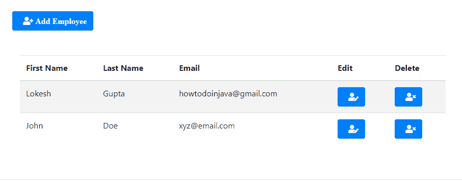

# Spring Boot – CRUD 应用程序

> 原文： [https://howtodoinjava.com/spring-boot2/crud-application-thymeleaf/](https://howtodoinjava.com/spring-boot2/crud-application-thymeleaf/)

通过基于 [Thymeleaf](https://www.thymeleaf.org/) 和 spring mvc 支持的基于表单的 UI，学习构建支持 **CRUD** 操作的 [Spring Boot](https://howtodoinjava.com/spring-boot-tutorials/) Web 应用程序。

## 1\. 概述

在本教程中，我们正在[创建具有两个视图的 Web 应用程序](https://howtodoinjava.com/maven/maven-web-project-in-eclipse/)：

*   **列出所有员工视图** – 以表格形式在 UI 中从数据库显示所有员工。 此外，还有指向“更新”或“删除”任何员工的链接。 该界面还具有一个单独的选项，可以导航到“创建”员工界面。

    

    列出所有员工的界面

*   **创建/更新员工视图** – 此界面用于添加新员工或编辑现有员工的详细信息。

    

    添加员工的界面

此示例中有两个主要组件需要重点关注-MVC 控制器和 UI 视图。

## 2\. Spring MVC 控制器

控制器类具有 URL 映射及其处理器方法。 所有 CRUD 操作都有处理器方法，包括 POST 操作，以处理表单提交以创建/更新员工的过程。

注意给定的处理器方法如何将模型数据绑定到视图； 并且它们以字符串格式返回视图名称，该视图名称由 HTML 文件中的[视图解析器](https://howtodoinjava.com/spring-boot/spring-boot-jsp-view-example/)解析。

`EmployeeMvcController.java`

[PRE0]

*   `getAllEmployees()` – 返回所有员工的列表，并映射到路径`/`。 这是应用程序的默认视图。
*   `editEmployeeById()` – 用于添加新员工或编辑现有员工。 两种操作都使用相同的 HTML 视图。 如果上下文中有一个员工 ID，则将对该员工进行编辑-否则将创建一个新员工。
*   `deleteEmployeeById()` – 通过 ID 删除员工的简单 URL 请求。
*   `createOrUpdateEmployee()` – 此方法处理用于创建新雇员或更新雇员的 HTTP POST 请求。 创建或更新操作取决于模型中是否存在员工 ID。

## 3\. Thymeleaf 模板

如前所述，我们在此示例中使用两个视图。

`list-employees.html`

[PRE1]

`add-edit-employee.html`

[PRE2]

## 4\. 实体和存储库

我们已经将`EmployeeEntity`类作为模型绑定到 UI。

`EmployeeEntity.java`

[PRE3]

为了将数据持久存储在数据库中，我们使用 [H2（内存中）数据库](https://howtodoinjava.com/spring-boot2/h2-database-example/)，并使用 Spring 数据的`CrudRepository`接口。 它为简单的 CRUD 操作提供了开箱即用的内置方法。

`EmployeeRepository.java`

[PRE4]

请注意，使用两个 SQL 文件初始化了存储库，这两个 SQL 文件创建数据库表并向其中填充默认数据。

`schema.sql`

[PRE5]

`data.sql`

[PRE6]

## 5\. 服务类

另一个重要的类是`EmployeeService`类，控制器通过该类与存储库进行交互。 它包含要执行的其他业务逻辑。

`EmployeeService.java`

[PRE7]

## 6\. 添加 Spring Boot 和 Thymeleaf Maven 依赖项

在 spring boot 项目中，我们只需要添加`spring-boot-starter-thymeleaf`依赖项，并使用默认配置为项目本身[自动配置](https://howtodoinjava.com/spring-boot/springbootapplication-auto-configuration/) thymeleaf。 它从`/src/main/resources/templates`文件夹中读取 HTML 模板。

`pom.xml`

[PRE8]

## 7\. Spring Boot thymeleaf Crud 教程演示

以 Spring Boot 应用程序的形式启动此应用程序，该应用程序将在嵌入式 tomcat 服务器中启动 Web 应用程序。

**点击网址：`http://localhost:8080/`**

验证是否使用`data.sql`文件中的两个默认员工详细信息渲染了屏幕。

玩应用程序。 创建几个新员工，编辑现有员工。 删除一些员工。

如果在上述 **spring boot mvc 示例**中遇到任何错误，请告诉我。

[下载源码](https://howtodoinjava.com/wp-content/downloads/spring-boot-hibernate-thymeleaf.zip)

学习愉快！