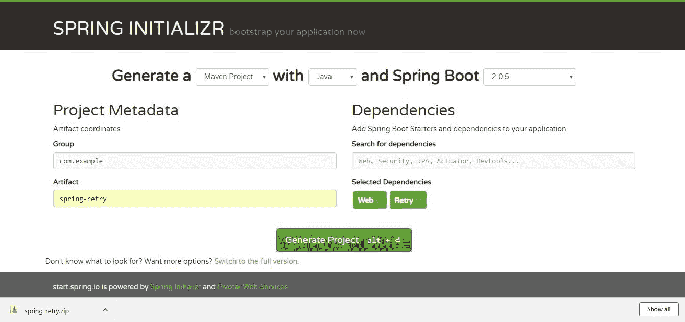

# 使用 Spring Boot 的 SpringRetry 模块示例

> 原文： [https://howtodoinjava.com/spring-boot2/spring-retry-module/](https://howtodoinjava.com/spring-boot2/spring-retry-module/)

在此 [Spring 运行教程](https://howtodoinjava.com/spring-boot-tutorials/)中，学习如何使用 **spring retry 模块**工具来构建应用程序，在该工具中，我们必须调用某些有时会期望出现异常的方法，并且必须重试该请求。

在这种情况下，如果必须在任何后端服务调用上实现任何重试功能，则通常我们使用循环和中断条件来实现，并继续重试至某些重试限制。 但是这种解决方案容易出错。

Spring 为我们提供了一个围绕这个叫做 spring-retry 的简单框架，可以使用注解进行配置。 我们可以定义重试限制，后备方法等。


## 1\. 为什么我们需要重试？

在我们的大多数项目中，通常会遇到一些场景，如果它是第一次下降，则可以重试很少的操作。 例如，假设在调用任何后端外部服务的过程中，该服务可能由于诸如网络中断，服务器关闭，网络故障，死锁等原因而关闭。在这种情况下，通常在发送特定错误到客户端程序之前，我们尝试重试该操作几次，以使处理更健壮，更不容易出错。

有时，它有助于自动重试失败的操作，以防后续尝试成功执行。 我想你们所有人都已经遇到了这个问题，并且作为一种解决方法，您很可能会通过循环并在达到重试限制后中断该循环来解决此问题，但是现在借助 spring-retry 模块，我们不必编写这样的代码来处理重试方案。

## 2\. `spring-retry`

spring 系列的 spring-retry 是另一个实用程序模块，可以帮助我们以标准方式处理任何特定操作的重试。 在 spring-retry 中，所有配置都是基于简单注解的。

#### 2.1. SpringRetry 注解

*   `@EnableRetry` – 在 Spring Boot 项目中启用 SpringRetry
*   `@Retryable` – 表示可以重试的任何方法
*   `@Recover` – 指定后备方法！

## 3\. SpringRetry 示例

#### 3.1. 开发环境

我们将使用以下技术堆栈在下面的 pur 示例应用中尝试 spring-retry。

*   Java，Eclipse，Maven 作为开发环境
*   Spring-boot 作为应用程序框架
*   spring-retry 模块作为重试模块
*   AspectJ 作为 spring-retry 的依赖

#### 3.2. 演示概述

1.  创建一个 Spring 运行项目以公开一次示例 Rest API，它将调用一个容易失败的后端操作，我们将模拟这种失败情况以启动重试。
2.  One service class which will actually invoke the remote api and this will send exception in case of failure, we will design the retry based on this custom exception, like once we receive this exception, we will retry for 3 times and finally return to client.

    在这 3 次尝试中，如果我们从后端服务获得成功响应，则将返回该成功响应，否则将调用标准后备方法。

#### 3.3. 创建 SpringBoot 项目

第一步，我们将从 spring 初始化程序站点创建一个 spring boot 项目，在此我们将测试 SpringRetry 功能。

为此，我们需要转到 https://start.spring.io/ 并选择依赖项`web`和`retry`。 下载包含框架项目的 zip 文件，然后导入到 maven。



Spring Boot Initializer

#### 3.4. Maven 依赖

Spring 初始化程序会在项目中自动添加`spring-boot-starter-data-rest`和`spring-boot-starter-security`依赖项。 为了使测试更加有效，我们将不需要这些，因此我们将从`pom.xml`中删除这两个依赖项。

此外，`spring-retry`取决于框架项目中未包含的 **Aspectj** ，因此我们将在`pom.xml`文件中添加以下依赖项。

`pom.xml`

```java
<dependency>
    <groupId>org.springframework.retry</groupId>
    <artifactId>spring-retry</artifactId>
    <version>${version}</version>
</dependency>
<dependency>
	<groupId>org.springframework</groupId>
	<artifactId>spring-aspects</artifactId>
	<version>${version}</version>
</dependency>

```

#### 3.5. 创建 Rest API 端点

创建一个示例 Rest 控制器，该控制器将调用后端服务类，在该类中我们将模拟异常，并且 spring-retry 模块将自动重试。

`MyRestController.java`

```java
package com.example.springretry;

import org.springframework.beans.factory.annotation.Autowired;
import org.springframework.web.bind.annotation.ExceptionHandler;
import org.springframework.web.bind.annotation.GetMapping;
import org.springframework.web.bind.annotation.RequestParam;
import org.springframework.web.bind.annotation.RestController;

@RestController
public class MyRestController {

	@Autowired
	BackendAdapter backendAdapter;

	@GetMapping("/retry")
	@ExceptionHandler({ Exception.class })
	public String validateSPringRetryCapability(@RequestParam(required = false) boolean simulateretry,
								@RequestParam(required = false) boolean simulateretryfallback) 
	{
		System.out.println("===============================");
		System.out.println("Inside RestController mathod..");

		return backendAdapter.getBackendResponse(simulateretry, simulateretryfallback);
	}
}

```

在 Rest Api 中，我们将添加两个可选的请求参数。

*   `Simulationretry` -模拟异常情况的参数，以便 spring 可以重试。
*   `Simulationretryfallback` – 由于我们正在模拟异常，因此在重试某些时间后，我们可以期待成功的后端调用或所有重试失败。 在这种情况下，我们将使用后退方法来获取硬编码/错误响应。 现在，此参数将确保所有重试都将失败，并且我们将仅回退路径。

#### 3.6. `@EnableRetry`注解

为了启用 spring-retry，我们需要在 Spring Boot Application 类中放置一个注解。 因此，打开`SpringRetryApplication`类并在类级别添加`@EnableRetry`。

`SpringRetryApplication.java`

```java
package com.example.springretry;

import org.springframework.boot.SpringApplication;
import org.springframework.boot.autoconfigure.SpringBootApplication;
import org.springframework.retry.annotation.EnableRetry;

@EnableRetry
@SpringBootApplication
public class SpringRetryApplication {

	public static void main(String[] args) {
		SpringApplication.run(SpringRetryApplication.class, args);
	}
}

```

#### 3.7. 后端服务适配器接口和实现

现在，我们将创建一个用于调用外部服务的接口/实现。 在这里，我们实际上不会调用任何外部服务调用，而是通过添加一些随机逻辑来模拟成功/失败方案，如下所示。

`BackendAdapter.java`

```java
package com.example.springretry;

import org.springframework.retry.annotation.Backoff;
import org.springframework.retry.annotation.Recover;
import org.springframework.retry.annotation.Retryable;

public interface BackendAdapter {

	@Retryable(value = { RemoteServiceNotAvailableException.class }, maxAttempts = 3, backoff = @Backoff(delay = 1000))
	public String getBackendResponse(boolean simulateretry, boolean simulateretryfallback);

	@Recover
	public String getBackendResponseFallback(RuntimeException e);

}

```

`BackendAdapterImpl.java`

```java
package com.example.springretry;

import java.util.Random;
import org.springframework.stereotype.Service;

@Service
public class BackendAdapterImpl implements BackendAdapter {

	@Override
	public String getBackendResponse(boolean simulateretry, boolean simulateretryfallback) {

		if (simulateretry) {
			System.out.println("Simulateretry is true, so try to simulate exception scenario.");

			if (simulateretryfallback) {
				throw new RemoteServiceNotAvailableException(
						"Don't worry!! Just Simulated for Spring-retry..Must fallback as all retry will get exception!!!");
			}
			int random = new Random().nextInt(4);

			System.out.println("Random Number : " + random);
			if (random % 2 == 0) {
				throw new RemoteServiceNotAvailableException("Don't worry!! Just Simulated for Spring-retry..");
			}
		}

		return "Hello from Remote Backend!!!";
	}

	@Override
	public String getBackendResponseFallback(RuntimeException e) {
		System.out.println("All retries completed, so Fallback method called!!!");
		return "All retries completed, so Fallback method called!!!";
	}
}

```

*   `@Retryable` – 这是`@EnableRetry`之后的主要注解。 此注解表明，如果我们从方法中获取`RemoteServiceNotAvailableException`，则在发送响应之前最多重试 3 次。 另外，每次重试都会引入 1 秒的延迟。
*   `@Recover` – 后备方法中的内容表示，如果 3 次重试后我们未获得任何成功响应，则响应将来自此后备方法。 确保将预期的异常作为参数传递，否则 spring 将很难找到确切的方法。
*   在调用远程服务的实际方法中，我们添加了一些自定义逻辑以基于`simulateretry`和`simulateretryfallback`参数控制异常。 代码很简单，只要满足条件就返回期望的异常重试，否则我们将返回成功响应。 此外，我们还基于“随机数”添加了一些随机逻辑来模拟故障的随机性。
*   后备方法实现发送简单的后备响应。

## 4\. 测试应用程序

测试部分非常简单。 我们将在 REST 请求中传递适当的参数以模拟重试请求。

#### 4.1. 重试 - 成功或者失败

让我们从浏览器中的`'http://localhost:8080/retry?simulateretry=true&simulateretryfallback=false'`开始。 基于该参数，我们期望后端服务调用中出现异常，并且与`simulateretryfallback=false`同时出现，我们取决于随机逻辑（随机数`%2 == 0` –&gt; 偶随机数），我们可以期望重试时的成功响应。

因此，一旦我们在浏览器中命中了请求，我们可能会在后端获得异常，并且 spring 将多次重试相同的方法。 结果可能是来自后端的成功响应。 这是我尝试重试的我的请求之一中的几行日志。

`Console`

```java
===============================
Inside RestController method..
Simulateretry is true, so try to simulate exception scenario.
Random Number : 1

===============================
Inside RestController mathod..
Simulateretry is true, so try to simulate exception scenario.
Random Number : 2
Simulateretry is true, so try to simulate exception scenario.
Random Number : 2
Simulateretry is true, so try to simulate exception scenario.
Random Number : 0
All retries completed, so Fallback method called!!!

```

第一次我找到了成功，第二次我进入了后备道路。

#### 4.2. 重试 - 仅回退

现在尝试使用`'http://localhost:8080/retry?simulateretry=true&simulateretryfallback=true'`，每次我们抛出 RuntimeException 时，您都会在重试限制之后得到回退响应，从代码中获取。 这是我的最后几行代码，它在发送响应之前尝试了 3 次。

`Console`

```java
===============================
Inside RestController method..
Simulateretry is true, so try to simulate exception scenario.
Simulateretry is true, so try to simulate exception scenario.
Simulateretry is true, so try to simulate exception scenario.
All retries completed, so Fallback method called!!!

```

## 5\. SpringRetry 总结

因此，我们已经知道可以使用 **spring retry 模块**轻松实现基于 Exception 的重试。 因此，下次如果您需要这种要求，则可以使用这种方法。 如果您对此有任何疑问，请在下面评论。

[Download source code](https://howtodoinjava.com/wp-content/uploads/2018/10/spring-retry.zip)

学习愉快！

参考文献：

[SpringRetry github 存储库和文档。](https://github.com/spring-projects/spring-retry)