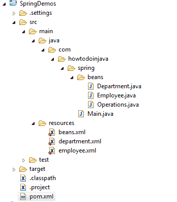

# Spring bean – XML 配置

> 原文： [https://howtodoinjava.com/spring5/core/spring-bean-xml-config/](https://howtodoinjava.com/spring5/core/spring-bean-xml-config/)

在此 **spring bean XML 配置示例**中，学习创建定义和创建 spring bean 以及在任何 spring 应用程序中填充应用程序上下文。 本示例使用 **xml 配置定义 bean** 。 我们将使用 maven 管理 Spring 依赖项，并使用 Eclipse 构建和运行代码。

## 1\. Spring Maven 依赖

要创建能够创建和管理 bean 的 spring 应用程序上下文，我们至少需要三个 maven 依赖项，即`spring-core`，`spring-beans`和`spring-context`。

1.  `spring-core`模块具有与其他 Spring 模块一起使用所需的最基本的类。
2.  `spring-beans`模块提供了与 Spring bean 一起使用所需的`org.springframework.beans.factory.BeanFactory`接口。
3.  `spring-context`模块提供`org.springframework.context.ApplicationContext`接口，该接口可启用其他功能，例如[消息资源](https://howtodoinjava.com/spring/spring-mvc/spring-mvc-internationalization-i18n-and-localization-i10n-example/)， [AOP](https://howtodoinjava.com/spring-aop-tutorial/) 功能，特定类型的应用程序上下文和 [bean 生命周期](https://howtodoinjava.com/spring/spring-core/spring-bean-life-cycle/) 事件监听器。

`pom.xml`

```java
<project xmlns="http://maven.apache.org/POM/4.0.0" xmlns:xsi="http://www.w3.org/2001/XMLSchema-instance"
	xsi:schemaLocation="http://maven.apache.org/POM/4.0.0 http://maven.apache.org/xsd/maven-4.0.0.xsd;
	<modelVersion>4.0.0</modelVersion>

	<groupId>com.howtodoinjava.spring.webmvc</groupId>
	<artifactId>SpringDemos</artifactId>
	<version>0.0.1-SNAPSHOT</version>
	<packaging>jar</packaging>

	<name>SpringDemos</name>
	<url>http://maven.apache.org</url>

	<properties>
		<project.build.sourceEncoding>UTF-8</project.build.sourceEncoding>
		<spring.version>5.2.0.RELEASE</spring.version>
	</properties>

	<dependencies>
		<!-- Spring Dependencies -->
		<dependency>
			<groupId>org.springframework</groupId>
			<artifactId>spring-core</artifactId>
			<version>${spring.version}</version>
		</dependency>
		<dependency>
			<groupId>org.springframework</groupId>
			<artifactId>spring-beans</artifactId>
			<version>${spring.version}</version>
		</dependency>
		<dependency>
			<groupId>org.springframework</groupId>
			<artifactId>spring-context</artifactId>
			<version>${spring.version}</version>
		</dependency>
	</dependencies>
</project>

```

## 2\. xml 配置中的 Spring bean 定义

#### 2.1. 具有 bean 定义的单个配置文件

您可以在单个 xml 文件中定义所有 **SpringBean** 及其传递依赖项。 此 xml 文件可用于**创建应用程序上下文**。

`beans.xml`

```java
<?xml version="1.0" encoding="UTF-8"?>
<beans xmlns="http://www.springframework.org/schema/beans"
	xmlns:xsi="http://www.w3.org/2001/XMLSchema-instance" xmlns:context="http://www.springframework.org/schema/context"
	xsi:schemaLocation="http://www.springframework.org/schema/beans 
	http://www.springframework.org/schema/beans/spring-beans.xsd 
	http://www.springframework.org/schema/context 
	http://www.springframework.org/schema/context/spring-context.xsd">

	<bean id="operations" 	class="com.howtodoinjava.spring.beans.Operations"></bean>
	<bean id="employee" 	class="com.howtodoinjava.spring.beans.Employee"></bean>
	<bean id="department" 	class="com.howtodoinjava.spring.beans.Department"></bean>

</beans> 

```

#### 2.2. 在多个配置文件中定义 bean 并导入到主文件中

该方法在编写**模块化代码**时更有用。 您可以在单独的 xml 文件中定义 bean，然后将文件导入主 xml 文件。

`employee.xml`

```java
<beans>

	<bean id="employee" class="com.howtodoinjava.spring.beans.Employee"></bean>

</beans> 

```

`department.xml`

```java
<beans>

	<bean id="department" class="com.howtodoinjava.spring.beans.Department"></bean>

</beans> 

```

`beans.xml`

```java
<?xml version="1.0" encoding="UTF-8"?>
<beans>

	<import resource="employee.xml"/>
	<import resource="department.xml"/>

	<bean id="operations" class="com.howtodoinjava.spring.beans.Operations"></bean>

</beans> 

```

## 3\. Spring bean 示例

要**创建[`ApplicationContext`](https://docs.spring.io/spring-framework/docs/current/javadoc-api/org/springframework/context/ApplicationContext.html)**，我们可以使用它作为可用实现的一种特定实现，例如 `ClassPathXmlApplicationContext`，`FileSystemXmlApplicationContext`，`StaticApplicationContext`，`XmlWebApplicationContext`等。

我们将需要将 **bean 配置文件名称作为使用类的构造函数参数**传递。 不要忘记将文件归档在`classpath`或[资源文件夹](https://howtodoinjava.com/java/io/read-file-from-resources-folder/)中。

`Main.java`

```java
import org.springframework.context.ApplicationContext;
import org.springframework.context.support.ClassPathXmlApplicationContext;

public class XmlConfigExample 
{
    public static void main( String[] args )
    {
	@SuppressWarnings("resource")
	ApplicationContext ctx = new 
                  ClassPathXmlApplicationContext( "com/howtodoinjava/core/demo/beans/beans.xml" );

        Employee employee = ctx.getBean(Employee.class);

        Department department = ctx.getBean(Department.class);

        Operations operations = ctx.getBean(Operations.class);

        System.out.println(department);
        System.out.println(employee);

        operations.helloWorld();
    }
}

```

程序输出：

`Console`

```java
Jan 02, 2018 3:10:27 PM org.springframework.beans.factory.xml.XmlBeanDefinitionReader loadBeanDefinitions
INFO: Loading XML bean definitions from class path resource [beans.xml]

Jan 02, 2018 3:10:27 PM org.springframework.beans.factory.xml.XmlBeanDefinitionReader loadBeanDefinitions
INFO: Loading XML bean definitions from class path resource [employee.xml]

Jan 02, 2018 3:10:27 PM org.springframework.beans.factory.xml.XmlBeanDefinitionReader loadBeanDefinitions
INFO: Loading XML bean definitions from class path resource [department.xml]

Employee [id=0, name=null]
Department [id=0, name=null]
Hello World !!

```

## 4\. 示例中使用的项目结构和其他类

#### 4.1. 项目结构



Spring XML Config Project Structure

#### 4.2. Bean

`Employee.java`

```java
@Getter
@Setter
@ToString
public class Employee 
{
	private long id;
	private String name;
}

```

`Department.java`

```java
@Getter
@Setter
@ToString
public class Department 
{
    private long id;
    private String name;
}

```

`Operations.java`

```java
public class Operations 
{
	public void helloWorld(){
		System.out.println("Hello World !!");
	}
}

```

在评论部分中，将您与基于 **Spring XML 配置**基于 **spring 容器**有关的问题交给我。

学习愉快！

有关：

[Spring Java 配置示例](https://howtodoinjava.com/spring5/core/spring-bean-java-config/)
[Spring Boot2 配置示例](https://howtodoinjava.com/spring-boot2/springbootapplication-auto-configuration/)

[下载源码](https://github.com/lokeshgupta1981/spring-core/tree/master/src/main/java/com/howtodoinjava/core/demo/beans)