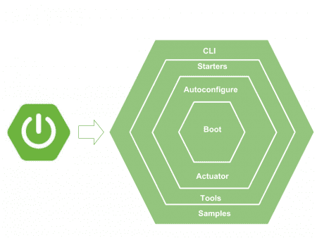

# Spring Boot 面试问题

> 原文： [https://howtodoinjava.com/interview-questions/spring-boot-interview-questions/](https://howtodoinjava.com/interview-questions/spring-boot-interview-questions/)

Spring Boot 使应用程序开发更加容易，但是在测试您对所有工作原理的了解时，我们可能会遇到一些艰难的面试问题。 使用给定的 **Spring Boot 面试问题和答案**为下一次面试做好准备。

## 1\. 什么是 Spring Boot？ 它与 Spring 框架有何不同？



Spring boot 模块

Spring Boot 是一个 Spring 框架模块，借助[入门模板](https://github.com/spring-projects/spring-boot/tree/master/spring-boot-project/spring-boot-starters/)和自动配置功能，它们向 Spring 框架提供 RAD（快速应用程序开发）功能，这些功能非常强大且可以完美运行。

它采用 Spring 平台和第三方库的观点视图。 这意味着只要我们将任何依赖项包含到应用程序中，Spring Boot 就会假定其具有通用性，并自动将库中最常用的类配置为具有合理默认值的 Spring bean。

例如，如果我们要创建 Web MVC 应用程序，则包含 maven 依赖项`spring-boot-starter-web`仅会使用 Spring webMVC 带来用于构建 Web 的所有 jar / 库，包括 RESTful 应用程序。 Ut 还包括 Tomcat 作为默认的嵌入式容器。

它还提供了一系列非功能性功能，例如嵌入式服务器，安全性，指标，运行状况检查和开箱即用的外部配置，而无需额外的配置。

如果我们必须确定 Spring 框架和 Spring Boot 之间的区别，那么可以说 Spring Boot 基本上是 Spring 框架的扩展，它消除了设置可正常生产的应用程序所需的样板配置。

它对导入到项目中的 Spring 和第三方库采取了自以为是的观点，并为我们配置了行为。 区别就这么简单。

## 2\. SpringBoot 的优缺点？

运行的两个最佳**优势**通过启动器 POM 以及最常用的库和行为的有意识的自动配置，简化了&版本无冲突依赖管理。

嵌入式 jar 可以将 Web 应用程序打包为 jar 文件，可以在任何地方运行。

它的执行器模块提供 HTTP 端点来访问应用程序内部，例如详细指标，应用程序内部工作状态，运行状况等。

在**劣势**方面，它们很少。 仍然有许多开发人员可能将初学者 poms 包含的传递性依赖项视为部署打包的负担。

另外，它的自动配置功能可能会启用许多我们在应用程序生命周期中从未使用过的功能，并且这些功能会一直被初始化和完全配置。 这可能会导致不必要的资源利用。

## 3\. 什么是自动配置？ 如何启用或禁用某些配置？

Spring Boot 自动配置扫描类路径，在类路径中找到库，然后尝试为它们猜测最佳配置，最后配置所有此类 bean。

自动配置会尝试尽可能智能化，并且会随着我们定义更多自己的自定义配置而退出。 它始终在注册用户定义的 bean 之后应用。

自动配置在`@Conditional`注解（例如`@ConditionalOnBean`和`@ConditionalOnClass`）的帮助下工作。

例如，查看`AopAutoConfiguration`类。 如果类路径扫描找到`EnableAspectJAutoProxy`，切面，建议和`AnnotatedElement`类，并且`spring.aop.auto=false`在属性文件中不存在，则启动 Spring 将为我们配置 Spring AOP 模块。

`AopAutoConfiguration.java`

```java
@Configuration

@ConditionalOnClass({ EnableAspectJAutoProxy.class, 
			Aspect.class, 
			Advice.class, 
			AnnotatedElement.class })

@ConditionalOnProperty(prefix = "spring.aop", 
			name = "auto", 
			havingValue = "true", 
			matchIfMissing = true)

public class AopAutoConfiguration 
{
	//code
}

```

## 4\. 什么是启动器依赖项？

Spring Boot 启动器是 Maven 模板，其中包含启动特定功能所需的所有相关传递依赖项的集合。

例如，如果我们要创建 [Spring WebMVC](https://howtodoinjava.com/spring-boot2/rest/rest-api-example/) 应用程序，则在传统设置中，我们将自己包括所有必需的依赖项。 它留下了版本冲突的机会，最终导致更多的运行时异常。

使用 Spring boot，要创建 Web MVC 应用程序，我们需要导入的只是[`spring-boot-starter-web`](https://github.com/spring-projects/spring-boot/blob/master/spring-boot-project/spring-boot-starters/spring-boot-starter-web/pom.xml)依赖项。 以传递方式，它引入了所有其他必需的依赖关系以构建 Web 应用程序，例如`spring-webmvc`，`spring-web`，`hibernate-validator`，`tomcat-embed-core`，`tomcat-embed-el`，`tomcat-embed-websocket`，`jackson-databind`，`jackson-datatype-jdk8`，`jackson-datatype-jsr310`和`jackson-module-parameter-name`。

`pom.xml`

```java
<dependency>
    <groupId>org.springframework.boot</groupId>
    <artifactId>spring-boot-starter-web</artifactId>
</dependency>

```

## 5\. Spring Boot 常用注解？

最常用和最重要的[SpringBoot 注解](https://howtodoinjava.com/spring-boot2/spring-boot-annotations/)如下：

*   `@EnableAutoConfiguration` – 启用自动配置机制。
*   `@ComponentScan` – 在应用程序类路径中启用组件扫描。
*   `@SpringBootApplication` – 一步启用上述所有三项功能，即启用自动配置机制，启用组件扫描并在上下文中注册额外的 bean。
*   `@ImportAutoConfiguration` – 仅导入并应用指定的自动配置类。 当我们不想启用默认自动配置时，应使用此选项。
*   `@AutoConfigureBefore, @AutoConfigureAfter, @AutoConfigureOrder` – 如果需要以特定顺序应用配置（在之后之前），则应使用`@AutoConfigureBefore, @AutoConfigureAfter, @AutoConfigureOrder`。
*   `@Conditional` – 诸如`@ConditionalOnBean`，`@ConditionalOnWebApplication`或`@ConditionalOnClass`之类的注解仅在条件满足时才注册 Bean。

## 6\. Spring Boot 是否支持嵌入式服务器？

Spring Boot 应用程序始终将 tomcat 作为嵌入式服务器依赖项。 这意味着您可以从命令提示符运行 Spring Boot 应用程序，而无需使用复杂的服务器基础结构。

如果需要的话，我们可以排除 tomcat，并根据需要包括其他任何嵌入式服务器。 或者我们可以完全排除服务器环境。 全部基于配置。

例如，以下配置排除了 tomcat，并包括了 jetty 作为嵌入式服务器。

`pom.xml`

```java
<dependency>
    <groupId>org.springframework.boot</groupId>
    <artifactId>spring-boot-starter-web</artifactId>
    <exclusions>
        <exclusion>
            <groupId>org.springframework.boot</groupId>
            <artifactId>spring-boot-starter-tomcat</artifactId>
        </exclusion>
    </exclusions>
</dependency>

<dependency>
    <groupId>org.springframework.boot</groupId>
    <artifactId>spring-boot-starter-jetty</artifactId>
</dependency>

```

## 7\. 为什么我们使用 spring boot maven 插件？

它在 Maven 中提供了 Spring Boot 支持，使我们可以打包可执行 jar 或 war 归档文件并“就地”运行应用程序。 要使用它，我们必须使用 Maven 3.2（或更高版本）。

[插件](https://docs.spring.io/spring-boot/docs/2.2.1.RELEASE/maven-plugin/usage.html)提供了使用 Spring Boot 应用程序的几个目标：

*   `spring-boot:repackage`：创建一个可自动执行的 jar 或 war 文件。 它可以替换常规工件，或者可以使用单独的**分类器**附加到构建生命周期。
*   `spring-boot:run`：运行带有多个选项的 Spring Boot 应用程序以将参数传递给它。
*   `spring-boot:start`和`stop`：将 Spring Boot 应用程序集成到`integration-test`阶段，以便应用程序先于它启动。
*   `spring-boot:build-info`：生成执行器可以使用的构建信息。

## 8\. 如何创建和运行一个简单的启动应用程序？

*   要创建任何简单的 spring boot 应用程序，我们需要先创建一个`pom.xml`文件。 将`spring-boot-starter-parent`添加为项目的父项，这使其成为 Spring Boot 应用程序。

    `pom.xml`

    ```java
    <?xml version="1.0" encoding="UTF-8"?>
    <project xmlns="http://maven.apache.org/POM/4.0.0" xmlns:xsi="http://www.w3.org/2001/XMLSchema-instance"
        xsi:schemaLocation="http://maven.apache.org/POM/4.0.0 https://maven.apache.org/xsd/maven-4.0.0.xsd">
        <modelVersion>4.0.0</modelVersion>

        <groupId>com.example</groupId>
        <artifactId>myproject</artifactId>
        <version>0.0.1-SNAPSHOT</version>

        <parent>
            <groupId>org.springframework.boot</groupId>
            <artifactId>spring-boot-starter-parent</artifactId>
            <version>2.2.1.RELEASE</version>
        </parent>
    </project>

    ```

    上面是**最简单的 Spring Boot 应用程序**，可以将其打包为 jar 文件。 现在，将项目导入到 IDE 中（可选）。

*   现在，我们可以开始添加在开发特定类型的应用程序时可能需要的其他启动程序依赖项。 例如，对于 Web 应用程序，我们添加了`spring-boot-starter-web`依赖项。

    `pom.xml`

    ```java
    <dependencies>
        <dependency>
            <groupId>org.springframework.boot</groupId>
            <artifactId>spring-boot-starter-web</artifactId>
        </dependency>
    </dependencies>

    ```

*   在此步骤开始添加应用程序业务逻辑，视图和域数据。 默认情况下，Maven 从`src/main/java`编译源代码，因此仅在此文件夹中创建应用程序代码。

    作为最初的软件包，添加**应用程序运行类**并添加[`@SpringBootApplication`](https://howtodoinjava.com/spring-boot/springbootapplication-auto-configuration/)注解。 此类将用于运行应用程序。 它的`main()`方法充当应用程序的入口点。

    `MyApplication.java`

    ```java
    import org.springframework.boot.SpringApplication;
    import org.springframework.boot.autoconfigure.SpringBootApplication;

    @SpringBootApplication
    public class MyApplication 
    {
    	public static void main(String[] args) {
    		SpringApplication.run(MyApplication.class, args);
    	}
    }

    ```

*   上面`main()`方法中提供的`SpringApplication`类运行我们的应用程序，启动 Spring，该 Spring 反过来又启动了自动配置的 Tomcat Web 服务器。 `MyApplication`（方法参数）指示主要的 Spring 组件。
*   由于我们使用了`spring-boot-starter-parent`父 POM，因此我们有一个有用的“运行”目标，可用于启动应用程序。 在根项目目录中键入`'mvn spring-boot：run'`以启动应用程序。

    它将通过单击 URL：`localhost:8080`启动我们可以在控制台日志以及浏览器中验证的应用程序。

## 9\. 如何将 Web 应用程序打包为可执行 jar 或 war 文件？

可执行 jar（有时称为“胖 jar”）是包含已编译类以及应用程序需要运行的所有 jar 依赖项的归档文件。

为了**创建一个可执行 jar** ，我们应该在`pom.xml`中添加`spring-boot-maven-plugin`。 默认情况下，此插件仅将应用程序打包为`.jar`文件。

`pom.xml`

```java
<build>
    <plugins>
        <plugin>
            <groupId>org.springframework.boot</groupId>
            <artifactId>spring-boot-maven-plugin</artifactId>
        </plugin>
    </plugins>
</build>

```

要[**创建 war 文件**](https://howtodoinjava.com/spring-boot/war-packaging-example/)，第一步是在`pom.xml`文件中声明打包类型`war`。

其次，将嵌入式服务器依赖项的范围设置为“已提供”，因为服务器依赖项将由将要部署 war 文件的应用程序服务器提供。

`pom.xml`

```java
<packaging>war</packaging>

<dependency>
    <groupId>org.springframework.boot</groupId>
    <artifactId>spring-boot-starter-tomcat</artifactId>
    <scope>provided</scope>
</dependency>

```

## 10\. 如何启用调试日志记录？

要启用调试日志记录，

1.  我们可以使用`--debug`开关启动应用程序。
2.  我们可以在`application.properties`文件中设置`logging.level.root=debug`属性。
3.  我们可以在提供的日志配置文件中设置根记录器的日志记录级别。

## 11\. 什么是 Spring 执行器？ 它有什么优势？

借助 Spring Boot 的[执行器模块](https://howtodoinjava.com/spring-boot/actuator-endpoints-example/)，我们可以监视和管理生产环境中的应用程序使用情况，而无需对其进行编码和配置。 这些监视和管理信息通过 [REST](https://restfulapi.net/)（如端点 URL）公开。

启用功能的最简单方法是向`spring-boot-starter-actuator`启动程序 pom 文件添加依赖项。

`pom.xml`

```java
<dependency>
    <groupId>org.springframework.boot</groupId>
    <artifactId>spring-boot-starter-actuator</artifactId>
</dependency>

```

Spring Boot 包含许多内置端点，我们可以添加自己的端点。 此外，每个单独的端点也可以启用或禁用。

一些重要且广泛使用的执行器端点如下：

| 端点 | 用法 |
| --- | --- |
| `/env` | 返回当前环境中的属性列表 |
| `/health` | 返响应用程序运行状况信息。 |
| `/auditevents` | 返回所有自动配置的候选对象以及应用它们“被”或“未被”的原因。 |
| `/beans` | 返响应用程序中所有 Spring Bean 的完整列表。 |
| `/trace` | 返回跟踪日志（默认情况下，最近的 100 个 HTTP 请求）。 |
| `/dump` | 它执行线程转储。 |
| `/metrics` | 它显示了一些有用的指标信息，例如 JVM 内存使用情况，系统 CPU 使用情况，打开的文件等等。 |

## 12\. 什么是 Spring Boot 中的宽松绑定？

Spring Boot 使用一些宽松的规则来解析配置属性名称，以便可以用多种方式编写一个简单的属性名称。

例如，可以通过以下方式编写简单的属性`log.level.my-package`，并且所有内容都是正确的，并将由框架根据属性来源对其值进行解析。

```java
log.level.my-package = debug    	//Kebab case
log.level.my_package = debug 		//Underscore notation
log.level.myPackage = debug 		//Camel case
LOG.LEVEL.MY-PACKAGE = debug 		//Upper case format

```

以下是每个属性源的宽松绑定规则列表。

| 属性源 | 允许的类型 |
| --- | --- |
| 属性文件 | Camel 大小写，Kebab 大小写或下划线 |
| YAML 文件 | Camel 大小写，Kebab 大小写或下划线 |
| 环境变量 | 以下划线作为定界符的大写格式。 `_`不应在属性名称中使用 |
| 系统属性 | Camel 大小写，Kebab 大小写或下划线 |

## 13\. 如何在 Spring Boot 应用程序中进行单元测试和集成测试？

通常，任何软件应用程序都分为不同的模块和组件。 单独测试一个这样的组件时，称为**单元测试**。

单元测试不能验证应用程序代码是否正确地与外部依赖项一起工作。 它专注于单个组件并模拟与该组件交互的所有依赖项。

要执行单元测试，我们可以借助特殊的注解，例如：

*   `@JdbcTest` – 当测试仅关注基于 jdbc 的组件时，可用于典型的 jdbc 测试。
*   `@JsonTest` – 当测试仅关注 JSON 序列化时使用。
*   `@RestClientTest` – 用于测试 REST 客户端。
*   `@WebMvcTest` – 用于 Spring MVC 测试，其配置仅与 MVC 测试相关。

**集成测试**可以根据要测试的内容，将整个应用程序置于范围内或仅包含某些组件。 他们可能需要为数据库实例和硬件分配资源。 尽管也可以模拟这些交互以提高测试性能。

在集成测试中，我们将专注于测试从控制器到持久层的完整请求处理。

`@SpringBootTest`注解有助于编写集成测试。 它启动嵌入式服务器并完全初始化应用程序上下文。 我们可以使用`@Autowired`注解将依赖项注入测试类中。

我们还可以使用嵌套`@Configuration`类或显式`@TestConfiguration`类提供特定于测试的 bean 配置。

它还注册了`TestRestTemplate`和/或`WebTestClient` bean，用于 Web 测试。

`EmployeeControllerIntegrationTests.java`

```java
@SpringBootTest(classes = SpringBootDemoApplication.class, 
        webEnvironment = WebEnvironment.RANDOM_PORT)
public class EmployeeControllerIntegrationTests 
{
    @LocalServerPort
    private int port;

    @Autowired
    private TestRestTemplate restTemplate;

    //tests
}

```

## 14\. 如何在浏览器中启用热部署和实时重载？

大多数现代 IDE 支持字节码的热交换，并且大多数代码更改应干净地重新加载而没有副作用。 此外，[`spring-boot-devtools`](https://howtodoinjava.com/spring-boot/developer-tools-module-tutorial/)模块还支持在类路径上的文件更改时自动重新启动应用程序。

默认情况下，将监视类路径上指向文件夹的任何条目的更改。 请注意，某些资源（例如静态资产和视图模板）不需要重新启动应用程序。

`spring-boot-devtools`模块包括一个嵌入式 LiveReload 服务器，该服务器可用于在更改资源时触发浏览器刷新。 可从 livereload.com 免费获得适用于 Chrome，Firefox 和 Safari 的 LiveReload 浏览器扩展。

要启用/禁用 LiveReload 服务器，请将`spring.devtools.livereload.enabled`属性的值更改为`true`（默认值）或`false`。

## 15\. 如何在 Spring Boot 中启用 HTTPS / SSL 支持？

可以通过`application.properties`并添加以下条目来添加 Spring Boot 项目中的[ SSL 支持](https://howtodoinjava.com/spring-boot/spring-boot-ssl-https-example/)。

`application.properties`

```java
server.port=8443
server.ssl.key-alias=selfsigned_localhost_sslserver
server.ssl.key-password=changeit
server.ssl.key-store=classpath:ssl-server.jks
server.ssl.key-store-provider=SUN
server.ssl.key-store-type=JKS

```

请与我们分享您过去遇到的 SpringBoot 面试问题。

学习愉快！