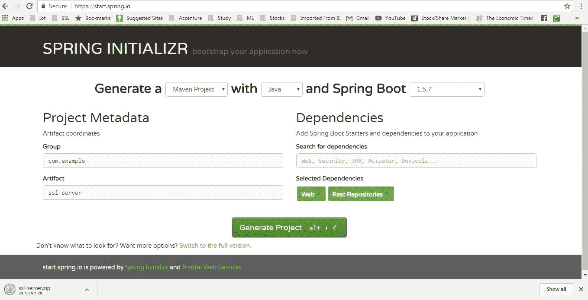

# Spring Boot SSL（HTTPS）示例

> 原文： [https://howtodoinjava.com/spring-boot/spring-boot-ssl-https-example/](https://howtodoinjava.com/spring-boot/spring-boot-ssl-https-example/)

在此 [SpringBoot](https://howtodoinjava.com/spring/spring-boot/spring-boot-tutorial-with-hello-world-example/) 示例中，学习配置 Web 应用程序以使用自签名证书在 SSL（HTTPS）上运行。 也要学习**创建 SSL 证书**。

## 不耐烦的 SSL 配置

#### Spring Boot HTTPS 配置

```java
server.port=8443
server.ssl.key-alias=selfsigned_localhost_sslserver
server.ssl.key-password=changeit
server.ssl.key-store=classpath:ssl-server.jks
server.ssl.key-store-provider=SUN
server.ssl.key-store-type=JKS

```

#### 从 HTTP 重定向到 HTTPS

```java
private Connector redirectConnector() {
  Connector connector = new Connector("org.apache.coyote.http11.Http11NioProtocol");
  connector.setScheme("http");
  connector.setPort(8080);
  connector.setSecure(false);
  connector.setRedirectPort(8443);
  return connector;
}

```

有关如何设置整体的详细教程，请继续阅读。

## 术语

在继续之前，让我们了解 SSL 或 TLS 等特定术语的含义。

**SSL** – 表示安全套接字层。 它是行业标准协议，用于通过保护在两个系统之间发送的所有敏感数据来保护 Internet 连接的安全，从而防止黑客读取和修改任何传输的信息。

**TLS** – （传输层安全性）是 SSL 的更新，更安全的版本。 它增加了更多功能。 如今，证书颁发机构提供的证书仅基于 TLS。 但是，关于网络上的安全通信，SSL 一词仍然很普遍，因为它很老，并且在社区中很流行。

**HTTPS** – 通过 SSL 证书保护网站时，URL 中显示（安全的超文本传输​​协议）。 它是 HTTP 协议的安全版本。

**信任库和密钥库** – 用于在 Java 中存储 SSL 证书的证书，但它们之间没有什么区别。 `truststore`用于存储公共证书，而`keystore`用于存储客户端或服务器的私有证书。

## 创建自己的自签名 SSL 证书

要为我们的应用程序获取 SSL 数字证书，我们有两种选择：

1.  创建一个自签名证书
2.  为了从证书颁发机构（CA）获得 SSL 证书，我们将其称为 CA 证书。

为了今天的演示目的，我们将创建由 Java `keytool`命令生成的自签名证书。 我们需要在命令提示符下运行`keytool -genkey`命令。

这是我们将使用的确切命令：

```java
keytool -genkey -alias selfsigned_localhost_sslserver -keyalg RSA -keysize 2048 -validity 700 -keypass changeit -storepass changeit -keystore ssl-server.jks
```

让我们了解以上命令：

*   `-genkey` – 是用于生成证书的`keytool`命令，实际上`keytool`是一种多功能且功能强大的工具，具有多个选项
*   `-alias selfsigned_localhost_sslserver` – 表示证书的别名，由 SSL / TLS 层使用
*   `-keyalg RSA -keysize 2048 -validity 700` – 是自描述参数，指示加密算法，密钥大小和证书有效性。
*   `-keypass changeit -storepass changeit` – 是我们的信任库和密钥库的密码
*   `-keystore ssl-server.jks` – 是将存储证书和公用/专用密钥的实际密钥库。 在这里，我们从 Java 密钥库使用 [JKS](https://en.wikipedia.org/wiki/Keystore)，密钥库还有其他格式。

一旦执行了以上命令，它将要求某些信息，最后看起来像这样。


生成证书的`keytool`

至此，我们就需要生成证书。 这将在执行`keytool`命令的目录中生成`ssl-server.jks`密钥库文件，其中包含我们的自签名证书。

要查看此密钥库中的内容，我们可以再次使用`keytool -list`命令。

```java
keytool -list -keystore ssl-server.jks
```

输出将类似于：


`keytool -list`选项

## 创建 Spring Boot 项目并配置 SSL

#### 生成 Spring Boot 项目

从 [SPRING 初始化器](https://start.spring.io/) 站点创建一个具有依赖项`Web`和`Rest Repositories`的 spring boot 项目。 选择依赖项并给出适当的 Maven GAV 坐标后，我们将获得压缩格式的下载选项。 下载框架项目，解压缩，然后将其作为 Maven 项目导入 eclipse 中。



Spring boot 项目生成

#### 添加 REST 端点

为了进行测试，我们将使用一个简单的 [REST](https://restfulapi.net) 端点。 为此，请打开已生成的带有`@SpringBootApplication`注解的 spring boot 应用程序类，并添加此代码。 这将在服务器中公开一个带有相对 URL `/secured`的其余端点。

```java
@RestController
class SecuredServerController{

	@RequestMapping("/secured")
	public String secured(){
		System.out.println("Inside secured()");
		return "Hello user !!! : " + new Date();
	}
}

```

这就是我们需要在应用程序中添加 Web 内容的全部。 您可以添加更多内容，例如添加页面，图像以创建功能完善的 Web 应用程序。

#### Spring Boot SSL 配置

首先，我们需要将生成的密钥库文件（`ssl-server.jks`）复制到`resources`文件夹中，然后打开`application.properties`并添加以下条目。

```java
server.port=8443
server.ssl.key-alias=selfsigned_localhost_sslserver
server.ssl.key-password=changeit
server.ssl.key-store=classpath:ssl-server.jks
server.ssl.key-store-provider=SUN
server.ssl.key-store-type=JKS

```

这就是我们启用 https 所需要的。 很简单，对吧？ 借助 SpringBoot，使一切变得非常容易。

#### 示例

现在是时候通过命令`mvn clean install`进行最终的 Maven 构建，并通过`java -jar target\ssl-server-0.0.1-SNAPSHOT.jar`命令启动应用程序。 这将在`localhost 8443`端口启动我们的安全应用程序，我们的端点 URL 将为 [https://localhost:8443/secured](https://localhost:8443/secured)。

由于我们的 REST 端点是通过 GET 公开的，因此我们只能通过浏览器进行测试。 转到 [https://localhost:8443/secured](https://localhost:8443/secured)，您将收到一些浏览器警告，例如未从受信任的证书颁发机构颁发证书，在浏览器中添加例外，您将收到刚刚由你创建的 HTTPS 服务器的响应。


浏览器输出

## 将 HTTP 请求重定向到 HTTPS

如果您要将 HTTP 流量重定向到 HTTPS，从而使整个站点变得安全，这是一个可选步骤。 为此，在 SpringBoot 时，我们需要在`8080`端口添加 HTTP 连接器，然后需要设置重定向端口`8443`。 这样`8080`中通过 http 发出的任何请求都将自动重定向到`8443`和 https。

为此，您只需要添加以下配置。

```java
@Bean
public EmbeddedServletContainerFactory servletContainer() {
  TomcatEmbeddedServletContainerFactory tomcat = new TomcatEmbeddedServletContainerFactory() {
      @Override
      protected void postProcessContext(Context context) {
        SecurityConstraint securityConstraint = new SecurityConstraint();
        securityConstraint.setUserConstraint("CONFIDENTIAL");
        SecurityCollection collection = new SecurityCollection();
        collection.addPattern("/*");
        securityConstraint.addCollection(collection);
        context.addConstraint(securityConstraint);
      }
    };

  tomcat.addAdditionalTomcatConnectors(redirectConnector());
  return tomcat;
}

private Connector redirectConnector() {
  Connector connector = new Connector("org.apache.coyote.http11.Http11NioProtocol");
  connector.setScheme("http");
  connector.setPort(8080);
  connector.setSecure(false);
  connector.setRedirectPort(8443);

  return connector;
}

```

通过命令`mvn clean install`进行最终的 Maven 构建，然后启动应用程序。 测试 [http://localhost:8080/secured](http://localhost:8080/secured)。 它将自动重定向到 HTTPS 安全 URL。

## 总结

因此，今天我们了解了如何在 Spring Bean 应用程序中启用 **HTTPS**，并且还了解了**如何将 HTTP 流量重定向至 HTTPS** 。 我们还学会了**创建自签名 SSL 证书**。

将我的问题放在评论部分。

[下载源码](https://howtodoinjava.com/wp-content/uploads/2017/09/ssl-server.zip)

学习愉快！