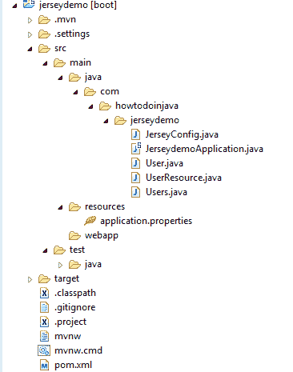

# Spring Boot Jersey 示例

> 原文： [https://howtodoinjava.com/spring-boot/spring-boot-jersey-example/](https://howtodoinjava.com/spring-boot/spring-boot-jersey-example/)

学习使用 **Spring Boot** 和 [**Jersey**](//howtodoinjava.com/jersey-jax-rs-tutorials/) 框架来配置和创建 JAX-RS 2.0 **REST** API。 此示例应用程序使用 Jersey 的 ServletContainer 部署 REST API。

## 项目结构

在本教程中创建的应用程序的项目结构如下：

Spring Boot Jersey Project Structure

## 从 Spring Initializr 创建 Spring Boot 应用程序

1.  Go to [Spring Initializr](https://start.spring.io/) portal and create spring boot application with **Jersey (JAX-RS)** dependency.

    

    Select Jersey in Spring Boot Initializr

2.  将项目生成为 zip 文件。 将其解压缩到计算机中的某个位置。 将项目作为`现有 Maven 应用程序`导入到 eclipse 中。
3.  检查 Maven 文件中是否应具有**依赖项。

    [PRE0]** 

## 创建 JAX-RS REST 资源

现在创建一些 JAX-RS 资源，我们将进入测试阶段。 我创建了`UserResource`类。

`UserResource.java`

[PRE1]

`Users.java`

[PRE2]

`User.java`

[PRE3]

## Jersey 配置

1.  Now we have a JAX-RS resource and we want to access it from spring boot application which include Jersey dependency. Let’s register this resource as Jersey resource.

    [PRE4]

    查看`@Component`注解。 它可以在 Spring Boot 自动扫描源文件夹中的 java 类时注册此类。

2.  `ResourceConfig`提供高级功能以简化 JAX-RS 组件的注册。
3.  用`SpringBootServletInitializer`扩展 spring boot 应用程序。

    [PRE5]

## 示例

将项目作为 Spring 启动应用程序运行。 现在测试其余资源。

**访问/ users 资源**

users resource

**访问/ users / 1 资源**

user resource

## 下载源代码

要下载此示例的源代码，请单击下面提供的下载链接。

[Download Sourcecode](//howtodoinjava.com/wp-content/downloads/jerseydemo.zip)

将我的问题放在评论部分。

学习愉快！