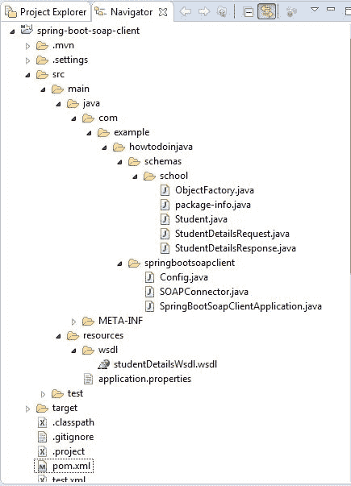
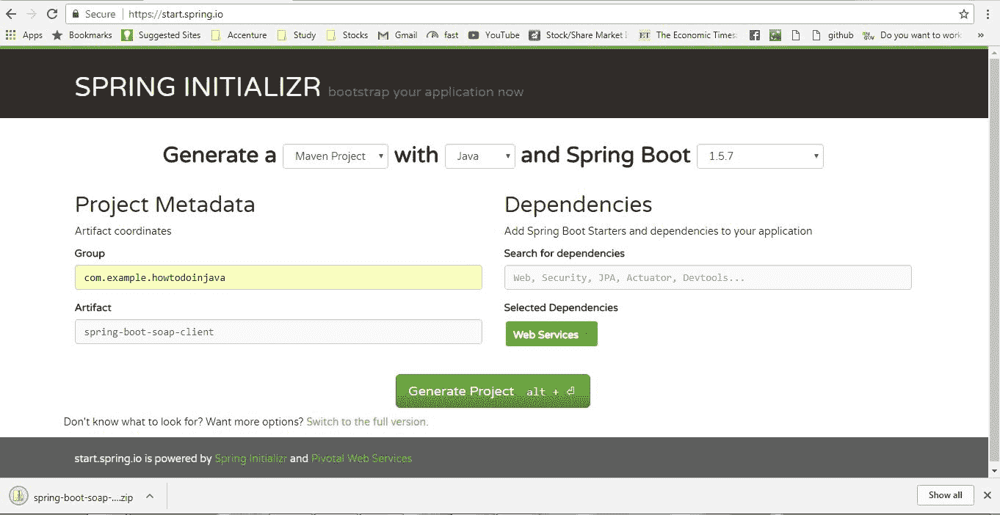

# Spring Boot SOAP 客户端– WebServiceTemplate 示例

> 原文： [https://howtodoinjava.com/spring-boot/spring-soap-client-webservicetemplate/](https://howtodoinjava.com/spring-boot/spring-soap-client-webservicetemplate/)

学习使用 Spring Boot Soap 客户端使用 SOAP Web 服务以及使用 JAXB maven 插件自动生成客户端代理类。 创建 SOAP Web 服务不在本教程的讨论范围内，但是您可以在中学习它。

> 阅读更多：[在 Spring Framework](https://howtodoinjava.com/spring/spring-boot/spring-boot-soap-webservice-example/) 中创建 SOAP WS。

## 先决条件

在运行此示例之前，我们需要准备好一个 SOAP 服务，该服务将从该客户端代码中调用。 为此，您可以下载附件的 maven 项目（在文章结尾），然后在本地工作区中运行它并使用它。

运行此 SOAP 服务器项目后，您将从`http://localhost:8080/service/studentDetailsWsdl.wsdl`获取 WSDL。 将 WSDL 下载为`studentDetailsWsdl.wsdl`，稍后将其放置在客户端项目的`resources/wsdl`文件夹中，该文件夹将在下一步创建以生成客户端代理代码。

## Spring Boot Soap 客户端的技术堆栈

*   JDK 1.8，Eclipse，Maven –开发环境
*   春季启动–基础应用程序框架
*   `maven-jaxb2-plugin`插件–用于生成 JAXB 存根
*   春季启动`CommandLineRunner` – 测试客户端代码

## 项目结构

为该演示创建的类和文件如下所示。



SOAP client project structure

## 使用 WebServiceTemplate 创建 Spring Client

#### 创建启动项目

仅从具有`Web Services`依赖关系的 [SPRING INITIALIZR](https://start.spring.io/) 站点创建一个 spring boot 项目。 选择依赖项并提供适当的 Maven GAV 坐标后，以压缩格式下载项目。 解压缩，然后将 eclipse 中的项目导入为 maven 项目。



Generate Spring boot project

#### 生成 SOAP 域类

现在使用`maven-jaxb2-plugin` maven 插件生成 **JAXB 注释的存根类**。 为此，将此 maven 插件添加到项目的`pom.xml`中。

`pom.xml`

```java
<plugin>
	<groupId>org.jvnet.jaxb2.maven2</groupId>
	<artifactId>maven-jaxb2-plugin</artifactId>
	<version>0.13.2</version>
	<executions>
		<execution>
			<goals>
				<goal>generate</goal>
			</goals>
		</execution>
	</executions>
	<configuration>
		<generatePackage>com.example.howtodoinjava.schemas.school</generatePackage>
		<generateDirectory>${project.basedir}/src/main/java</generateDirectory>
		<schemaDirectory>${project.basedir}/src/main/resources/wsdl</schemaDirectory>
		<schemaIncludes>
			<include>*.wsdl</include>
		</schemaIncludes>
	</configuration>
</plugin>	

```

此插件将在项目的`src`目录的`com.example.howtodoinjava.springbootsoapclient`包中生成类，并且此插件将检查类的生成时间戳，以便仅在`WSDL`中发生任何更改时才生成这些类。

#### 使用 WebServiceTemplate 创建 SOAP 客户端

创建一个名为`SOAPConnector.java`的类，该类将充当对 Web 服务的所有请求的通用 Web 服务客户端。

`SOAPConnector.java`

```java
package com.example.howtodoinjava.springbootsoapclient;

import org.springframework.ws.client.core.support.WebServiceGatewaySupport;

public class SOAPConnector extends WebServiceGatewaySupport {

	public Object callWebService(String url, Object request){
		return getWebServiceTemplate().marshalSendAndReceive(url, request);
	}
}

```

1.  `SOAPConnector`类是对`WebServiceGatewaySupport`的扩展，它基本上是通过`getWebServiceTemplate()`方法提供的`WebServiceTemplate`内部实现注入一个接口。
2.  我们将使用此`WebServiceTemplate`来调用 SOAP 服务。
3.  该类还期望注入一个名为`Marshaller`和`Unmarshaller`的 spring bean，它们将由配置类提供，我们将在下面看到。

#### Spring bean 配置

现在，我们需要创建一个用`@Configuration`注释的配置类，该类将具有`SOAPConnector`所需的必需的 bean 定义，以使其正常工作。

`Config.java`

```java
package com.example.howtodoinjava.springbootsoapclient;

import org.springframework.context.annotation.Bean;
import org.springframework.context.annotation.Configuration;
import org.springframework.oxm.jaxb.Jaxb2Marshaller;

@Configuration
public class Config {
	@Bean
	public Jaxb2Marshaller marshaller() {
		Jaxb2Marshaller marshaller = new Jaxb2Marshaller();
		// this is the package name specified in the <generatePackage> specified in
		// pom.xml
		marshaller.setContextPath("com.example.howtodoinjava.schemas.school");
		return marshaller;
	}

	@Bean
	public SOAPConnector soapConnector(Jaxb2Marshaller marshaller) {
		SOAPConnector client = new SOAPConnector();
		client.setDefaultUri("http://localhost:8080/service/student-details");
		client.setMarshaller(marshaller);
		client.setUnmarshaller(marshaller);
		return client;
	}
}

```

1.  `WebServiceGatewaySupport`需要`Marshaller`和`Unmarshaller`，它们是`Jaxb2Marshaller`类的实例。
2.  它使用`com.example.howtodoinjava.schemas.school`作为 JAXB 类的基本包。 它将使用此包创建 JAXB 上下文。
3.  我们将使用此`Jaxb2Marshaller` bean 作为`SOAPConnector` bean 的`Marshaller/Unmarshaller`。

#### 使用 CommandLineRunner 测试

为简单起见，我们将创建一个 [Spring Boot 命令行运行程序](https://howtodoinjava.com/spring/spring-boot/command-line-runner-interface-example/)，该加载程序将加载 spring 上下文并调用处理程序方法，并将命令行参数传递给该方法。 实时地，我们需要用一些其他代码替换此命令行运行程序，这些代码将更适合企业。

我们需要在`SpringBootApplication`类中将此命令行运行器 bean 添加为波纹管。

`SpringBootSoapClientApplication.java`

```java
package com.example.howtodoinjava.springbootsoapclient;

import org.springframework.boot.CommandLineRunner;
import org.springframework.boot.SpringApplication;
import org.springframework.boot.autoconfigure.SpringBootApplication;
import org.springframework.context.annotation.Bean;
import com.example.howtodoinjava.schemas.school.StudentDetailsRequest;
import com.example.howtodoinjava.schemas.school.StudentDetailsResponse;

@SpringBootApplication
public class SpringBootSoapClientApplication {

	public static void main(String[] args) {
		SpringApplication.run(SpringBootSoapClientApplication.class, args);
	}

	@Bean
	CommandLineRunner lookup(SOAPConnector soapConnector) {
		return args -> {
			String name = "Sajal";//Default Name
			if(args.length>0){
				name = args[0];
			}
			StudentDetailsRequest request = new StudentDetailsRequest();
			request.setName(name);
			StudentDetailsResponse response =(StudentDetailsResponse) soapConnector.callWebService("http://localhost:8080/service/student-details", request);
			System.out.println("Got Response As below ========= : ");
			System.out.println("Name : "+response.getStudent().getName());
			System.out.println("Standard : "+response.getStudent().getStandard());
			System.out.println("Address : "+response.getStudent().getAddress());
		};
	}
}

```

在这里，我们从命令行获取搜索参数，并创建`StudentDetailsRequest`对象，并使用`SOAPConnector`调用 SOAP Web 服务。

#### 很少的可选配置

打开`application.properties`并添加以下配置

`application.properties`

```java
server.port = 9090
logging.level.org.springframework.ws=TRACE

```

在这里，我们用`server.port = 9090`将默认端口覆盖为`9090`，因为您已经注意到我们的示例 SOAP 服务在默认端口`8080`中运行，因为两个 Java 进程不能在同一端口中运行。

另外，我们正在通过`logging.level.org.springframework.ws=TRACE`为`org.springframework.ws`软件包启用`TRACE`日志记录。 这将在控制台中打印 SOAP 负载。

这就是我们使用 Spring Boot 消费 SOAP 服务所需要做的一切，现在是时候进行测试了。

## 演示版

现在使用 maven 命令`mvn clean install`来构建应用程序。 我们可以从命令提示符下通过命令`java -jar target\spring-boot-soap-client-0.0.1-SNAPSHOT.jar Lokesh`调用命令行运行程序。

请注意，我们在此处传递了一个命令行参数“ Lokesh”，该参数将在`CommandLineRunner` bean 的查找方法中使用。 如果没有传递任何名称，我们将在该方法中传递一个默认名称。

调用命令行运行程序后，我们应该看到 SOAP 服务输出，并且响应已正确解组到 JAXB 对象`StudentDetailsResponse`。 同样，我们可以在 TRACE 日志中看到完整的 SOAP 请求/响应，如下所示。

#### 输出

```java
2017-10-09 23:20:45.548 TRACE 9204 --- [           main] o.s.ws.client.MessageTracing.received    : Received response [<SOAP-ENV:Envelope xmlns:SOAP-ENV="http://schemas.xmlsoap.org/soap/envelope/"><SOAP-ENV:Header/><SOAP-ENV:Body><ns2:StudentDetailsResponse xmlns:ns2="https://www.howtodoinjava.com/xml/school"><ns2:Student><ns2:name>Sajal</ns2:name><ns2:standard>5</ns2:standard><ns2:address>Pune</ns2:address></ns2:Student></ns2:StudentDetailsResponse></SOAP-ENV:Body></SOAP-ENV:Envelope>] for request [<SOAP-ENV:Envelope xmlns:SOAP-ENV="http://schemas.xmlsoap.org/soap/envelope/"><SOAP-ENV:Header/><SOAP-ENV:Body><ns2:StudentDetailsRequest xmlns:ns2="https://www.howtodoinjava.com/xml/school"><ns2:name>Sajal</ns2:name></ns2:StudentDetailsRequest></SOAP-ENV:Body></SOAP-ENV:Envelope>]
Got Response As below ========= :
Name : Lokesh
Standard : 6
Address : Delhi

```

## 摘要

在本 SOAP 教程中，我们学习了如何轻松地从 Spring Boot Soap 客户端中使用**来使用 SOAP 服务**。 每当需要使用任何此类 SOAP 服务时，都可以使用此方法。 希望这对您有用。

请在评论部分添加您的反馈。

[Download Sourcecode](https://howtodoinjava.com/wp-content/uploads/2017/10/spring-boot-soap-client.zip)

学习愉快！