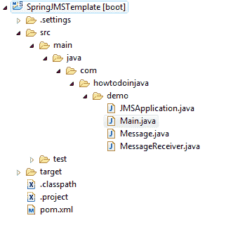

# 带有嵌入式 ActiveMQ 的 Spring Boot `JMSTemplate`

> 原文： [https://howtodoinjava.com/spring-boot/spring-boot-jmstemplate-activemq/](https://howtodoinjava.com/spring-boot/spring-boot-jmstemplate-activemq/)

了解如何使用嵌入式 [ActiveMQ](http://activemq.apache.org/) 配置 [Spring Boot](https://projects.spring.io/spring-boot/) 应用程序，以便借助 [`JMSTemplate`](https://docs.spring.io/spring/docs/current/javadoc-api/org/springframework/jms/core/JmsTemplate.html) 发送和接收 [JMS](//howtodoinjava.com/jms/jms-java-message-service-tutorial/) 消息。

## 项目结构

请在 [Eclipse](//howtodoinjava.com/maven/create-a-simple-java-project-using-maven/) 中创建一个 Maven 应用程序，然后在给定的文件夹结构下创建。

Spring Boot `JMSTemplate` – 项目结构

要运行该示例，您将需要在运行时中使用 Java 1.8.

## Maven 配置

使用 Spring Boot 和 ActiveMQ 依赖项更新`pom.xml`文件。 此外，对于[对象到 JSON 转换](//howtodoinjava.com/jackson/jackson-2-convert-json-to-from-java-object/)，我们需要 [Jackson](https://github.com/FasterXML/jackson)。

[PRE0]

## `@EnableJms`和`JmsListenerContainerFactory`配置

通过使用`@SpringBootApplication`注解对其进行注解来创建 Spring Boot 应用程序类。 将此代码添加到类中。

[PRE1]

*   `@SpringBootApplication`注解等效于使用`@Configuration`，`@EnableAutoConfiguration`和`@ComponentScan`及其默认属性。 这是使用注解配置轻松配置 spring 应用程序的快捷方式。
*   `@EnableJms`启用由`JmsListenerContainerFactory`在封面下创建的`@JmsListener`带注解的端点。
*   `JmsListenerContainerFactory`负责创建负责特定端点的监听器容器。 作为`DefaultJmsListenerContainerFactory`的典型实现提供了基础`MessageListenerContainer`支持的必要配置选项。
*   `MappingJackson2MessageConverter`用于将`Message`的有效载荷从序列化形式转换为类型化对象，反之亦然。
*   我们已经配置了`MessageType.TEXT`。 此消息类型可用于传输基于文本的消息。 客户端收到`TextMessage`时，处于只读模式。 如果客户端此时尝试写入消息，则会抛出`MessageNotWriteableException`。

## 使用`@JmsListener`的 JMS 消息接收器

消息接收器类是带有注解`@JmsListener`的单一方法的非常简单的类。 `@JmsListener`允许您将托管 Bean 的方法公开为 JMS 监听器端点。

因此，只要在配置的队列上有任何消息可用（在此示例中，队列名称为`jms.message.endpoint`），就会调用带注解的方法（即`receiveMessage`）。

`@JmsListener`是一个可重复的注释，因此您可以在同一方法上多次使用它，以将多个 JMS 目标注册到同一方法。

[PRE2]

`Message`类是简单的 POJO 类。

[PRE3]

## 使用`JmsTemplate`发送消息

要发送 JMS 消息，您将需要来自 spring 容器的 bean 类`JmsTemplate`的引用。 调用它的`convertAndSend()`方法发送消息。

[PRE4]

## 示例

执行上述`Main`类的`main()`方法。 这将启动 Spring Boot 应用程序，然后将消息发送到队列`jms.message.endpoint`。

`MessageReceiver.receiveMessage()`已经在监听此队列地址。 因此此方法将接收到消息，可以通过将消息打印到控制台进行验证。

在控制台中，输出将如下所示：

[PRE5]

显然，邮件已成功发送和接收。 这就是**使用嵌入式 ActiveMQ** 的 Spring `JMSTemplate`的快速示例。

将我的问题放在评论部分。

学习愉快！