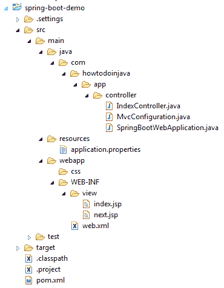
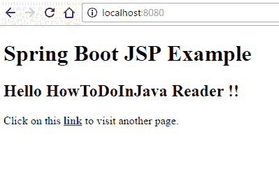
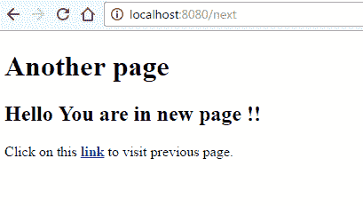

# Spring Boot JSP View 解析器示例

> 原文： [https://howtodoinjava.com/spring-boot/spring-boot-jsp-view-example/](https://howtodoinjava.com/spring-boot/spring-boot-jsp-view-example/)

学习创建和配置 **spring boot jsp 视图解析器**，该解析器使用 **JSP 模板**文件渲染视图层。 本示例使用**嵌入式 Tomcat 服务器**运行该应用程序。

## 源代码结构

该应用程序中的文件作为给定的结构放置在图像中。



Spring Boot Application Structure

## Maven 依赖项– pom.xml

此应用程序使用以下给定的依赖项。

```java
<project xmlns="http://maven.apache.org/POM/4.0.0" xmlns:xsi="http://www.w3.org/2001/XMLSchema-instance"
	xsi:schemaLocation="http://maven.apache.org/POM/4.0.0 http://maven.apache.org/maven-v4_0_0.xsd">
	<modelVersion>4.0.0</modelVersion>
	<groupId>com.howtodoinjava</groupId>
	<artifactId>spring-boot-demo</artifactId>
	<packaging>war</packaging>
	<version>0.0.1-SNAPSHOT</version>
	<name>spring-boot-demo Maven Webapp</name>
	<url>http://maven.apache.org</url>
	<parent>
		<groupId>org.springframework.boot</groupId>
		<artifactId>spring-boot-starter-parent</artifactId>
		<version>1.5.1.RELEASE</version>
	</parent>
	<properties>
		<java.version>1.8</java.version>
	</properties>
	<dependencies>
		<!-- Web -->
		<dependency>
			<groupId>org.springframework.boot</groupId>
			<artifactId>spring-boot-starter-web</artifactId>
		</dependency>
		<!-- Tomcat Embed -->
		<dependency>
			<groupId>org.springframework.boot</groupId>
			<artifactId>spring-boot-starter-tomcat</artifactId>
			<scope>provided</scope>
		</dependency>
		<!-- JSTL -->
		<dependency>
			<groupId>javax.servlet</groupId>
			<artifactId>jstl</artifactId>
		</dependency>
		<!-- To compile JSP files -->
		<dependency>
			<groupId>org.apache.tomcat.embed</groupId>
			<artifactId>tomcat-embed-jasper</artifactId>
			<scope>provided</scope>
		</dependency>
	</dependencies>
</project>

```

## Spring Boot 应用程序初始化器

产生可部署 war 文件的第一步是提供`SpringBootServletInitializer`子类并覆盖其`configure()`方法。 这利用了 Spring Framework 的 Servlet 3.0 支持，并允许您在 Servlet 容器启动应用程序时对其进行配置。

```java
package com.howtodoinjava.app.controller;

import org.springframework.boot.SpringApplication;
import org.springframework.boot.autoconfigure.SpringBootApplication;
import org.springframework.boot.builder.SpringApplicationBuilder;
import org.springframework.boot.web.support.SpringBootServletInitializer;

@SpringBootApplication
public class SpringBootWebApplication extends SpringBootServletInitializer {

	@Override
	protected SpringApplicationBuilder configure(SpringApplicationBuilder application) {
		return application.sources(SpringBootWebApplication.class);
	}

	public static void main(String[] args) throws Exception {
		SpringApplication.run(SpringBootWebApplication.class, args);
	}
}

```

## 弹簧控制器

控制器类可以将方法映射到应用程序中的特定 URL。 在给定的应用程序中，它具有两个视图，即“ /”和“ / next”。

```java
package com.howtodoinjava.app.controller;

import java.util.Map;

import org.springframework.stereotype.Controller;
import org.springframework.web.bind.annotation.RequestMapping;

@Controller
public class IndexController {

	@RequestMapping("/")
	public String home(Map<String, Object> model) {
		model.put("message", "HowToDoInJava Reader !!");
		return "index";
	}

	@RequestMapping("/next")
	public String next(Map<String, Object> model) {
		model.put("message", "You are in new page !!");
		return "next";
	}

}

```

## Spring Boot JSP ViewResolver 配置

要解决 **JSP** 文件的位置，可以采用两种方法。

#### 1）在 application.properties 中添加条目

```java
spring.mvc.view.prefix=/WEB-INF/view/
spring.mvc.view.suffix=.jsp

//For detailed logging during development

logging.level.org.springframework=TRACE
logging.level.com=TRACE

```

#### 2）配置 InternalResourceViewResolver 服务 JSP 页面

```java
package com.howtodoinjava.app.controller;

import org.springframework.context.annotation.ComponentScan;
import org.springframework.context.annotation.Configuration;
import org.springframework.web.servlet.config.annotation.EnableWebMvc;
import org.springframework.web.servlet.config.annotation.ViewResolverRegistry;
import org.springframework.web.servlet.config.annotation.WebMvcConfigurerAdapter;
import org.springframework.web.servlet.view.InternalResourceViewResolver;
import org.springframework.web.servlet.view.JstlView;

@Configuration
@EnableWebMvc
@ComponentScan
public class MvcConfiguration extends WebMvcConfigurerAdapter
{
    @Override
	public void configureViewResolvers(ViewResolverRegistry registry) {
		InternalResourceViewResolver resolver = new InternalResourceViewResolver();
		resolver.setPrefix("/WEB-INF/view/");
		resolver.setSuffix(".jsp");
		resolver.setViewClass(JstlView.class);
		registry.viewResolver(resolver);
	}
}

```

## JSP 文件

下面是这个 Spring Boot JSP 示例中使​​用的两个 JSP 文件。

**index.jsp**

```java
<!DOCTYPE html>
<%@ taglib prefix="spring" uri="http://www.springframework.org/tags"%>
<html lang="en">
<body>
	<div>
		<div>
			<h1>Spring Boot JSP Example</h1>
			<h2>Hello ${message}</h2>

			Click on this <strong><a href="next">link</a></strong> to visit another page.
		</div>
	</div>
</body>
</html>

```

**next.jsp**

```java
<!DOCTYPE html>
<%@ taglib prefix="spring" uri="http://www.springframework.org/tags"%>
<html lang="en">
<body>
	<div>
		<div>
			<h1>Another page</h1>
			<h2>Hello ${message}</h2>

			Click on this <strong><a href="/">link</a></strong> to visit previous page.
		</div>
	</div>
</body>
</html>

```

## 演示版

编写完所有代码并将其放置在文件夹中之后，通过执行`SpringBootWebApplication`类中的`main()`方法来运行应用程序。

#### 现在点击 URL：`http://localhost:8080/`



Spring Boot Application – index

#### 点击下一个链接



Spring Boot Application – next

## Spring Boot JSP 示例源代码

用下面的墨水下载该应用程序的源代码。

[Download Source Code](//howtodoinjava.com/wp-content/downloads/spring-boot-demo-jsp-example.zip)

在本教程中，我们通过示例学习了 Spring Boot JSP ViewResolver，以及其他可能使用的多个视图解析器。

学习愉快！

**参考：**

[Spring Boot](https://projects.spring.io/spring-boot/)
[Spring Boot 应用程序属性](https://docs.spring.io/spring-boot/docs/current/reference/html/common-application-properties.html)
[Spring MVC](https://docs.spring.io/spring/docs/current/spring-framework-reference/html/mvc.html#mvc-default-servlet-handler)