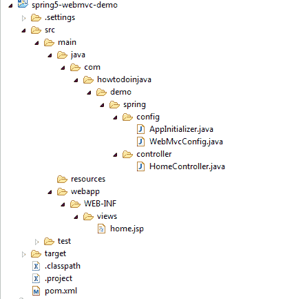
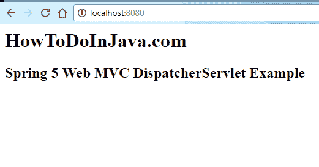

# Spring `DispatcherServlet` – 它是如何工作的？

> 原文： [https://howtodoinjava.com/spring5/webmvc/spring-dispatcherservlet-tutorial/](https://howtodoinjava.com/spring5/webmvc/spring-dispatcherservlet-tutorial/)

了解 Spring 的[`DispatcherServlet`](https://docs.spring.io/spring/docs/current/javadoc-api/org/springframework/web/servlet/DispatcherServlet.html)类，其职责以及如何使用示例进行配置。

## 1\. 什么是 Spring `DispatcherServlet`

`DispatcherServlet`充当基于 Spring 的 Web 应用程序的[前控制器](https://en.wikipedia.org/wiki/Front_controller)。 它提供了一种用于请求处理的机制，其中实际工作由可配置的委托组件执行。 它继承自[`javax.servlet.http.HttpServlet`](https://tomcat.apache.org/tomcat-7.0-doc/servletapi/javax/servlet/http/HttpServlet.html)，通常在`web.xml`文件中进行配置。

Web 应用程序可以定义任意数量的`DispatcherServlet`实例。 每个 servlet 将在其自己的名称空间中运行，并使用映射，处理器等加载其自己的应用程序上下文。只有[`ContextLoaderListener`](https://docs.spring.io/spring/docs/current/javadoc-api/org/springframework/web/context/ContextLoaderListener.html)加载的根应用程序上下文（如果有）将被共享。 在大多数情况下，应用程序仅具有上下文根 URL `(/)`的单个`DispatcherServlet`，即，到达该域的所有请求都将由该域处理。

`DispatcherServlet`使用 Spring 配置类发现请求映射，视图解析，异常处理等所需的委托组件。

## 2\. 如何使用`WebApplicationContext`

让我们了解调度程序 servlet 在内部如何工作？ 在基于 Spring 的应用程序中，我们的应用程序对象位于对象容器中。 该容器创建对象和对象之间的关联，并管理它们的完整生命周期。 这些容器对象称为 Spring 管理的 Bean（或简称为 Bean），在 Spring 世界中，该容器称为**应用程序上下文**（通过类[`ApplicationContext`](https://docs.spring.io/spring/docs/current/javadoc-api/org/springframework/context/ApplicationContext.html)）。

[`WebApplicationContext`](https://docs.spring.io/spring/docs/current/javadoc-api/org/springframework/web/context/WebApplicationContext.html)是普通`ApplicationContext`的扩展。 它是网络感知的`ApplicationContext`，即它具有 Servlet 上下文信息。 加载`DispatcherServlet`后，它将查找`WebApplicationContext`的 bean 配置文件并对其进行初始化。

通过访问 Servlet 上下文，任何实现[`ServletConextAware`](https://docs.spring.io/spring-framework/docs/current/javadoc-api/org/springframework/web/context/ServletContextAware.html)接口的 spring bean – 都可以访问[`ServletContext`](https://docs.oracle.com/javaee/7/api/javax/servlet/ServletContext.html)实例并用它做很多事情。 例如，它可以获取上下文初始化参数，获取上下文根信息以及获取 Web 应用程序文件夹内的资源位置。

## 3\. `DispatcherServlet` XML 配置

让我们看看典型的`DispatcherServlet`声明和初始化的样子。

`web.xml`

```java
<web-app>

  <listener>
    <listener-class>org.springframework.web.context.ContextLoaderListener</listener-class>
  </listener>

  <context-param>
    <param-name>contextConfigLocation</param-name>
    <param-value>/WEB-INF/dispatcher-servlet-context.xml</param-value>
  </context-param>

  <servlet>
    <servlet-name>dispatcher-servlet</servlet-name>
    <servlet-class>org.springframework.web.servlet.DispatcherServlet</servlet-class>
    <init-param>
      <param-name>contextConfigLocation</param-name>
      <param-value></param-value>
    </init-param>
    <load-on-startup>1</load-on-startup>
  </servlet>

  <servlet-mapping>
    <servlet-name>dispatcher-servlet</servlet-name>
    <url-pattern>/*</url-pattern>
  </servlet-mapping>

</web-app>

```

在上面的代码中，`dispatcher-servlet-context.xml`文件将包含所有可用于`DispatcherServlet`的 bean 定义和关联。 这些 bean 定义将覆盖在全局范围内用相同名称定义的任何 bean 的定义。 例如

`applicationContext.xml`

```java
<beans xmlns="http://www.springframework.org/schema/beans"
	xmlns:xsi="http://www.w3.org/2001/XMLSchema-instance"
	xsi:schemaLocation="http://www.springframework.org/schema/beans
	http://www.springframework.org/schema/beans/spring-beans-2.5.xsd">

    <bean id="viewResolver"
    	class="org.springframework.web.servlet.view.InternalResourceViewResolver" >
        <property name="prefix">
            <value>/WEB-INF/views/</value>
        </property>
        <property name="suffix">
            <value>.jsp</value>
        </property>
    </bean>

</beans>

```

## 4\. `DispatcherServlet` Java 配置

从 Servlet 3.0 开始，除了`web.xml`文件中的声明性配置外，还可以通过实现或扩展 Spring 提供的这三个支持类之一来以编程方式配置`DispatcherServlet`：

*   [`WebAppInitializer`](https://docs.spring.io/spring/docs/current/javadoc-api/org/springframework/web/WebApplicationInitializer.html)界面
*   [`AbstractDispatcherServletInitializer`](https://docs.spring.io/spring/docs/current/javadoc-api/org/springframework/web/servlet/support/AbstractDispatcherServletInitializer.html)抽象类
*   [`AbstractAnnotationConfigDispatcherServletInitializer`](https://docs.spring.io/spring/docs/current/javadoc-api/org/springframework/web/servlet/support/AbstractAnnotationConfigDispatcherServletInitializer.html)抽象类

#### 4.1. `WebAppInitializer`示例

在下面的类中，`WebApplicationInitializer`确保`SpringServletContainerInitializer`检测到类`ApplicationInitializer`（它本身会自动运行），并用于初始化任何 Servlet 3 容器。

**spring boot `DispatcherServlet`映射**的示例。

`ApplicationInitializer.java`

```java
public class ApplicationInitializer implements WebApplicationInitializer 
{
	@Override
	public void onStartup(ServletContext servletContext) throws ServletException 
	{
		XmlWebApplicationContext appContext = new XmlWebApplicationContext();
		appContext.setConfigLocation("/WEB-INF/dispatcher-servlet-context.xml");

		ServletRegistration.Dynamic registration = servletContext
					.addServlet("rootDispatcher", new DispatcherServlet(appContext));
		registration.setLoadOnStartup(1);
		registration.addMapping("/");
	}
}

```

#### 4.2. 完整的基于 Java 的初始化

`ApplicationInitializer.java`

```java
public class ApplicationInitializer implements WebApplicationInitializer 
{
	@Override
	public void onStartup(ServletContext container) 
	{
		// Create the 'root' Spring application context
		AnnotationConfigWebApplicationContext rootContext = new AnnotationConfigWebApplicationContext();
		rootContext.register(AppConfig.class);

		// Manage the lifecycle of the root application context
		container.addListener(new ContextLoaderListener(rootContext));

		// Create the dispatcher servlet's Spring application context
		AnnotationConfigWebApplicationContext dispatcherContext = new AnnotationConfigWebApplicationContext();
		dispatcherContext.register(DispatcherConfig.class);

		ServletRegistration.Dynamic dispatcher = container.addServlet("dispatcher", 
						new DispatcherServlet(dispatcherContext));
		dispatcher.setLoadOnStartup(1);
		dispatcher.addMapping("/");
	}
}

```

在上面的代码中，`AppConfig`和`DispatcherConfig`类定义将在 Web 应用程序上下文中的 spring 托管 bean。

#### 4.3. `AbstractDispatcherServletInitializer`示例

这是在 Servlet 上下文中注册`DispatcherServlet`的`WebApplicationInitializer`实现的基类。

`ApplicationInitializer.java`

```java
public class ApplicationInitializer extends AbstractDispatcherServletInitializer {

	@Override
	protected WebApplicationContext createRootApplicationContext() {
	        return null;
	}

	@Override
	protected WebApplicationContext createServletApplicationContext() {
	        XmlWebApplicationContext cxt = new XmlWebApplicationContext();
	        cxt.setConfigLocation("/WEB-INF/dispatcher-servlet-context.xml");
	        return cxt;
	}

	@Override
	protected String[] getServletMappings() {
	        return new String[] { "/" };
	}

	//Register filters
	@Override
    protected Filter[] getServletFilters() {
        return new Filter[] { new HiddenHttpMethodFilter(), new CharacterEncodingFilter() };
    }
}

```

请注意，如果您需要自定义`DispatcherServlet`，则可以覆盖`createDispatcherServlet()`方法。

#### 4.4. `AbstractAnnotationConfigDispatcherServletInitializer`示例

该类扩展了`AbstractDispatcherServletInitializer`并隐式地执行了一些操作，否则您可能会自己做。 另一个优点是，您现在可以使用 Spring 提供的便利类，而不必手动配置`DispatcherServlet`和/或`ContextLoaderListener`。

对于使用基于 Java 的 Spring 配置的应用程序，这是首选方法。 它使您能够启动 servlet 应用程序上下文以及根应用程序上下文。

`AppInitializer.java`

```java
public class AppInitializer extends AbstractAnnotationConfigDispatcherServletInitializer {

   @Override
   protected Class<?>[] getRootConfigClasses() {
      return new Class[] { RootConfig.class };
   }

   @Override
   protected Class<?>[] getServletConfigClasses() {
      return new Class[] { WebMvcConfig.class };
   }

   @Override
   protected String[] getServletMappings() {
      return new String[] { "/" };
   }
}

```

这里`RootConfig`和`WebMvcConfig`类用于在 root 和 servlet 上下文范围内配置 bean。

> 阅读更多： [Spring 5 MVC 示例](https://howtodoinjava.com/spring5/webmvc/spring5-mvc-hibernate5-example/)

## 5\. 支持`DispatcherServlet`的 Bean

收到网络请求后，`DispatcherServlet`将执行一组操作以进行请求处理。 为此，它使用了一组支持 bean。 下表列出了这些默认配置的 Bean 及其职责：

| Bean | 职责范围 |
| --- | --- |
| `HandlerMapping` | 将传入的 Web 请求映射到处理器以及预处理器和后处理器 |
| `HandlerAdapter` | 调用用于解析参数和依赖项的处理器，例如用于 URL 映射的控制器方法端点的带注解的参数 |
| `HandlerExceptionResolver` | 允许以编程方式处理异常并将异常映射到视图 |
| `ViewResolver` | 解析逻辑视图名称以查看实例 |
| `LocaleResolver` | 解决客户的语言环境以实现国际化 |
| `LocaleContextResolver` | `LocaleResolver`的更扩展，带有时区信息 |
| `ThemeResolver` | 解决了在您的应用中配置的主题，以增强用户体验 |
| `MultipartResolver` | 处理多部分文件上传作为 HTTP 请求的一部分 |
| `FlashMapManager` | 管理`FlashMap`实例，这些实例在彼此重定向的请求之间存储临时 Flash 属性 |

如果要更改任何 bean 的任何特定行为，则需要覆盖它。

## 6\. Spring `DispatcherServlet`示例

为了演示`DispatcherServlet`的使用，我编写了一个非常简单的应用程序，该应用程序仅配置了调度程序 servlet 并覆盖了视图解析程序 bean。

#### 6.1. 项目结构



Spring5 MVC 项目结构

#### 6.2. `AppInitializer.java`

`AppInitializer.java`

```java
package com.howtodoinjava.demo.spring.config;

public class AppInitializer extends 
	AbstractAnnotationConfigDispatcherServletInitializer {

   @Override
   protected Class<?>[] getRootConfigClasses() {
      return new Class[] { };
   }

   @Override
   protected Class<?>[] getServletConfigClasses() {
      return new Class[] { WebMvcConfig.class };
   }

   @Override
   protected String[] getServletMappings() {
      return new String[] { "/" };
   }
}

```

#### 6.3. `WebMvcConfig.java`

`WebMvcConfig.java`

```java
@Configuration
@EnableWebMvc
@ComponentScan(basePackages = { "com.howtodoinjava.demo.spring"})
public class WebMvcConfig implements WebMvcConfigurer {

   @Bean
   public InternalResourceViewResolver resolver() {
      InternalResourceViewResolver resolver = new InternalResourceViewResolver();
      resolver.setViewClass(JstlView.class);
      resolver.setPrefix("/WEB-INF/views/");
      resolver.setSuffix(".jsp");
      return resolver;
   }
}

```

#### 6.4. `HomeController.java`

`HomeController.java`

```java
@Controller
public class HomeController 
{
	@GetMapping("/")
	public String homeInit(Locale locale, Model model) {
		return "home";
	}
}

```

#### `home.jsp`

`home.jsp`

```java
<html>
<head>
	<title>Spring 5 Web MVC Example</title>
</head>
<body>
	<h1>HowToDoInJava.com</h1>
	<h2>Spring 5 Web MVC DispatcherServlet Example</h2>
</body>
</html>

```

#### 6.5. `pom.xml`

`pom.xml`

```java
<project xmlns="http://maven.apache.org/POM/4.0.0" xmlns:xsi="http://www.w3.org/2001/XMLSchema-instance"
	xsi:schemaLocation="http://maven.apache.org/POM/4.0.0 http://maven.apache.org/xsd/maven-4.0.0.xsd;
	<modelVersion>4.0.0</modelVersion>
	<groupId>com.howtodoinjava.spring5.mvc</groupId>
	<artifactId>spring5-webmvc-demo</artifactId>
	<packaging>war</packaging>
	<version>0.0.1-SNAPSHOT</version>
	<name>spring5-webmvc-demo Maven Webapp</name>
	<url>http://maven.apache.org</url>
	<properties>
		<failOnMissingWebXml>false</failOnMissingWebXml>
		<spring.version>5.2.0.RELEASE</spring.version>
		<jstl.version>1.2.1</jstl.version>
		<tld.version>1.1.2</tld.version>
		<servlets.version>3.1.0</servlets.version>
		<jsp.version>2.3.1</jsp.version>
	</properties>
	<dependencies>
		<!-- Spring MVC Dependency -->
		<dependency>
			<groupId>org.springframework</groupId>
			<artifactId>spring-webmvc</artifactId>
			<version>${spring.version}</version>
		</dependency>

		<!-- JSTL Dependency -->
		<dependency>
			<groupId>javax.servlet.jsp.jstl</groupId>
			<artifactId>javax.servlet.jsp.jstl-api</artifactId>
			<version>${jstl.version}</version>
		</dependency>

		<dependency>
			<groupId>taglibs</groupId>
			<artifactId>standard</artifactId>
			<version>${tld.version}</version>
		</dependency>

		<!-- Servlet Dependency -->
		<dependency>
			<groupId>javax.servlet</groupId>
			<artifactId>javax.servlet-api</artifactId>
			<version>${servlets.version}</version>
			<scope>provided</scope>
		</dependency>

		<!-- JSP Dependency -->
		<dependency>
			<groupId>javax.servlet.jsp</groupId>
			<artifactId>javax.servlet.jsp-api</artifactId>
			<version>${jsp.version}</version>
			<scope>provided</scope>
		</dependency>
	</dependencies>
	<build>
		<sourceDirectory>src/main/java</sourceDirectory>
		<resources>
			<resource>
				<directory>src/main/resources</directory>
			</resource>
		</resources>
		<plugins>
			<plugin>
				<artifactId>maven-compiler-plugin</artifactId>
				<version>3.5.1</version>
				<configuration>
					<source>1.8</source>
					<target>1.8</target>
				</configuration>
			</plugin>
			<plugin>
				<groupId>org.apache.tomcat.maven</groupId>
				<artifactId>tomcat7-maven-plugin</artifactId>
				<version>2.2</version>
				<configuration>
					<path>/</path>
				</configuration>
			</plugin>
		</plugins>
	</build>
</project>

```

#### 6.6. 运行应用程序

要运行应用程序，请执行 maven 目标：`tomcat7:run`。 现在在浏览器中打开`http://localhost:8080`。



Spring `DispatcherServlet`示例截图

将我的问题放在评论部分。

[下载源码](https://github.com/lokeshgupta1981/spring-webmvc)

学习愉快！