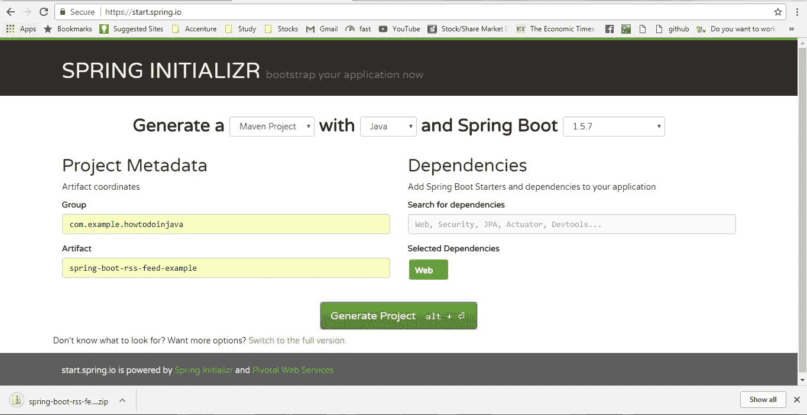
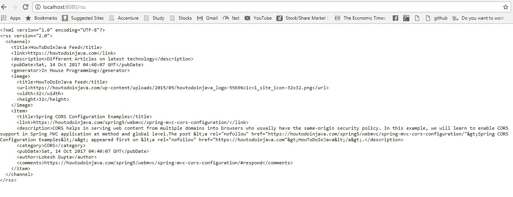

# 带有罗马的 Spring Boot RSS feed

> [https://howtodoinjava.com/spring-boot/spring-boot-rome-rss-and-atom-feed/](https://howtodoinjava.com/spring-boot/spring-boot-rome-rss-and-atom-feed/)

在本教程中，学习从 SpringBoot 应用程序**创建和使用 RSS 和 Atom 提要**。 您一定已经在[各种网站](https://howtodoinjava.com/feed/)（如 RSS 提要之类的）上以文本或图像按钮的形式看到了这一点，并邀请您“通过 RSS 订阅”。RSS 是简单的联合 API，通常称为 Rich Site Summary。 RSS 彻底改变了用户与在线内容进行交互的方式。

与 RSS 相似，Atom 也是基于 XML 的 Web 内容和元数据联合格式，并且是用于发布和编辑属于定期更新的网站的 Web 资源的应用程序级协议。 所有 Atom 提要必须是格式为`application/atom+xml`的 XML 文档。

## 总览

在这个运行示例中，我们将使用 Spring Boot API 公开 RSS 和 ATOM 的两个简单端点，并且我们将了解如何使用 java 客户端使用这些提要。

#### 技术栈

*   JDK 1.8，Eclipse，Maven – 开发环境
*   SpringBoot – 基础应用程序框架
*   [ROME 库](https://github.com/rometools/rome) – 用于发布提要

## 怎么运行的？

基本上，使用 Spring 框架发布 RSS 或 Atom 提要非常容易。 在 spring 框架中，有两个 http 消息转换器（ [RssChannelHttpMessageConverter](https://docs.spring.io/spring/docs/current/javadoc-api/org/springframework/http/converter/feed/RssChannelHttpMessageConverter.html) 和 [AtomFeedHttpMessageConverter](https://docs.spring.io/spring-framework/docs/current/javadoc-api/org/springframework/http/converter/feed/AtomFeedHttpMessageConverter.html) ）可以将 spring 控制器方法的响应转换为 XML feed 格式（如果返回类型与以下任何一种相关） 饲料。

这两个转换器都依赖于 ROME 库，当 Spring 框架在类路径上发现库时，Spring 框架会自动注册这两个转换器。 我们要做的就是将 ROME 库添加为对`pom.xml`的依赖。

## 项目结构

下面给出了为此演示创建的类和文件。


Project Structure

## 创建 RSS / ATOM 提要生成器

#### 创建 Spring Boot 项目

首先从 [Spring Initializer](https://start.spring.io/) 站点创建一个仅具有`Web`依赖项的 spring boot 项目。 选择依赖项并提供适当的 Maven GAV 坐标后，以压缩格式下载项目。 解压缩，然后将 eclipse 中的项目导入为 maven 项目。

[](https://howtodoinjava.com/wp-content/uploads/2017/10/1-2.jpg)

Spring boot project generation

#### 添加 ROAM 依赖关系

现在，我们需要在新创建的项目的 pom.xml 中添加 ROAM 依赖项。

```java
<dependency>
    <groupId>com.rometools</groupId>
    <artifactId>rome</artifactId>
    <version>1.8.0</version>
</dependency>

```

## 创建控制器

现在添加一个 Spring Controller 并添加两个端点`/rss`和`/atom`分别公开 RSS 和 Atom 提要。 正如我们已经提到的，仅添加此控制器将自动适用于我们的情况，因为内部 spring 框架将注册两个 http 消息转换器（`RssChannelHttpMessageConverter`和`AtomFeedHttpMessageConverter`），一旦我们在类路径中具有 ROAM 依赖项，它们便将被注册。

我们唯一需要做的就是从控制器方法中返回正确的`Feed`类型的 Object。 在我们的情况下，提要对象的 RSS 类型为`com.rometools.rome.feed.rss.Channel`，Atom 类型为`com.rometools.rome.feed.atom.Feed`。 因此，在添加提要的内容以及有关通道的其他详细信息之后，我们的控制器将如下所示。

```java
package com.example.howtodoinjava.rss;

import java.util.Collections;
import java.util.Date;

import org.springframework.web.bind.annotation.GetMapping;
import org.springframework.web.bind.annotation.RestController;

import com.rometools.rome.feed.atom.Category;
import com.rometools.rome.feed.atom.Content;
import com.rometools.rome.feed.atom.Entry;
import com.rometools.rome.feed.atom.Feed;
import com.rometools.rome.feed.atom.Link;
import com.rometools.rome.feed.atom.Person;
import com.rometools.rome.feed.rss.Channel;
import com.rometools.rome.feed.rss.Description;
import com.rometools.rome.feed.rss.Image;
import com.rometools.rome.feed.rss.Item;
import com.rometools.rome.feed.synd.SyndPerson;

@RestController
public class FeedController {

	@GetMapping(path = "/rss")
	public Channel rss() {
		Channel channel = new Channel();
		channel.setFeedType("rss_2.0");
		channel.setTitle("HowToDoInJava Feed");
		channel.setDescription("Different Articles on latest technology");
		channel.setLink("https://howtodoinjava.com");
		channel.setUri("https://howtodoinjava.com");
		channel.setGenerator("In House Programming");

		Image image = new Image();
		image.setUrl("https://howtodoinjava.com/wp-content/uploads/2015/05/howtodoinjava_logo-55696c1cv1_site_icon-32x32.png");
		image.setTitle("HowToDoInJava Feed");
		image.setHeight(32);
		image.setWidth(32);
		channel.setImage(image);

		Date postDate = new Date();
		channel.setPubDate(postDate);

		Item item = new Item();
		item.setAuthor("Lokesh Gupta");
		item.setLink("https://howtodoinjava.com/spring5/webmvc/spring-mvc-cors-configuration/");
		item.setTitle("Spring CORS Configuration Examples");
		item.setUri("https://howtodoinjava.com/spring5/webmvc/spring-mvc-cors-configuration/");
		item.setComments("https://howtodoinjava.com/spring5/webmvc/spring-mvc-cors-configuration/#respond");

		com.rometools.rome.feed.rss.Category category = new com.rometools.rome.feed.rss.Category();
		category.setValue("CORS");
		item.setCategories(Collections.singletonList(category));

		Description descr = new Description();
		descr.setValue(
				"CORS helps in serving web content from multiple domains into browsers who usually have the same-origin security policy. In this example, we will learn to enable CORS support in Spring MVC application at method and global level."
						+ "The post <a rel=\"nofollow\" href=\"https://howtodoinjava.com/spring5/webmvc/spring-mvc-cors-configuration/\">Spring CORS Configuration Examples</a> appeared first on <a rel=\"nofollow\" href=\"https://howtodoinjava.com\">HowToDoInJava</a>.");
		item.setDescription(descr);
		item.setPubDate(postDate);

		channel.setItems(Collections.singletonList(item));
		//Like more Entries here about different new topics
		return channel;
	}

	@GetMapping(path = "/atom")
	public Feed atom() {
		Feed feed = new Feed();
		feed.setFeedType("atom_1.0");
		feed.setTitle("HowToDoInJava");
		feed.setId("https://howtodoinjava.com");

		Content subtitle = new Content();
		subtitle.setType("text/plain");
		subtitle.setValue("Different Articles on latest technology");
		feed.setSubtitle(subtitle);

		Date postDate = new Date();
		feed.setUpdated(postDate);

		Entry entry = new Entry();

		Link link = new Link();
		link.setHref("https://howtodoinjava.com/spring5/webmvc/spring-mvc-cors-configuration/");
		entry.setAlternateLinks(Collections.singletonList(link));
		SyndPerson author = new Person();
		author.setName("Lokesh Gupta");
		entry.setAuthors(Collections.singletonList(author));
		entry.setCreated(postDate);
		entry.setPublished(postDate);
		entry.setUpdated(postDate);
		entry.setId("https://howtodoinjava.com/spring5/webmvc/spring-mvc-cors-configuration/");
		entry.setTitle("spring-mvc-cors-configuration");

		Category category = new Category();
		category.setTerm("CORS");
		entry.setCategories(Collections.singletonList(category));

		Content summary = new Content();
		summary.setType("text/plain");
		summary.setValue(
				"CORS helps in serving web content from multiple domains into browsers who usually have the same-origin security policy. In this example, we will learn to enable CORS support in Spring MVC application at method and global level."
						+ "The post <a rel=\"nofollow\" href=\"https://howtodoinjava.com/spring5/webmvc/spring-mvc-cors-configuration/\">Spring CORS Configuration Examples</a> appeared first on <a rel=\"nofollow\" href=\"https://howtodoinjava.com\">HowToDoInJava</a>.");
		entry.setSummary(summary);

		feed.setEntries(Collections.singletonList(entry));
		//Like more Entries here about different new topics
		return feed;
	}
}

```

#### 示例

启动 spring boot 应用程序，使用`mvn clean install`进行 maven 构建，然后使用`java -jar target\spring-boot-rss-feed-example-0.0.1-SNAPSHOT.jar`命令启动应用程序。 这将在默认端口`8080`中启动一台 tomcat 服务器，并将在其中部署应用程序。

现在，从浏览器转到 [http://localhost:8080/rss](http://localhost:8080/rss) 和 [http://localhost:8080/atom](http://localhost:8080/atom) ，您应该会看到 RSS 和 Atom 提要中的主题 已添加到控制器中。



RSS feed


Atom Feed

## 创建 RSS Feed 阅读器

我们已经有很多 Feed 阅读器可用，但是如果您需要以编程方式使用此 Feed，也可以使用 ROAM 库通过以下几行代码来完成此操作。

```java
package com.example.howtodoinjava.rss;

import java.net.URL;
import com.rometools.rome.feed.synd.SyndEntry;
import com.rometools.rome.feed.synd.SyndFeed;
import com.rometools.rome.io.SyndFeedInput;
import com.rometools.rome.io.XmlReader;

public class FeedConsumer {
	public static void main(String[] args) {

		try {
			String url = "http://localhost:8080/rss";

			try (XmlReader reader = new XmlReader(new URL(url))) {
				SyndFeed feed = new SyndFeedInput().build(reader);
				System.out.println(feed.getTitle());
				System.out.println("***********************************");
				for (SyndEntry entry : feed.getEntries()) {
					System.out.println(entry);
					System.out.println("***********************************");
				}
				System.out.println("Done");
			}
		}  catch (Exception e) {
			e.printStackTrace();
		}

	}
}

```

这里的 URL 用于 RSS feed，如果将 URL 更改为 Atom feed，同样的代码也可以工作。

**输出**

这是 feed 客户端的控制台输出。

```java
HowToDoInJava Feed
***********************************
SyndEntryImpl.comments=https://howtodoinjava.com/spring5/webmvc/spring-mvc-cors-configuration/#respond
SyndEntryImpl.author=Lokesh Gupta
SyndEntryImpl.wireEntry=null
SyndEntryImpl.link=https://howtodoinjava.com/spring5/webmvc/spring-mvc-cors-configuration/
SyndEntryImpl.description.mode=null
SyndEntryImpl.description.type=text/html
SyndEntryImpl.description.interface=interface com.rometools.rome.feed.synd.SyndContent
SyndEntryImpl.description.value=CORS helps in serving web content from multiple domains into browsers who usually have the same-origin security policy. In this example, we will learn to enable CORS support in Spring MVC application at method and global level.The post <a rel="nofollow" href="https://howtodoinjava.com/spring5/webmvc/spring-mvc-cors-configuration/">Spring CORS Configuration Examples</a> appeared first on <a rel="nofollow" href="https://howtodoinjava.com">HowToDoInJava</a>.
SyndEntryImpl.foreignMarkup=[]
SyndEntryImpl.source=null
SyndEntryImpl.updatedDate=null
SyndEntryImpl.title=Spring CORS Configuration Examples
SyndEntryImpl.interface=interface com.rometools.rome.feed.synd.SyndEntry
SyndEntryImpl.uri=https://howtodoinjava.com/spring5/webmvc/spring-mvc-cors-configuration/
SyndEntryImpl.enclosures=[]
SyndEntryImpl.modules[0].date=Sat Oct 14 10:57:12 IST 2017
SyndEntryImpl.modules[0].formats=[]
SyndEntryImpl.modules[0].sources=[]
SyndEntryImpl.modules[0].rightsList=[]
SyndEntryImpl.modules[0].subject=null
SyndEntryImpl.modules[0].creators[0]=Lokesh Gupta
SyndEntryImpl.modules[0].description=null
SyndEntryImpl.modules[0].language=null
SyndEntryImpl.modules[0].source=null
SyndEntryImpl.modules[0].type=null
SyndEntryImpl.modules[0].title=null
SyndEntryImpl.modules[0].interface=interface com.rometools.rome.feed.module.DCModule
SyndEntryImpl.modules[0].descriptions=[]
SyndEntryImpl.modules[0].coverages=[]
SyndEntryImpl.modules[0].relation=null
SyndEntryImpl.modules[0].contributor=null
SyndEntryImpl.modules[0].rights=null
SyndEntryImpl.modules[0].publishers=[]
SyndEntryImpl.modules[0].coverage=null
SyndEntryImpl.modules[0].identifier=null
SyndEntryImpl.modules[0].creator=Lokesh Gupta
SyndEntryImpl.modules[0].types=[]
SyndEntryImpl.modules[0].languages=[]
SyndEntryImpl.modules[0].identifiers=[]
SyndEntryImpl.modules[0].subjects=[]
SyndEntryImpl.modules[0].format=null
SyndEntryImpl.modules[0].dates[0]=Sat Oct 14 10:57:12 IST 2017
SyndEntryImpl.modules[0].titles=[]
SyndEntryImpl.modules[0].uri=http://purl.org/dc/elements/1.1/
SyndEntryImpl.modules[0].publisher=null
SyndEntryImpl.modules[0].contributors=[]
SyndEntryImpl.modules[0].relations=[]
SyndEntryImpl.contents=[]
SyndEntryImpl.links=[]
SyndEntryImpl.publishedDate=Sat Oct 14 10:57:12 IST 2017
SyndEntryImpl.contributors=[]
SyndEntryImpl.categories[0].taxonomyUri=null
SyndEntryImpl.categories[0].name=CORS
SyndEntryImpl.categories[0].interface=interface com.rometools.rome.feed.synd.SyndCategory
SyndEntryImpl.titleEx.mode=null
SyndEntryImpl.titleEx.type=null
SyndEntryImpl.titleEx.interface=interface com.rometools.rome.feed.synd.SyndContent
SyndEntryImpl.titleEx.value=Spring CORS Configuration Examples
SyndEntryImpl.authors=[]
***********************************
Done

```

## 摘要

在此示例中，我们了解到如何轻松地将 RSS 和 Atom feed 配置到我们的 spring boot 项目中。 我们也看到了如何从 Java 代码中使用它们。 就是今天的话题。 我在这里附上完整的 Eclipse 项目，以供您参考。

请在评论部分添加您的反馈。

[Download Sourcecode](https://howtodoinjava.com/wp-content/uploads/2017/10/spring-boot-rss-feed-example.zip)

学习愉快！