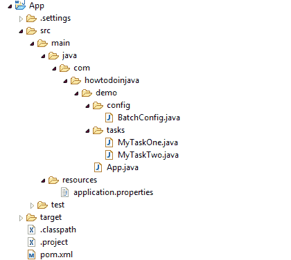

# Spring Batch + Spring Boot Java 配置示例

> 原文： [https://howtodoinjava.com/spring-batch/java-config-multiple-steps/](https://howtodoinjava.com/spring-batch/java-config-multiple-steps/)

学习**使用 Java 配置创建 Spring 批处理作业（具有多个步骤）**。 它使用 **Spring Boot 2** ， **Spring 批处理 4** 和 **H2 数据库**来执行批处理作业。

## 项目结构

在这个项目中，我们将创建一个包含两步任务的简单作业，并执行该作业以观察日志。 作业执行流程将是 – 

1.  开始工作
2.  执行任务一
3.  执行任务二
4.  完成工作



Spring Batch Java Config Example

## Maven 依赖

我们需要包括[`spring-boot-starter-batch`](https://mvnrepository.com/artifact/org.springframework.boot/spring-boot-starter-batch)依赖性。 Spring 批处理依赖于持久性数据存储的作业存储库。 因此，我们也需要一个数据库。 我正在使用 H2（内存数据库），它与 Spring Batch 很好地集成在一起。

`pom.xml`

```java
<project xmlns="http://maven.apache.org/POM/4.0.0"
	xmlns:xsi="http://www.w3.org/2001/XMLSchema-instance"
	xsi:schemaLocation="http://maven.apache.org/POM/4.0.0 http://maven.apache.org/xsd/maven-4.0.0.xsd;
	<modelVersion>4.0.0</modelVersion>

	<groupId>com.howtodoinjava</groupId>
	<artifactId>App</artifactId>
	<version>0.0.1-SNAPSHOT</version>
	<packaging>jar</packaging>

	<name>App</name>
	<url>http://maven.apache.org</url>

	<parent>
		<groupId>org.springframework.boot</groupId>
		<artifactId>spring-boot-starter-parent</artifactId>
		<version>2.0.3.RELEASE</version>
	</parent>

	<properties>
		<project.build.sourceEncoding>UTF-8</project.build.sourceEncoding>
	</properties>

	<dependencies>
		<dependency>
			<groupId>org.springframework.boot</groupId>
			<artifactId>spring-boot-starter-batch</artifactId>
		</dependency>
		<dependency>
			<groupId>com.h2database</groupId>
			<artifactId>h2</artifactId>
			<scope>runtime</scope>
		</dependency>
	</dependencies>

	<build>
		<plugins>
			<plugin>
				<groupId>org.springframework.boot</groupId>
				<artifactId>spring-boot-maven-plugin</artifactId>
			</plugin>
		</plugins>
	</build>

	<repositories>
		<repository>
			<id>repository.spring.release</id>
			<name>Spring GA Repository</name>
			<url>http://repo.spring.io/release</url>
		</repository>
	</repositories>
</project>

```

## 添加任务

第一步是创建一些任务，这些任务将按一定顺序运行以形成作业。 在 Spring 批处理中，它们实现为[`Tasklet`](https://docs.spring.io/spring-batch/4.0.x/api/org/springframework/batch/core/step/tasklet/Tasklet.html)。

`MyTaskOne.java`

```java
import org.springframework.batch.core.StepContribution;
import org.springframework.batch.core.scope.context.ChunkContext;
import org.springframework.batch.core.step.tasklet.Tasklet;
import org.springframework.batch.repeat.RepeatStatus;

public class MyTaskOne implements Tasklet {

	public RepeatStatus execute(StepContribution contribution, ChunkContext chunkContext) throws Exception 
	{
		System.out.println("MyTaskOne start..");

	    // ... your code

	    System.out.println("MyTaskOne done..");
	    return RepeatStatus.FINISHED;
	}    
}

```

`MyTaskTwo.java`

```java
import org.springframework.batch.core.StepContribution;
import org.springframework.batch.core.scope.context.ChunkContext;
import org.springframework.batch.core.step.tasklet.Tasklet;
import org.springframework.batch.repeat.RepeatStatus;

public class MyTaskTwo implements Tasklet {

	public RepeatStatus execute(StepContribution contribution, ChunkContext chunkContext) throws Exception 
	{
		System.out.println("MyTaskTwo start..");

	    // ... your code

	    System.out.println("MyTaskTwo done..");
	    return RepeatStatus.FINISHED;
	}    
}

```

## Spring 批处理配置

这是主要步骤，您可以定义所有与作业相关的配置及其执行逻辑。

`BatchConfig.java`

```java
package com.howtodoinjava.demo.config;

import org.springframework.batch.core.Job;
import org.springframework.batch.core.Step;
import org.springframework.batch.core.configuration.annotation.EnableBatchProcessing;
import org.springframework.batch.core.configuration.annotation.JobBuilderFactory;
import org.springframework.batch.core.configuration.annotation.StepBuilderFactory;
import org.springframework.batch.core.launch.support.RunIdIncrementer;
import org.springframework.beans.factory.annotation.Autowired;
import org.springframework.context.annotation.Bean;
import org.springframework.context.annotation.Configuration;

import com.howtodoinjava.demo.tasks.MyTaskOne;
import com.howtodoinjava.demo.tasks.MyTaskTwo;

@Configuration
@EnableBatchProcessing
public class BatchConfig {

	@Autowired
	private JobBuilderFactory jobs;

	@Autowired
	private StepBuilderFactory steps;

	@Bean
	public Step stepOne(){
	    return steps.get("stepOne")
	            .tasklet(new MyTaskOne())
	            .build();
	}

	@Bean
	public Step stepTwo(){
	    return steps.get("stepTwo")
	            .tasklet(new MyTaskTwo())
	            .build();
	}   

	@Bean
	public Job demoJob(){
	    return jobs.get("demoJob")
	    		.incrementer(new RunIdIncrementer())
	            .start(stepOne())
	            .next(stepTwo())
	            .build();
	}
}

```

## 示例

现在，我们的简单作业`'demoJob'`已配置并准备执行。 当应用程序完全启动时，我正在使用`CommandLineRunner`界面通过`JobLauncher`自动执行作业。

`App.java`

```java
package com.howtodoinjava.demo;

import org.springframework.batch.core.Job;
import org.springframework.batch.core.JobParameters;
import org.springframework.batch.core.JobParametersBuilder;
import org.springframework.batch.core.launch.JobLauncher;
import org.springframework.beans.factory.annotation.Autowired;
import org.springframework.boot.CommandLineRunner;
import org.springframework.boot.SpringApplication;
import org.springframework.boot.autoconfigure.SpringBootApplication;

@SpringBootApplication
public class App implements CommandLineRunner
{
	@Autowired
	JobLauncher jobLauncher;

	@Autowired
	Job job;

	public static void main(String[] args) 
	{
		SpringApplication.run(App.class, args);
	}

	@Override
	public void run(String... args) throws Exception 
	{
		JobParameters params = new JobParametersBuilder()
					.addString("JobID", String.valueOf(System.currentTimeMillis()))
					.toJobParameters();
		jobLauncher.run(job, params);
	}
}

```

注意控制台日志。

`Console Logs`

```java
o.s.b.c.l.support.SimpleJobLauncher      : Job: [SimpleJob: [name=demoJob]] launched with 
the following parameters: [{JobID=1530697766768}]

o.s.batch.core.job.SimpleStepHandler     : Executing step: [stepOne]
MyTaskOne start..
MyTaskOne done..

o.s.batch.core.job.SimpleStepHandler     : Executing step: [stepTwo]
MyTaskTwo start..
MyTaskTwo done..

o.s.b.c.l.support.SimpleJobLauncher      : Job: [SimpleJob: [name=demoJob]] completed with 
the following parameters: [{JobID=1530697766768}] and the following status: [COMPLETED]

```

> Spring 还自动运行配置的批处理作业。 要禁用作业的自动运行，您需要使用 application.properties 文件中的`spring.batch.job.enabled`属性。
> 
> `application.properties`
> 
> ```java
> spring.batch.job.enabled=false
> 
> ```

将我的问题放在评论部分。

学习愉快！