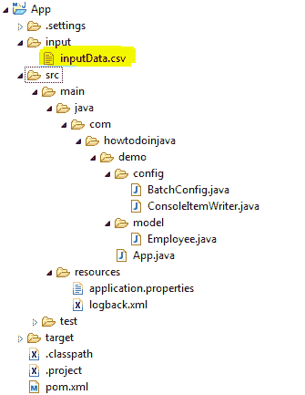

# Spring Batch `FlatFileItemReader` – 读取 CSV 示例

> 原文： [https://howtodoinjava.com/spring-batch/flatfileitemreader-read-csv-example/](https://howtodoinjava.com/spring-batch/flatfileitemreader-read-csv-example/)

学习使用[`FlatFileItemReader`](https://docs.spring.io/spring-batch/4.0.x/api/org/springframework/batch/item/file/FlatFileItemReader.html)类从文件系统或资源文件夹中读取 CSV 文件。

## 项目结构

在这个项目中，我们将学习-

1.  从`input/inputData.csv`读取 CSV 文件。
2.  将数据写入控制台。

Project Structure

## 使用`FlatFileItemReader`读取 CSV

您需要使用`FlatFileItemReader`从 CSV 文件中读取行。

`BatchConfig.java`

[PRE0]

`inputData.csv`

[PRE1]

## 将读取的行写入控制台

创建实现`ItemWriter`接口的`ConsoleItemWriter`类。

`ConsoleItemWriter.java`

[PRE2]

使用`ConsoleItemWriter`作为编写器。

`BatchConfig.java`

[PRE3]

## Maven 依赖

查看项目依赖项。

`pom.xml`

[PRE4]

## 示例

在运行该应用程序之前，请查看`BatchConfig.java`的完整代码。

`BatchConfig.java`

[PRE5]

`Employee.java`

[PRE6]

`App.java`

[PRE7]

`application.properties`

[PRE8]

#### 运行应用程序

将应用程序作为 Spring 运行应用程序运行，并观察控制台。 批处理作业将在每分钟开始时开始。 它将读取输入文件，并在控制台中打印读取的值。

`Console`

[PRE9]

将我的问题放在评论部分。

学习愉快！