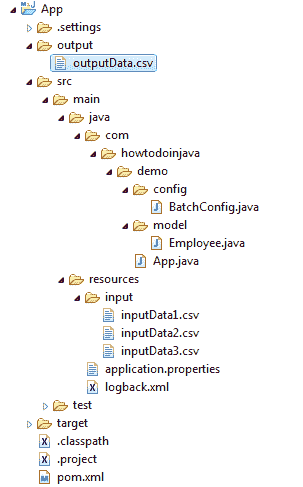

# Spring Batch `FlatFileItemWriter` – 写入 CSV 文件

> 原文：[https://howtodoinjava.com/spring-batch/flatfileitemwriter-write-to-csv-file/](https://howtodoinjava.com/spring-batch/flatfileitemwriter-write-to-csv-file/)

学习使用[`FlatFileItemWriter`](https://docs.spring.io/spring-batch/4.0.x/api/org/springframework/batch/item/file/FlatFileItemWriter.html)写入 CSV 数据。 它是将数据写入文件或流的项目编写器。 输出文件的位置由`Resource`定义，并且必须表示可写文件。

## 项目结构

在这个项目中，我们将学习：

1.  使用`MultiResourceItemReader`从`input/*.csv`读取 3 个 CSV 文件。
2.  使用`FlatFileItemWriter`将整个数据写入`output/outputData.csv`文件。

项目结构

## 使用`FlatFileItemWriter`写入数据 CSV 文件

您需要使用`FlatFileItemWriter`写入从 CSV 文件读取的行。 它将内容写入传递给`writer.setResource()`方法的任何`Resource`。

`BatchConfig.java`

[PRE0]

`Employee.java`

[PRE1]

`inputData1.csv`

[PRE2]

`inputData2.csv`

[PRE3]

`inputData3.csv`

[PRE4]

## Maven 依赖

查看项目依赖项。

`pom.xml`

[PRE5]

## 示例

在运行该应用程序之前，请查看`App.java`的完整代码，该代码将其作为 Spring Boot 应用程序运行。

`App.java`

[PRE6]

`application.properties`

[PRE7]

#### 运行应用程序

将应用程序作为 Spring 运行应用程序运行，并观察控制台。 批处理作业将在每分钟开始时开始。 它将读取输入文件，并在控制台中打印读取的值。

`outputData.csv`

[PRE8]

将我的问题放在评论部分。

学习愉快！