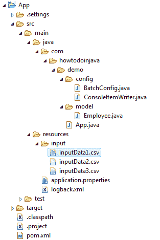

# Spring Batch `MultiResourceItemReader` – 读取多个 CSV 文件示例

> 原文： [https://howtodoinjava.com/spring-batch/multiresourceitemreader-read-multiple-csv-files-example/](https://howtodoinjava.com/spring-batch/multiresourceitemreader-read-multiple-csv-files-example/)

学习使用[`MultiResourceItemReader`](https://docs.spring.io/spring-batch/4.0.x/api/org/springframework/batch/item/file/MultiResourceItemReader.html)类从文件系统或资源文件夹中读取多个 CSV 文件。 这些文件可能具有第一行作为标题，因此不要忘记跳过第一行。

## 项目结构

在此项目中，我们将-

1.  从`input/*.csv`读取 3 个 CSV 文件。
2.  将数据写入控制台。

Project Structure

## 使用`MultiResourceItemReader`读取 CSV 文件

您需要使用`MultiResourceItemReader`从 CSV 文件中读取行。 它从多个资源顺序读取项目。

`BatchConfig.java`

[PRE0]

`Employee.java`

[PRE1]

`inputData1.csv`

[PRE2]

`inputData2.csv`

[PRE3]

`inputData3.csv`

[PRE4]

## 将读取的行写入控制台

创建实现`ItemWriter`接口的`ConsoleItemWriter`类。

`ConsoleItemWriter.java`

[PRE5]

使用`ConsoleItemWriter`作为编写器。

`BatchConfig.java`

[PRE6]

## Maven 依赖

查看项目依赖项。

`pom.xml`

[PRE7]

## 示例

在运行该应用程序之前，请查看`BatchConfig.java`的完整代码。

`BatchConfig.java`

[PRE8]

`App.java`

[PRE9]

`application.properties`

[PRE10]

#### 运行应用程序

将应用程序作为 Spring 运行应用程序运行，并观察控制台。 批处理作业将在每分钟开始时开始。 它将读取输入文件，并在控制台中打印读取的值。

`Console`

[PRE11]

将我的问题放在评论部分。

学习愉快！