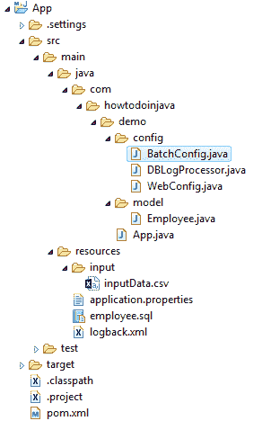
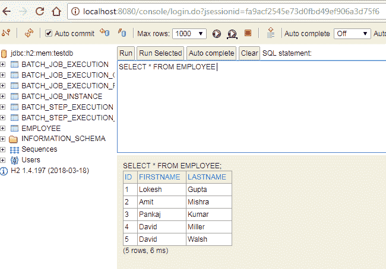

# Spring Batch CSV 到数据库 – Java 注解配置示例

> 原文： [https://howtodoinjava.com/spring-batch/csv-to-database-java-config-example/](https://howtodoinjava.com/spring-batch/csv-to-database-java-config-example/)

学习使用 Spring Batch 从 CSV 文件读取记录，并使用`JdbcBatchItemWriter`插入数据库。 我正在使用嵌入式数据库`H2`演示此示例。

## 项目概况

在此应用程序中，我们将执行以下任务：

1.  使用[`FlatFileItemReader`](https://docs.spring.io/spring-batch/4.0.x/api/org/springframework/batch/item/file/FlatFileItemReader.html)从 CSV 文件读取员工记录
2.  配置`H2`数据库并在其中创建`EMPLOYEE`表
3.  用[`JdbcBatchItemWriter`](https://docs.spring.io/spring-batch/3.0.x/apidocs/org/springframework/batch/item/database/JdbcBatchItemWriter.html)将员工记录写入`EMPLOYEE`表
4.  使用[`ItemProcessor`](https://docs.spring.io/spring-batch/trunk/apidocs/org/springframework/batch/item/ItemProcessor.html)将日志项插入数据库
5.  使用`H2`控制台验证插入的记录

#### 项目结构



Package Structure

## Maven 依赖

快速浏览构建此示例所需的 maven 依赖关系。 需要`spring-boot-starter-web`才能从浏览器窗口验证`H2`控制台中的数据。

`pom.xml`

```java
<project xmlns="http://maven.apache.org/POM/4.0.0"
	xmlns:xsi="http://www.w3.org/2001/XMLSchema-instance"
	xsi:schemaLocation="http://maven.apache.org/POM/4.0.0 http://maven.apache.org/xsd/maven-4.0.0.xsd;
	<modelVersion>4.0.0</modelVersion>

	<groupId>com.howtodoinjava</groupId>
	<artifactId>App</artifactId>
	<version>0.0.1-SNAPSHOT</version>
	<packaging>jar</packaging>

	<name>App</name>
	<url>http://maven.apache.org</url>

	<parent>
		<groupId>org.springframework.boot</groupId>
		<artifactId>spring-boot-starter-parent</artifactId>
		<version>2.0.3.RELEASE</version>
	</parent>

	<properties>
		<project.build.sourceEncoding>UTF-8</project.build.sourceEncoding>
	</properties>

	<dependencies>
		<dependency>
			<groupId>org.springframework.boot</groupId>
			<artifactId>spring-boot-starter-batch</artifactId>
		</dependency>
		<dependency>
			<groupId>org.springframework.boot</groupId>
			<artifactId>spring-boot-starter-web</artifactId>
		</dependency>
		<dependency>
			<groupId>com.h2database</groupId>
			<artifactId>h2</artifactId>
			<scope>runtime</scope>
		</dependency>
	</dependencies>

	<build>
		<plugins>
			<plugin>
				<groupId>org.springframework.boot</groupId>
				<artifactId>spring-boot-maven-plugin</artifactId>
			</plugin>
		</plugins>
	</build>

	<repositories>
		<repository>
			<id>repository.spring.release</id>
			<name>Spring GA Repository</name>
			<url>http://repo.spring.io/release</url>
		</repository>
	</repositories>
</project>

```

## CSV 读取器和数据库写入器配置

1.  我们将使用`FlatFileItemReader`读取 CSV 文件。 我们将使用涉及`DefaultLineMapper`，`DelimitedLineTokenizer`和`BeanWrapperFieldSetMapper`类的标准配置。
2.  为了将记录写入数据库，我们将使用`JdbcBatchItemWriter`这是标准编写器，用于在数据库中为 Spring Batch 作业执行批处理查询。

`BatchConfig.java`

```java
package com.howtodoinjava.demo.config;

import javax.sql.DataSource;
import org.springframework.batch.core.Job;
import org.springframework.batch.core.Step;
import org.springframework.batch.core.configuration.annotation.EnableBatchProcessing;
import org.springframework.batch.core.configuration.annotation.JobBuilderFactory;
import org.springframework.batch.core.configuration.annotation.StepBuilderFactory;
import org.springframework.batch.core.launch.support.RunIdIncrementer;
import org.springframework.batch.item.ItemProcessor;
import org.springframework.batch.item.database.BeanPropertyItemSqlParameterSourceProvider;
import org.springframework.batch.item.database.JdbcBatchItemWriter;
import org.springframework.batch.item.file.FlatFileItemReader;
import org.springframework.batch.item.file.LineMapper;
import org.springframework.batch.item.file.mapping.BeanWrapperFieldSetMapper;
import org.springframework.batch.item.file.mapping.DefaultLineMapper;
import org.springframework.batch.item.file.transform.DelimitedLineTokenizer;
import org.springframework.beans.factory.annotation.Autowired;
import org.springframework.beans.factory.annotation.Value;
import org.springframework.context.annotation.Bean;
import org.springframework.context.annotation.Configuration;
import org.springframework.core.io.Resource;
import org.springframework.jdbc.datasource.embedded.EmbeddedDatabaseBuilder;
import org.springframework.jdbc.datasource.embedded.EmbeddedDatabaseType;
import com.howtodoinjava.demo.model.Employee;

@Configuration
@EnableBatchProcessing
public class BatchConfig {

	@Autowired
	private JobBuilderFactory jobBuilderFactory;

	@Autowired
	private StepBuilderFactory stepBuilderFactory;

	@Value("classPath:/input/inputData.csv")
	private Resource inputResource;

	@Bean
	public Job readCSVFileJob() {
		return jobBuilderFactory
				.get("readCSVFileJob")
				.incrementer(new RunIdIncrementer())
				.start(step())
				.build();
	}

	@Bean
	public Step step() {
		return stepBuilderFactory
				.get("step")
				.<Employee, Employee>chunk(5)
				.reader(reader())
				.processor(processor())
				.writer(writer())
				.build();
	}

	@Bean
    public ItemProcessor<Employee, Employee> processor() {
        return new DBLogProcessor();
    }

	@Bean
	public FlatFileItemReader<Employee> reader() {
		FlatFileItemReader<Employee> itemReader = new FlatFileItemReader<Employee>();
		itemReader.setLineMapper(lineMapper());
		itemReader.setLinesToSkip(1);
		itemReader.setResource(inputResource);
		return itemReader;
	}

	@Bean
	public LineMapper<Employee> lineMapper() {
		DefaultLineMapper<Employee> lineMapper = new DefaultLineMapper<Employee>();
		DelimitedLineTokenizer lineTokenizer = new DelimitedLineTokenizer();
		lineTokenizer.setNames(new String[] { "id", "firstName", "lastName" });
		lineTokenizer.setIncludedFields(new int[] { 0, 1, 2 });
		BeanWrapperFieldSetMapper<Employee> fieldSetMapper = new BeanWrapperFieldSetMapper<Employee>();
		fieldSetMapper.setTargetType(Employee.class);
		lineMapper.setLineTokenizer(lineTokenizer);
		lineMapper.setFieldSetMapper(fieldSetMapper);
		return lineMapper;
	}

	@Bean
	public JdbcBatchItemWriter<Employee> writer() {
		JdbcBatchItemWriter<Employee> itemWriter = new JdbcBatchItemWriter<Employee>();
		itemWriter.setDataSource(dataSource());
		itemWriter.setSql("INSERT INTO EMPLOYEE (ID, FIRSTNAME, LASTNAME) VALUES (:id, :firstName, :lastName)");
		itemWriter.setItemSqlParameterSourceProvider(new BeanPropertyItemSqlParameterSourceProvider<Employee>());
		return itemWriter;
	}

	@Bean
	public DataSource dataSource(){
		EmbeddedDatabaseBuilder embeddedDatabaseBuilder = new EmbeddedDatabaseBuilder();
		return embeddedDatabaseBuilder.addScript("classpath:org/springframework/batch/core/schema-drop-h2.sql")
				.addScript("classpath:org/springframework/batch/core/schema-h2.sql")
				.addScript("classpath:employee.sql")
				.setType(EmbeddedDatabaseType.H2)
				.build();
	}
}

```

还创建`DBLogProcessor`，它将在写入数据库之前记录员工记录。 它是可选的。

`DBLogProcessor.java`

```java
package com.howtodoinjava.demo.config;

import org.springframework.batch.item.ItemProcessor;
import com.howtodoinjava.demo.model.Employee;

public class DBLogProcessor implements ItemProcessor<Employee, Employee>
{
	public Employee process(Employee employee) throws Exception
	{
		System.out.println("Inserting employee : " + employee);
		return employee;
	}
}

```

#### 模型类

`Employee.java`

```java
package com.howtodoinjava.demo.config;
package com.howtodoinjava.demo.model;

public class Employee {

	String id;
	String firstName;
	String lastName;

	//Setter and getter methods
}

```

#### 应用属性

`application.properties`

```java
#Disable batch job's auto start 
spring.batch.job.enabled=false
spring.main.banner-mode=off

#batch input files location
input.dir=c:/temp/input

```

#### 日志配置

`logback.xml`

```java
<?xml version="1.0" encoding="UTF-8"?>
<configuration scan="true">

	<appender name="consoleAppender" class="ch.qos.logback.core.ConsoleAppender">
		<encoder>
			<charset>UTF-8</charset>
			<Pattern>%d{yyyy-MM-dd HH:mm:ss} %p %X{TXNID} - %m%n</Pattern>
		</encoder>
	</appender>

	<root level="INFO">
		<appender-ref ref="consoleAppender" />
	</root>
</configuration>

```

## 配置 H2 数据库

我们已经在`BatchConfig.java`中配置了数据源。

`BatchConfig.java`

```java
@Bean
public DataSource dataSource(){
	EmbeddedDatabaseBuilder embeddedDatabaseBuilder = new EmbeddedDatabaseBuilder();
	return embeddedDatabaseBuilder.addScript("classpath:org/springframework/batch/core/schema-drop-h2.sql")
			.addScript("classpath:org/springframework/batch/core/schema-h2.sql")
			.addScript("classpath:employee.sql")
			.setType(EmbeddedDatabaseType.H2)
			.build();
}

```

#### 创建`EMPLOYEE`表

以上配置将自动生成默认表。 要生成`EMPLOYEE`表，请创建模式文件`employee.sql`并将其放置在`resources`文件夹中。

`employee.sql`

```java
DROP TABLE EMPLOYEE IF EXISTS;

CREATE TABLE EMPLOYEE  (
	ID VARCHAR(10),  
	FIRSTNAME VARCHAR(100),  
	LASTNAME VARCHAR(100) 
) ;

```

#### 启用 H2 控制台

要启用 H2 控制台，请向 Spring Web 注册`org.h2.server.web.WebServlet`。

`WebConfig.java`

```java
package com.howtodoinjava.demo.config;

import org.h2.server.web.WebServlet;
import org.springframework.boot.web.servlet.ServletRegistrationBean;
import org.springframework.context.annotation.Bean;
import org.springframework.context.annotation.Configuration;

@SuppressWarnings({"rawtypes","unchecked"})
@Configuration
public class WebConfig {

	@Bean
    ServletRegistrationBean h2servletRegistration(){
		ServletRegistrationBean registrationBean = new ServletRegistrationBean( new WebServlet());
        registrationBean.addUrlMappings("/console/*");
        return registrationBean;
    }
}

```

## 示例

我们的应用程序配置完成，Job 准备执行。 让我们创建输入 CSV 文件。

`inputData.csv`

```java
id,firstName,lastName
1,Lokesh,Gupta
2,Amit,Mishra
3,Pankaj,Kumar
4,David,Miller
5,David,Walsh

```

#### 运行演示

要运行演示和批处理作业，请创建 Spring 运行应用程序类并启动应用程序。

`App.java`

```java
package com.howtodoinjava.demo;

import org.springframework.batch.core.Job;
import org.springframework.batch.core.JobParameters;
import org.springframework.batch.core.JobParametersBuilder;
import org.springframework.batch.core.launch.JobLauncher;
import org.springframework.beans.factory.annotation.Autowired;
import org.springframework.boot.SpringApplication;
import org.springframework.boot.autoconfigure.SpringBootApplication;
import org.springframework.scheduling.annotation.EnableScheduling;
import org.springframework.scheduling.annotation.Scheduled;

@SpringBootApplication
@EnableScheduling
public class App
{
    @Autowired
    JobLauncher jobLauncher;

    @Autowired
    Job job;

    public static void main(String[] args)
    {
        SpringApplication.run(App.class, args);
    }

    @Scheduled(cron = "0 */1 * * * ?")
    public void perform() throws Exception
    {
        JobParameters params = new JobParametersBuilder()
                .addString("JobID", String.valueOf(System.currentTimeMillis()))
                .toJobParameters();
        jobLauncher.run(job, params);
    }
}

```

#### 验证批处理作业结果

要验证批处理作业是否成功执行，请检查日志和 H2 控制台。

`Console`

```java
2018-07-11 19:11:00 INFO  - Job: [SimpleJob: [name=readCSVFileJob]] launched with the following parameters: [{JobID=1531316460004}]

2018-07-11 19:11:00 INFO  - Executing step: [step]

Inserting employee : Employee [id=1, firstName=Lokesh, lastName=Gupta]
Inserting employee : Employee [id=2, firstName=Amit, lastName=Mishra]
Inserting employee : Employee [id=3, firstName=Pankaj, lastName=Kumar]
Inserting employee : Employee [id=4, firstName=David, lastName=Miller]
Inserting employee : Employee [id=5, firstName=David, lastName=Walsh]

2018-07-11 19:11:00 INFO  - Job: [SimpleJob: [name=readCSVFileJob]] completed with the following parameters: [{JobID=1531316460004}] and the following status: [COMPLETED]

```

#### H2 控制台


H2 Console Login



Data in H2 Console

将我的问题放在评论部分。

学习愉快！

[下载源码](https://howtodoinjava.com/wp-content/downloads/Spring Boot CSV to Database.zip)