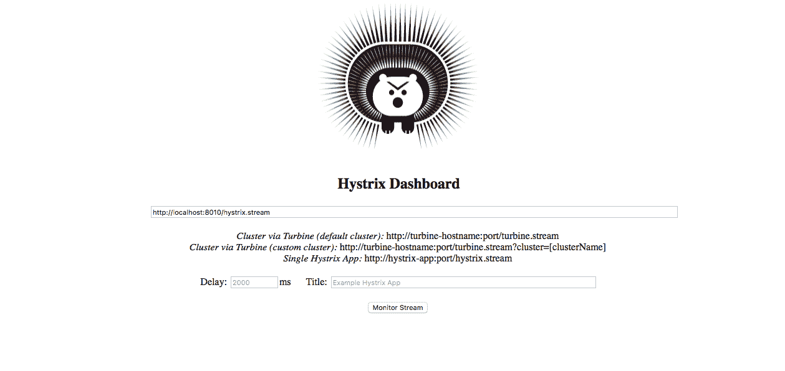
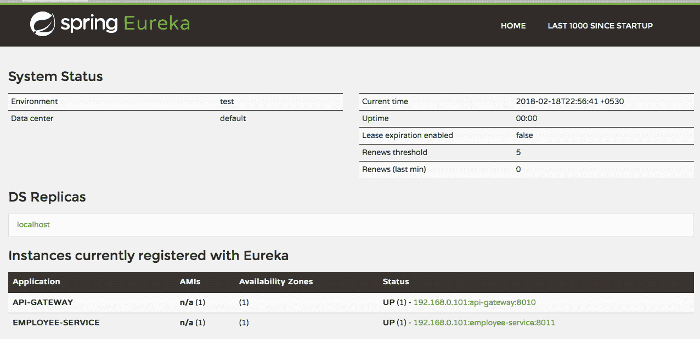
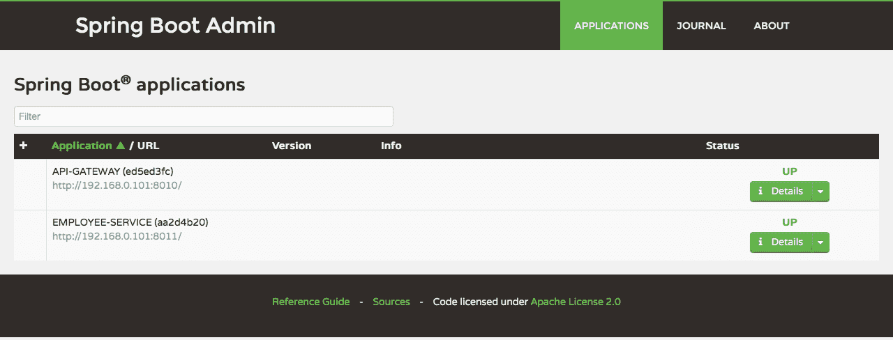
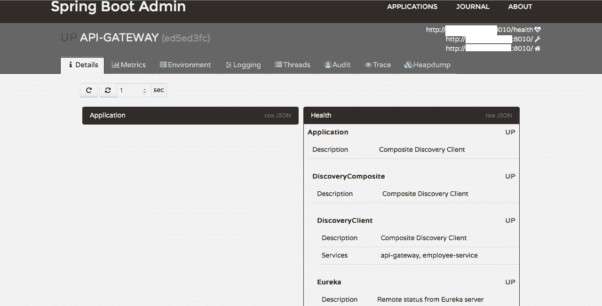
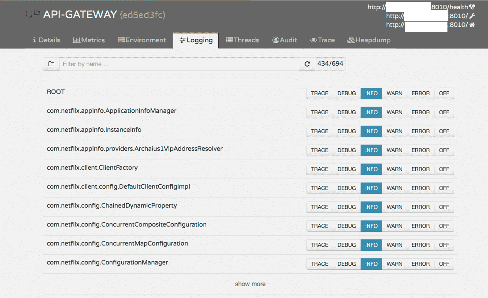
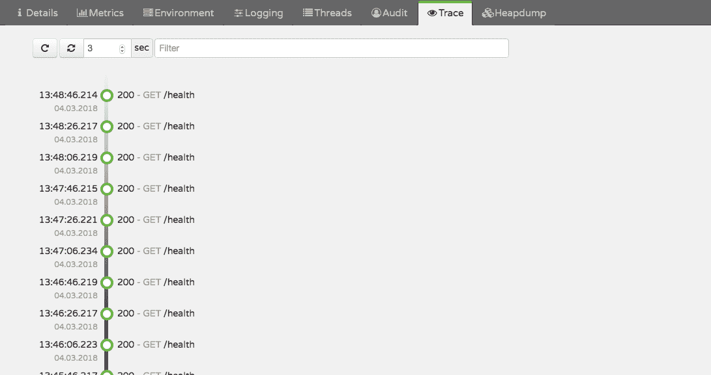

# 服务监控 – Hystrix，Eureka 管理员和 Spring Boot 管理员

> 原文： [https://howtodoinjava.com/spring-cloud/microservices-monitoring/](https://howtodoinjava.com/spring-cloud/microservices-monitoring/)

Spring Boot 和 Spring Cloud 在交付基于微服务的应用程序时被广泛使用。 最终，基于在不同主机上运行的 Spring 运行应用程序**监视微服务**成为必要。 有许多工具可用来监视这些微服务的各种运行状况。

在此 SpringCloud 教程中，我们将学习使用三种监视工具，即 **Hystrix 仪表板**， **Eureka 管理仪表板**和 **Spring boot 管理仪表板**。

## 1\. 概述

在此演示中，我们将创建三个应用程序。

1.  **员工服务** – 此微服务应用程序负责获取员工的数据。
2.  **Api 网关** – 此应用程序将在访问不同的微服务时提供公共网关。 在以下示例中，它将充当上述员工服务的网关。
3.  **Eureka 服务器** – 此微服务应用程序将提供上述微服务的服务发现和注册。

该演示是围绕 **Netflix Eureka** 创建的，以集中管理和监视注册的应用程序。 您可能已经知道 Netflix Eureka 服务器是用于构建**服务注册表服务器**和关联的 Eureka 客户端的，它们将注册自己以查找其他服务并通过 REST API 进行通信。

## 2\. 技术栈

*   Java 1.8
*   Spring 工具套件
*   SpringCloud
*   SpringBoot
*   SpringRest
*   Maven

## 3\. 员工服务

*   Create a Spring boot project from [Spring boot initializer](https://start.spring.io/)/[Spring tool suite](https://spring.io/tools/sts) with dependencies **Eureka Discovery**, **Actuator**, **Web**, **Rest repositories**.

    

*   The main application class `EmployeeServiceApplication` to start the Spring boot application.

    `EmployeeServiceApplication.java`

    [PRE0]

    `@EnableEurekaClient` – 此注解在下面创建的 [Eureka Server 应用程序](#eureka-dashboard)中将该服务注册为 Eureka 客户端。

*   Create a Rest controller class [EmployeeServiceController] to expose Employee data.

    `EmployeeServiceController.java`

    [PRE1]

    关联的`Employee` Bean 类如下。

    `Employee.java`

    [PRE2]

*   Create `application.yml` in `src/main/resources` directory.

    `application.yml`

    [PRE3]

*   启动此应用可访问的`http://localhost:8011/findEmployeeDetails/111`
    

## 4\. 带有 Hystrix 的 API 网关

*   Create a Spring boot project from [Spring boot initializer](https://start.spring.io/)/[Spring tool suite](https://spring.io/tools/sts) with dependencies `Eureka Discovery`, `Actuator`, `Web`, `Hystrix`, `Hystrix Dashboard`, `Rest repositories`.

    

*   The main application class `ApiGatewayApplication` to start Spring boot application.

    `ApiGatewayApplication.java`

    [PRE4]

    `@EnableHystrixDashBoard` – 提供 Hystrix 流的仪表板视图。
    
	`@EnableCircuitBreaker` – 启用断路器实现。

*   Create a REST controller class [ EmployeeController ] to expose Employee data.

    `EmployeeController.java`

    [PRE5]

*   Create `application.yml` in `src/main/resources` directory.

    `application.yml`

    [PRE6]

*   Start the application reachable at `http://localhost:8010/employeeDetails/111`.

    

## 5\. Hystrix 仪表板视图

*   To **monitor via Hystrix dashboard**, open Hystrix dashboard at `http://localhost:8010/hystrix`.

    

    这是主页，需要放置事件流 URL 进行监视。

*   Now view **hystrix stream** in dashboard – `http://localhost:8010/hystrix.stream`

    

    这提供了所有 Hystrix 命令和线程池的实时信息。

## 6\. Eureka 管理仪表板视图

现在让我们学习如何使用 Eureka 管理控制台视图。

*   Create a Spring boot project from [Spring boot initializer](https://start.spring.io/)/[Spring tool suite](https://spring.io/tools/sts) with these dependencies **Eureka Server**, **Actuator**, **Web**, **Spring Boot Admin Server**.

    

*   The main application class `EurekaServerApplication` to start spring boot application.

    `EurekaServerApplication.java`

    [PRE7]

    `@EnableEurekaServer` – 此注解将使此应用程序充当微服务注册表和发现服务器。
    
	`@EnableAdminServer` – 此注解提供 Spring Boot Admin 配置。

*   在`src/main/resources`目录中创建`application.yml`和`bootstrap.yml`。
*   Add `application.yml` with given config. Please note that for Spring boot admin server a different context path `/admin` has been provided for not conflicting with `/eureka`.

    `application.yml`

    [PRE8]

*   Create `bootstrap.yml` and give this configuration.

    `bootstrap.yml`

    [PRE9]

*   Start the application. But before that make sure the rest of the client applications mentioned above are started before so as to see all registered applications. This application is reachable at `http://localhost:8761`.

    

## 7\. Spring Boot 管理仪表板视图

*   To monitor via Spring Boot Admin server, invoke this URL running at different context path- `http://localhost:8761/admin`.

    

*   This admin interface provides application overview, desktop notifications, application health check, log file browsing, JMX Beans, thread heap dump etc. To see individual application health and monitor its metrics, click on the detail button. It will take you to the admin dashboard of individual application.

    

*   使用仪表板管理日志级别。
    
*   Using dashboard to manage runtime environment properties.

    

*   Also you can use it to view HTTP traces.

    

从 Spring 运行管理员的角度来看，目前是这样。 请随时添加任何评论/查询。 我们很乐意解决同样的问题。

[Download Employee Service](https://howtodoinjava.com/wp-content/uploads/2018/03/Employee-Service.zip)
[Download Api Gateway](https://howtodoinjava.com/wp-content/uploads/2018/03/Api-Gateway.zip)
[Download Eureka server](https://howtodoinjava.com/wp-content/uploads/2018/03/Eureka-server.zip)

学习愉快！